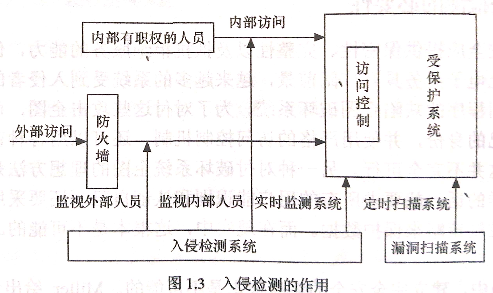
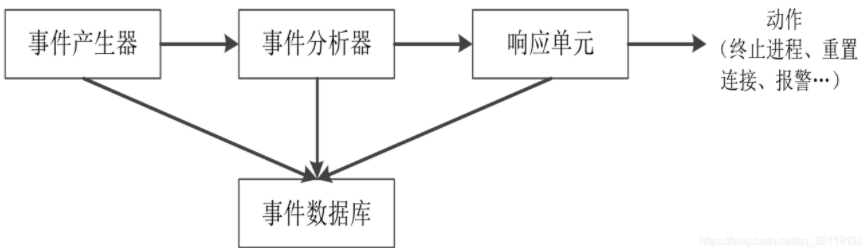
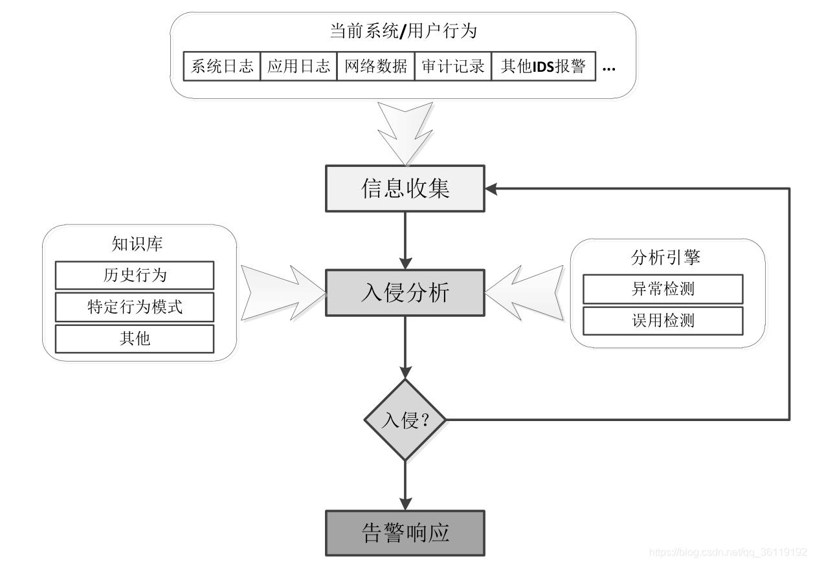

# ids   

# 第一次作业  

**任务**：  
1. [已完成]校园网 https://10.21.49.169/ 使用上学期注册的账号，建立新的工程项目 ids。   
2. [已完成]用 md 格式，网上搜集有关 ids 产品的信息，上传到服务器。   
3. [已完成]网上下载 snort, libpcap 等软件的源代码。   
> 注意： 对 snort 源代码的分析是本次课程作业的主要部分。  

## 源代码  
- `libpcap`版本：1.10.0。  
- `snort` 版本: 0.96。

## IDS基础  
> 入侵检测是一种动态的监控、预防或抵御系统入侵行为的安全机制，  
> 主要通过监控网络、系统的状态、行为以及系统的适用请况， 
> 来检测系统用户的越权使用以及系统外部的入侵者利用系统的安全缺陷对系统进行入侵的企图。  

### 入侵检测的概念  

- **入侵**： 任何试图危及计算机资源的完整性、机密性、可用性的行为。  
- **入侵检测**：对入侵行为的发觉。  
- **入侵检测系统**:  进行入侵检测的软件与硬件的组合。  

**入侵检测的原理**：   
> 入侵检测时通过收集并分析信息系统的若干节点的信息，   
> 从而发现是否有**违反安全策略**的行为和遭到袭击的迹象。   

**入侵检测是对安全机制的补充**：  
> 入侵检测是对传统计算机安全机制的一种补充。   
> 入侵检测是防火墙的合理补充。帮助系统对付网络攻击，扩展系统管理员的安全管理能力（安全审计、监视、进攻识别和响应）。  
> 入侵检测是第二道安全阀门。在不影响网络性能的情况下，对网络进行监测，从而提供对内部攻击、外部攻击和误操作的实时保护。  

**入侵检测适用广泛**：  
> 入侵检测所需要的分析数据源仅是记录系统活动轨迹的审计数据。  
> 所以入侵检测几乎适用于所有计算机系统。  

**分析数据和行为模型**：  
> 在网络安全体系中，IDS是唯一一个通过数据和行为模式判断网络安全体系是否有效的系统。   

### 入侵检测的目的
1. 识别入侵者。  
2. 识别入侵行为。  
3. 检测和监视已成功的安全突破。  
4. 为对抗入侵提供重要信息，防止事件的发生和事态的扩大。 

### 入侵检测的作用  

**IDS的作用和功能**：  
- 监控、分析用户和系统的活动。    
- 审计系统的配置和弱点。  
- 评估关键系统和数据文件的完整性。  
- 识别攻击的活动模式。  
- 对异常活动进行统计分析。  
- 对操作系统进行审计跟踪管理、识别违反策略的用户活动。  

### 入侵检测的优缺点 

**IDS的优点**：  
- 提高信息安全体系中其他部分的完整性。  
- 提高系统的监控能力。  
- 从入口点到出口点跟踪用户的活动。  
- 识别和汇报数据文件的变化。  
- 侦测系统配置错误并纠正它们。  
- 识别特殊攻击模式，并向管理员发出警报，进行防御。 

**IDS的缺点**：  
- 不能弥补差的认证机制。  
- 如果没有人的干预，不能管理攻击调查。  
- 不能知道安全策略的内容。   
- 不能弥补网络协议上的弱点。  
- 不能弥补系统服务质量或完整性的缺陷。  
- 不能分析一个堵塞的网络。  
- 不能处理有关Packet-Level的攻击。  

### 研究入侵检测的必要性  
- 实践中不可能建立完全安全的系统。  
- 将带有安全缺陷的系统转换成安全系统耗时长。  
- 若口令弱且被破解，则访问控制系统不能保护相关用户的信息的安全。  
- 静态安全措施不足以保护安全对象属性。  
- 加密技术本身存在一定的问题。  
- 安全系统易受到内部用户滥用职权的攻击。  
- 安全访问控制等级和用户的适用效率成反比。  
- 软件工程中存在软件测试不足，生命周期缩短，大型软件复杂性等难解问题，使得软件不可能没有错误。  
- 修补系统软件的缺陷不能令人满意。  

### 入侵检测面临的问题  
- 高速网络环境的性能提供问题。  
- IDS主动防御能力不足的问题。  
    > 多数的入侵检测系统以检测漏洞为主，很难以发现新的攻击方式， 
    > 一般只有在攻击发生一次后，才将新的规则添加到系统中。  
    > 这就导致不能对攻击做到提前预防，系统的检测规则更新比较缓慢和滞后。 
- IDS体系结构的问题。  
    > IDS体系结构的问题：  
    > 网络攻击手段向分布式方向发展，攻击的破坏性和隐蔽性越来越强。  
    > 集中式的IDS体系结果不能适应分布式攻击的检测。 
- IdS自身的健壮性问题。  
- 云环境下的入侵检测问题。  

### 入侵检测的发展  
- 智能化入侵检测。  
- 分布式入侵检测。 
- 入侵检测系统的标准化。  
- 集成网络分析和管理能力。  
- 高速网络中的入侵检测。  
- 数据库入侵检测。  
- 无线网络入侵检测。 

## IDS系统  

### 入侵检测系统的分类  

**按入侵检测形态**：   
- 软件入侵检测。  
- 硬件入侵检测。  

**按目标系统的类型**：  
- 主机入侵检测。 
- 网络入侵检测。  

**按系统结构**：  
- 集中式。  
- 分布式。  

### 入侵检测系统的组成  
> IETF将一个入侵检测系统分为四个组件 
- 事件产生器。  
    > 它的目的是从整个计算环境中获得事件，并向系统的其他部分提供此事件。  
- 事件分析器。  
    > 它经过分析得到数据，并产生分析结果。  
- 响应单元。  
    >  它是对分析结果作出反应的功能单元，它可以作出切断连接、改变文件属性等强烈反应，也可以只是简单的报警。  
- 事件数据库。  
    > 事件数据库是存放各种中间和最终数据的地方的统称，它可以是复杂的数据库，也可以是简单的文本文件。   

### 入侵检测工作流程  

### 入侵检测的分析方法  

**误用检测**：  
- 模式匹配法。  
    > 是常常被用于入侵检测技术中：  
    > 它是通过把收集到的信息与网络入侵和系统误用模式数据库中的已知信息进行比较，从而对违背安全策略的行为进行发现。  
    > 模式匹配法可以显著地减少系统负担，有较高的检测率和准确率。  
- 专家系统法：  
    > 这个方法的思想是把安全专家的知识表示成规则知识库，再用推理算法检测入侵。  
    > 主要是针对有特征的入侵行为。  
- 基于状态转移分析的检测法：  
    > 该方法的基本思想是将攻击看成一个连续的、分步骤的并且各个步骤之间有一定的关联的过程。  
    > 在网络中发生入侵时及时阻断入侵行为，防止可能还会进一步发生的类似攻击行为。
    > 在状态转移分析方法中，一个渗透过程可以看作是由攻击者做出的一系列的行为而导致系统从某个初始状态变为最终某个被危害的状态。  

**异常检测**：  
- 基于贝叶斯推理检测法：  
    > 是通过在任何给定的时刻，测量变量值，推理判断系统是否发生入侵事件。  
- 基于特征选择检测法：  
    > 指从一组度量中挑选出能检测入侵的度量，用它来对入侵行为进行预测或分类。  
- 基于贝叶斯网络检测法：  
    > 用图形方式表示随机变量之间的关系。  
    > 通过指定的与邻接节点相关一个小的概率集来计算随机变量的联接概率分布。  
    > 按给定全部节点组合，所有根节点的先验概率和非根节点概率构成这个集。  
    > 贝叶斯网络是一个有向图，弧表示父、子结点之间的依赖关系。  
    > 当随机变量的值变为已知时，就允许将它吸收为证据，为其他的剩余随机变量条件值判断提供计算框架。  
- 基于模式预测的检测法：  
    > 事件序列不是随机发生的而是遵循某种可辨别的模式是基于模式预测的异常检测法的假设条件，  
    > 其特点是事件序列及相互联系被考虑到了，只关心少数相关安全事件是该检测法的最大优点。  
- 基于统计的异常检测法：  
    > 是根据用户对象的活动为每个用户都建立一个特征轮廓表，通过对当前特征与以前已经建立的特征进行比较，来判断当前行为的异常性。  
    > 用户特征轮廓表要根据审计记录情况不断更新，其保护去多衡量指标，这些指标值要根据经验值或一段时间内的统计而得到。  
- 基于机器学习检测法：  
    > 是根据离散数据临时序列学习获得网络、系统和个体的行为特征，并提出了一个实例学习法IBL，  
    > IBL是基于相似度，该方法通过新的序列相似度计算将原始数据（如离散事件流和无序的记录）转化成可度量的空间。  
    > 然后，应用IBL学习技术和一种新的基于序列的分类方法，发现异常类型事件，从而检测入侵行为。  
    > 其中，成员分类的概率由阈值的选取来决定。  
- 数据挖掘检测法：  
    > 数据挖掘的目的是要从海量的数据中提取出有用的数据信息。  
    > 网络中会有大量的审计记录存在，审计记录大多都是以文件形式存放的。  
    > 如果靠手工方法来发现记录中的异常现象是远远不够的，所以将数据挖掘技术应用于入侵检测中，可以从审计数据中提取有用的知识，然后用这些知识区检测异常入侵和已知的入侵。  
    > 采用的方法有KDD算法，其优点是善于处理大量数据的能力与数据关联分析的能力，但是实时性较差。  
- 基于应用模式的异常检测法：  
    > 该方法是根据服务请求类型、服务请求长度、服务请求包大小分布计算网络服务的异常值。  
    > 通过实时计算的异常值和所训练的阈值比较，从而发现异常行为。  
- 基于文本分类的异常检测法：  
    > 该方法是将系统产生的进程调用集合转换为“文档”。  
    > 利用K邻聚类文本分类算法，计算文档的相似性。  

