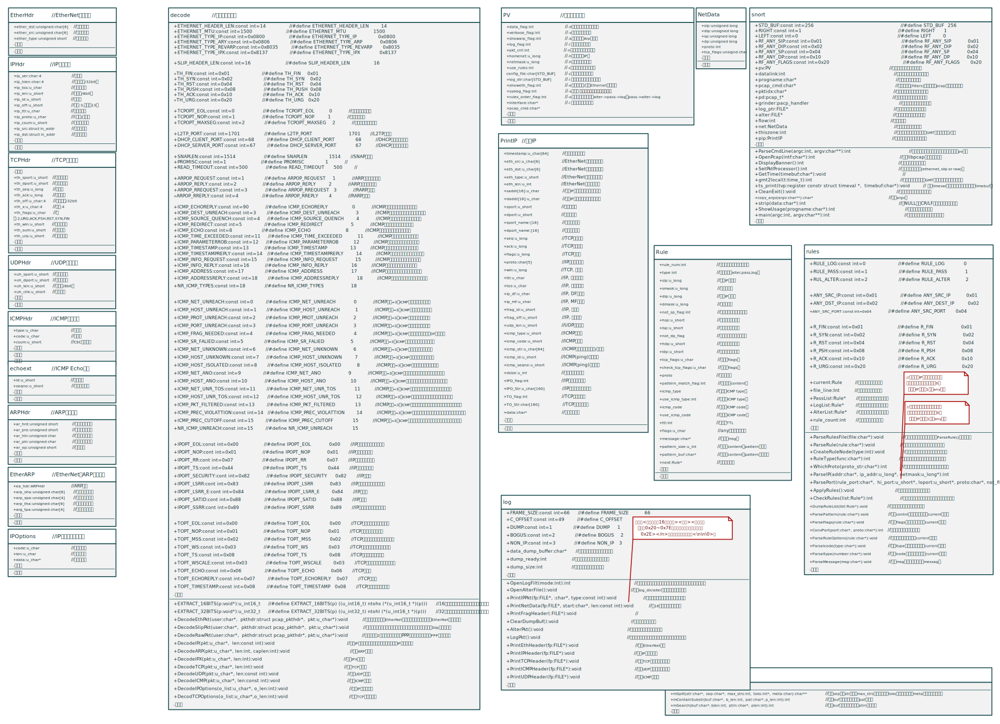
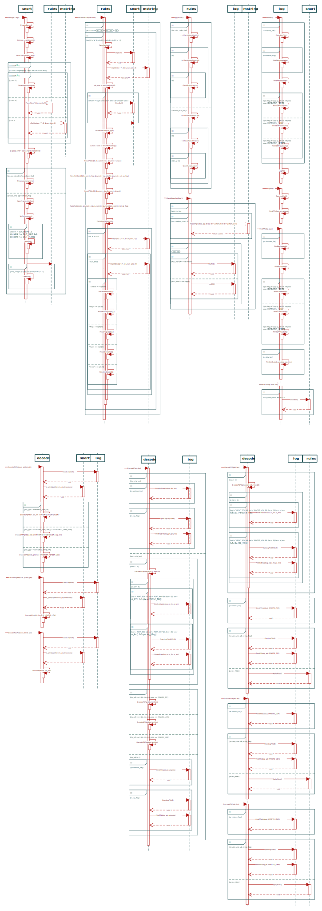

# Snort 分析  

# Snort 1.0  

## 简介  

这个程序穿过应用层从链路层读取和解析数据包，转储解码的数据包。  
它可以将这些数据包以解码的形式记录到基于远程对等方的IP地址生成的目录中。  
如果您指定要记录的流量和要通过的流量，则可以将其用作一种“穷人的入侵检测系统”。  
要记录的流量可以在命令行中过滤，也可以通过文件中包含的一组灵活的规则进行过滤。  
例如，当我外出旅行或周末外出时，我用它来记录办公室六台电脑的感兴趣的流量。  
它还可以很好地调试网络代码，因为它向您展示了有关数据包的大部分重要内容（TM）（在我看来）。  
代码很容易修改，可以提供更完整的包解码，所以可以随意提出建议。  

## 用法  

### 命令行  

- `snort -[options] <filters>`  

### 选项  

- `-a`      : 显示ARP数据包(非常基本的解码)。  
- `-c <cf>` : 使用配置文件`<cf>`。这是一个规则文件，它告诉系统要记录、警告或传递什么！  
- `-d`      : 转储应用层数据。  
- `-e`      : 显示/记录以太网数据包头数据。  
- `-h <hn>` : 将“家庭网络”设置为`<hn>`，这是一个类似192.168.1.0之类的C类IP地址。 如果使用此交换机，则来自外部网络的流量将被格式化，数据包转储的方向箭头指向右侧表示传入的外部流量，左侧表示传出的内部流量。  
- `-i <if>` : 使用接口`<if>`。Linux上默认为eth0，Solaris上默认为hme0，FreeBSD上默认为xl0。  
- `-l <ld>` : 将数据包记录到目录`<ld>`。建立一个分层目录结构，以日志目录为基本起始目录，以产生流量的远程对等方的IP地址为目录，将来自该地址的数据包存储在其中。  
- `-n <num>`: 处理`<num>`个数据包后退出。  
- `-o`		: 更改规则应用于数据包的顺序。这将在Pass->Alert->Log order中应用它们，而不是在标准的Alert->Pass->Log order中应用它们，这样人们就不必使用大量的BPF命令行参数来过滤警报规则。用户请求的。  
- `-s`		: 将警报消息记录到系统日志。在LinuxBoxen上，它们将出现在/var/log/secure中。  
- `-v`		: 使冗长(即详细模式)，将数据包打印到控制台。详细模式有一个大问题：它仍然有点慢。如果您使用Snort进行IDS工作，不要使用-v开关，您将丢弃数据包（不是很多，而是一些）。  
- `-V`		: 显示版本号并退出。  
- `-?`		: 显示用法摘要并退出。  

### 过滤器   

“过滤器”是TCPDump中看到的标准BPF样式的过滤器。  
查看TCPDump手册页，了解如何正确使用TCPDump。  
一般来说，您可以给它一个主机、网络或协议来进行过滤，以及一些逻辑语句来将其连接在一起，并获得您感兴趣的特定流量。  

例如：  

```bash
[zeus ~]# ./snort -h 192.168.1.0/24 -d -v host 192.168.1.1  
```  
> 记录进出主机192.168.1.1的通信量。    

```bash
[zeus ~]# ./snort -h 192.168.1.0/24 -d -v net 192.168.1 and not host 192.168.1.1   
```  
> 记录192.168.1.0/24 C类子网上的所有流量，但不记录进出192.168.1.1的流量。    
> 请注意，在“-h”开关之后指定的命令行数据的格式与在命令行末尾提供的BPF命令不同。   
> 很抱歉造成混淆，但我喜欢CIDER符号，我不会重写libpcap使其一致！    

### 规则    
  
**规则与rules.SAMPLE`文件**：   
> 规则的概念是0.98版本的新特性。    
> 现在您可以开始使用Snort作为一个真正的实时入侵检测系统，尽管它不如商业系统好。    
> 规则格式目前相当简单，包含在发行版中的“rules.SAMPLE”文件中。    
> 请在那里查看规则系统如何工作的完整解释。    

**警报与`alter`文件**：    
> 系统生成的警报被记录到一个名为（令人惊讶的是）“alter”的文件中。    
> 您可以使用“rt”或“tail-f”之类的命令来显示系统警报。    

**`-l`重定向日志目录**：  
> 请注意，系统需要使用“-l”标志将基于规则的日志重定向到特定目录。    
> 如果您没有为它指定一个位置，它就会进入Snort认为“.”所在的位置，可能是您当前的工作目录，也可能是Snort二进制文件所在的位置。    
> 我建议使用“-l”选项。    

**`-c`指定规则文件**：   
> 请记住，如果指定一个规则文件，它将不再记录所有内容，只记录与当前规则集匹配的内容。    
> 规则是按照它们在类中输入的顺序应用的。    
> 换句话说，警报规则是按照从规则文件中读取的顺序应用的，对于日志和传递规则也是如此。    

## 规则说明    

从版本0.99rc6开始，有全新的规则选项，旧规则将不再适用于此新版本。    

对所有IP地址和端口使用数字，此系统不进行查找。    
您可以使用“#”作为注释。    

### 规则格式  
- **文法**：`func proto src_ip/mask src_port_range -> dst_ip/mask dst_port_range (options)`    
- **单行限制**：规则只能在一行上，解析器不能处理多行规则！      
- **`any`通配**： 使用“any”表示IP地址通配符或端口通配符。   
- **`ip`**：是域名或点分十进制表示。  
- **`mask`**: CRID记法，表示连续mask个1，然后全0。   
- **`!`**: 对端口范围取反。  


### 规则应用顺序   
规则按以下顺序应用于流量。    
1. 警报规则。    
2. 通过规则。    
3. 日志规则。    

### 规则选项    
> 新的规则选项用括号括起来，用分号分隔。     
- `msg`=>要在警报/日志文件中输出的消息。    
- `flags`=>TCP标志，使用0表示完全没有标志。    
- `ttl`=>您想要输入的ttl值（非常适合捕捉traceroutes）。     
- `content`=>包应用层，在这里查找缓冲区溢出。    
- `itype`=>ICMP类型的编号。    
- `icode`=>ICMP代码的编号。    

### 示例与规则说明    

**基本用法示例**：   

`log tcp any any -> 192.168.1.1/32 23`    
> 此规则记录从任何网络上的任何计算机到您（名义上）网络上特定IP地址的telnet通信。   

`log icmp any any -> 192.168.1.0/24 any`    
> 这个将所有ICMP通信记录到您的本地C类地址。    
> 注意端口通配符，即使是ICMP通信也需要为端口输入一些内容，这样规则解析器就不会混淆了。    

**双向通信的规则示例**：  
```
pass tcp any 80 -> 192.168.1.0/24 any   
pass tcp 192.168.1.0/24 any -> any 80   
```
> 此规则将双向传递站点所做的所有传出web浏览。    
> 请注意，这些规则都是单向的，因此如果您希望能够记录/忽略/提醒双向通信，则每个要执行的操作需要两个规则！    

**规则选项的示例**：    
```
alter tcp 192.168.1.0/24 any -> any 111 (msg:"Portmapper call";)    
alter tcp any 111 -> 192.168.1.0/24 any (msg:"Portmapper call";)    
```
> 此示例显示了警报规则的外观，并在规则末尾添加了“规则选项”：    

**端口范围的示例**：  
```
log tcp any :1024 -> 192.168.1.0/24 :1024    
```
> 现在我们来看看端口范围是如何指定的这个记录了从任何地方到本地C类的所有TCP通信，这些通信来自1024以下的端口。    


`log tcp any 6000:6010 -> 192.168.1.0/24 6000:6010`    
> 这个监视从任何计算机到C类的端口范围（X个窗口）。    

```
pass udp any 1024: -> 192.168.1.0/24 1024:    
```
> 这一个向/从大于1024的端口传递流量。    

**`flags`选项的示例**： 
下面这些规则进入规则的选项部分   
可以在上搜索TCP标志    
标志值如下：   
- S = SYN    
- F = FIN    
- A = ACK    
- U = URG    
- P = PSH    
- R = RST    
- 0 = NULL   

`alert tcp any any -> 192.168.1.0/24 any (msg:"SYN-FIN scan!"; flags: SF;)`    
> 此规则将查找SYN FIN扫描。    

`alert tcp any any -> 192.168.1.0/24 any (msg:"Null scan!"; flags: 0;)`    
> 这个会找到TCP空扫描。    


**`content`选项的示例**：   

> 内容字符串将与应用层中包含的数据相匹配。     
> 此字符串可以是二进制的，也可以是文本，二进制部分由管道“|”符号表示。    
> 实际的“二进制”代码是用十六进制表示法编写的。    
> 如果要将管道符号放入内容匹配字符串中，只需使用“\|”，这将在模式缓冲区中放入一个“|”。    

`alert tcp any any -> 192.168.1.0/24 143 (msg:"IMAP Buffer overflow!"; content:"|90E8 C0FF FFFF|/bin/sh";)`    
> 下面是一个基于内容的警报示例。    

`alert tcp any any -> 192.168.1.0/24 80 (msg:"PHF attempt"; content:"/cgi-bin/phf";)`    
> 一个PHF攻击检测的示例，在应用层中只搜索一个纯文本字符串。    

```
alert tcp any any -> 192.168.1.0/24 111 (msg:"External mountd access"; content:"|00 01 86 A5|";)  
alert udp any any -> 192.168.1.0/24 111 (msg:"External mountd access"; content:"|00 01 86 A5|";)  
```
> 应用层中的直接二进制代码（外部装载访问尝试）的示例。    

**`ttl`选项示例**：   
`alert udp any any -> 192.168.1.0/24 any (msg:"Traceroute"; ttl:1;)`    
> 是一个如何使用99rc6的新ttl选项功能检测跟踪路由的示例。    

**`itype`和`icode`选项示例**：    

`alert icmp any any -> 10.1.1.0/24 any (msg:"Being Pinged"; itype: 8;) `    
> 这一个将检测到来自外部的ping（大概）。     

`alert icmp any any -> any any (msg:"Port Unreachable"; itype: 3; icode: 1;)`    
> 下一步将检测到ICMP主机不可访问，这在某些情况下可能是有意义的。    

## 源码分析    

- **分析信息**：将分析信息注释在源代码里面不太好，所以我**把分析信息注释在模型**里面。   
- **静态结构分析**：分析为对象模型。  
- **动态行为分析**：分析为动态模型。  
- **程序整体分析**：分析为功能模型。  

**关键代码**：  
- `OpenPcap()`函数：打开Pcap抓软件，获取并设置相关抓包信息，如：`dp`,`datalink`。  
- `grinder`保存数据包处理器：
    > snort.c 116行代码，调用自定义的`SetPktProcessor()`设置数据包处理函数的函数指针给`grinder`全局变量。  
    >`SetPktProcess()`函数根据进程所在主机的数据链路层来决定数据包处理函数。  
    >当数据链路层是EtherNet时，用`DecodeEthPkt()`处理数据包。  
    >当数据链路层是Slip时，用`DecodeSlipPkt()`处理数据包。  
    >当数据链路层是Raw时，用`DecodeRawPkt()`处理数据包。  
    >```C
    >116  SetPktProcessor();
    >```
- `pcap_loop`回调`grinder`处理数据包:   
    > snort.c 119行代码，将pd,pv.pkt_cnt,grinder传递个pacp模块的抓包函数`pcap_loop`。  
    >`pcap_loop`将至多抓包pv.pkt_cnt次，并回调`grinder`函数处理数据包。  
    >```C
    >119 if(pcap_loop(pd, pv.pkt_cnt, grinder, NULL) < 0)  
    >```

### 功能模型    

  


### 对象模型   

**建模规则**：  
- 所有成员的访问权限一律为`public`。  
- 一对`.h`与`.c`映射为一个模块类。   
- `struct`：映射为一个类，其成员映射为域。  
- 宏常量：映射为模块类类常量。  
- 宏函数：隐射为模块类静态方法。  
- 全局变量：映射为模块类类变量。  
- 函数：映射为模块类的静态方法。  
- main函数：映射为公有静态方法。  

  

### 动态模型    

**建模规则**：   
- 调用系统外模块不展开生命线。  
- 只被调用一次的函数，调用时则连续展开。  
- 被多个地方调用的函数，则独立为其建立生命线。  

  
