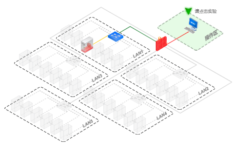

<!-- 下面是 实验报告 md 封面模板， 你可以自行修改-->

<!-- 显示校徽和校名图片，注意图片文件路径一定与md文件相匹配，否则无法显示-->
 </img>
<p align=center>  </img> </p>

<!-- 下面是标题和信息的格式， infor1 给出 标题的格式， infor2 定义 信息的格式-->
<style>
p.infor1 {text-indent:0em;font-size:22.0pt;line-height:150%;font-family:黑体; font-style:blod;text-align:center;}
p.infor2 {text-indent:10em;font-size:16.0pt;line-height:150%;font-family:黑体; font-style:blod;}
p.date {text-indent:0em;font-size:16.0pt;font-family:黑体; font-style:blod;text-align:center;}
</style>

<!-- 下面是标题-->
<br/>
<p class="infor1">入侵检测技术实验报告</p>
<p class="infor1">入侵检测系统Snort</p>  <!--***************** 一定要修改为你的课设题目 ******************-->
<br/>

<!-- 下面是信息-->
<b>
<p class="infor2">学&nbsp;&nbsp;&nbsp;&nbsp;院 &nbsp; <u>计算机学院</u>
<p class="infor2">专&nbsp;&nbsp;&nbsp;&nbsp;业 &nbsp; <u>信息安全</u>
<p class="infor2">年级班别 &nbsp; <u> 信安18（2） </u>
<p class="infor2">学&nbsp;&nbsp;&nbsp;&nbsp;号 &nbsp; <u>318005434</u>
<p class="infor2">学生姓名 &nbsp; <u>钟景文</u>
<p class="infor2">指导老师 &nbsp; <u>郝彦军</u>

<!-- 下面是日期-->
<br/><br/><br/>
<p class="date">2021 年 6 月</p>
</b>

<!-- 下面指定打印时标题1处自动分页-->
<style>
@media print {
  h1 {
    page-break-before: always;
  }
}
</style>


# 实验目的
1. 学习入侵检测系统Snort的安装和使用。  

# 实验平台
1. 操作机：
	- OS: Windows XP 
	- IP: 172.16.11.2
2. 目标机：
	- OS: Windows XP
	- IP：172.16.12.2
2. 使用软件:   
	- 端口扫描：Namp。  
3. 开发语言与技术：无。  



# 实验前准备
1. 查阅Snort源代码，掌握Snort原理和使用。  

# 实验内容

## Snort简介与安装  

### IDS基础概念  

<div id="sectionDoc" class="markdown-body czsc_con smallTxt "><h2 id="-">实验步骤</h2>
<p><strong>Snort</strong></p>
<p>Snort，它是一款免费、开源的网络入侵防御系统<code>（Network Intrusion Prevention System，NIPS）</code>和网络入侵检测系统<code>（Network Intrusion Detection System，NIDS）</code>工具，用于管理和防御黑客入侵您的 Web 站点、应用程序和支持 Internet 的程序，能够运行在几乎所有的操作系统上。</p>
<p>从本质上来讲，Snort就是一个网络数据包嗅探器，但其真正的价值在于把数据包经过规则处理的过程。Snort灵活强大的语言能对网络中的所有的数据包进行分析，决定如何处理任何特殊的数据包，可供选择的方式有忽略，记录和报警。</p>
<p>Snort的规则都保存在文本文件中，规则一类别分类，不同类别的规则存储在不同的文件中。主配置文件snort.conf引用这些规则文件。Snort在启动的时候读取这些文件，并建立内部数据结构或链表以用这些规则来捕获数据。Snort已经预先定义了许多入侵检测规则，用户可以自由添加自定义的规则，也可以移除一些内建规则。</p>
<p>Snort依赖Libcap，几乎所有的操作系统都提供该工具。Libcap是一个强大的网络驱动程序库，但是在流量超出百兆负荷是它就无法正常运转。</p>
<h3 id="-ids-"><strong>入侵检测系统（IDS）</strong>基础概念</h3>
<p><strong>本次实验我们首先学习IDS的作用，然后学习IDS如何检测入侵，接下来了解IDS的分类，最后了解IDS的选择与部署。</strong></p>
<h3 id="-">实验步骤</h3>
<h4 id="-1-ids-">步骤1：入侵检测系统（IDS）的作用</h4>
<p>当我们谈到网络安全，我们首先想到的就是防火墙。入侵检测系统就相当于防火墙之后的第二道安全关卡。如果说防火墙相当门卫的话那么入侵检测系统就相当于内部监控系统。入侵检测有传感器和管理员控制台组成，前者相当于密布到处的摄像头，而后者就相当于一排监视画面，管理员则是坐在监视画面之前的保安。显然只有门卫的机构是不安全的。</p>
<p><code>IDS</code>通过分析数据包的内容检测来自网络的未经许可的访问，资源请求等可疑行为，从已知的攻击类型中发现是否有人正在试图攻击网络或者主机，并成功捕获攻击。利用入侵检测系统收集的信息，网管或者管理员能够采取有效措施加固自己的系统，从而避免造成更多的损失。除了检测攻击外，IDS还能记录下攻击者的罪证，以便以后的取证。</p>
<p><strong>IDS可以通过执行以下的任务来实现其功能：</strong></p>
<ol>
<li>监视，分析用户和系统活动</li>
<li>审计系统的配置和弱点</li>
<li>异常活动的统计分析</li>
<li>评估关键系统和数据文件的完整性</li>
<li>对操作系统和其他应用程序的日志进行审计，识别用户违反安全策略的行为</li>
<li>实时报警和主动响应</li>
</ol>
<p>到这里我们就基本上了解了IDS的作用。下一步学习IDS如何检测入侵。</p>
<h4 id="-2-ids-">步骤2：IDS如何检测入侵</h4>
<p>要判断是否发生了入侵，就需要用到检测技术。</p>
<p>IDS检测技术基本可以分为<strong>两大类：</strong></p>
<ul>
<li>基于特征（规则）的入侵检测</li>
<li>基于异常的入侵检测</li>
</ul>
<p>接下来分别介绍这两类：</p>
<h5 id="-">特征检测技术：</h5>
<ul>
<li>对于基于特征（规则）的检测技术来说，首先要定义违背安全策略的事件的特征，如网络数据包的某些头信息。检测主要判别这类特征是否在所收集到的数据中出现。此方法非常类似杀毒软件。IDS系统包含一系列已知入侵行为的特征的规则集合，每当IDS匹配到一条入侵规则时，都会触发一条警报，为了提高准确性，IDS还需要在特征匹配之前对数据包进行预处理。比如格式统一等。</li>
<li>一方面，特征检测技术仅仅是机械的匹配字符串，因此有时候即使是正常的流量也可能触发警报，导致错报。另一方面，字符串匹配也很容易被有心的攻击者避开。对于一些明显的反常行为，例如多次错误登陆，午夜登陆，异地登陆等，因为没有可以用来匹配的字符串，特征检测也无法检测出来。还有就是要不断的更新特征库，特征库的增长代价也越大。</li>
</ul>
<h5 id="-"><strong>异常检测技术:</strong></h5>
<ul>
<li>异常检测技术不使用入侵特征库，而是通过识别异常行为来检测，那么有异常行为检测，那肯定有一个判断正常行为的基准，一般IDS允许用户定义一个正常行为的基准，例如登陆时间，登陆地点，登陆尝试次数等。然后它可以通过采样统计，神经网络等方法构造“用户正常行为基准”。</li>
<li>异常检测IDS从用户的系统行为中收集一组数据，检查其是否偏离“正常行为基准”，异常检测技术在检测未知的攻击时比特征检测高效准确。例如用异常检测来检测提升权限攻击。如果一个用户本身是没有权限访问某写重要的文件，但该用户却可以访问该文件，异常检测就能及时发现。</li>
<li>但异常检测需要使用复杂的算法，计算代价比特征检测高很多，在某些情况下异常检测比特征检测更容易丢包和漏报。比如一种异常行为发生在IDS收集用户正常行为建模时，IDS就会把它看作是正常的，就会造成漏报。同时一些没有被收集到正常行为基准的正常流量会被当作是恶意流量处理，会导致错报。</li>
</ul>
<p><strong>小提示：</strong></p>
<p>在IDS中漏报和错报所处的地位是不一样的，造成的后果程度也不一样。误报只是将一些正常当作了异常，会增加一些工作量。但漏报的性质就完全不一样了，漏报标志系统发生了实质性的损害后才被察觉，这以为着IDS没有起到作用。所以对于IDS来说应该降低漏报率，保持一定的误报。</p>
<p>本步骤我们学习了IDS如何检测入侵，下一步学习IDS有哪些分类</p>
<h4 id="-3-ids-">步骤3：IDS的分类</h4>
<p>IDS通常分为两大类：</p>
<ul>
<li><strong>NIDS</strong><code>（Network Intrusion Detection System）</code>是站在整个网络高度的IDS。在一般情况下，计算机网卡工作在非混杂模式下，即只有数据包中的目的地址是本机时，网卡才会接收并处理，否则丢弃。在混杂模式时，网卡会接收所有流经本机的数据包，不管目的地址是不是自己，在混杂模式下，NIDS可以监视不流向自己的数据包。</li>
</ul>
<ul>
<li><strong>HIDS</strong><code>（Host Intrusion Detection System）</code>基于主机。与<strong>NIDS</strong>不同的是<strong>HIDS</strong>只能保护它所在的计算机，计算机网卡设置的是“非混杂模式”。在HIDS中，网卡只在正常的“非混杂模式”下工作，因为所有的网卡都能设置成混杂模式的。</li>
</ul>
<p>本步骤我们学习了IDS的分类，下一步了解IDS的选择与部署</p>
<h4 id="-4-ids-">步骤4：IDS的选择与部署</h4>
<p><strong>IDS的选择</strong></p>
<p>我们通常在选择IDS的时候，会考虑以下几点：</p>
<ul>
<li>实时性；</li>
<li>其他产品联动，自动反应能力；</li>
<li>能检测所有事件，不会发生漏报；</li>
<li>能适应多种操作系统平台；</li>
</ul>
<p><strong>IDS部署原则</strong></p>
<p>对IDS的部署，唯一的要求就是IDS应当挂在所有关键流量都必须流经的链路上。关键流量的定义是所有可能对网络，主机造成损害的流量。包括：</p>
<ul>
<li>所有从外网进入内网的流量；</li>
<li>所有访问核心服务器区域的流量；</li>
</ul>
<p>IDS在交换网络中的位置一般选择在：</p>
<ul>
<li>尽可能靠近攻击源的地方；</li>
<li>尽可能靠近受保护源的地方；</li>
</ul>
<h4 id="-ids-ips-"><strong>IDS与IPS的区别</strong></h4>
<p><strong>IPS</strong><code>（Intrusion Prevention System</code>入侵防御系统，<strong>IDS</strong><code>Intrusion Detection System</code>入侵检测系统。</p>
<p>IPS是位于防火墙和网络的设备之间的设备。如果检测到攻击，IPS会在这种攻击扩散到网络的其它地方之前阻止这个恶意的通信。而IDS只是存在于你的网络之外起到报警的作用，而不是在你的网络前面起到防御的作用。</p>
<p>IPS检测攻击的方法也与IDS不同。一般来说，IPS系统都依靠对数据包的检测。IPS将检查入网的数据包，确定这种数据包的真正用途，然后决定是否允许这种数据包进入你的网络。IDS的思路是监视经过你的防火墙的全部通信并且查找可能是恶意的通信。即使这个通信信息被检测到了并且被证实是一种攻击，IDS系统除了向管理员发出警报和记录这个攻击之外没有力量做出任何事情。</p>
<h4 id="-">实验结果分析与总结</h4>
<p>这部分主要讲解了入侵检测系统的基本概念，了解入侵检测系统的原理和工作流程，入侵检测系统的分类和部署。了解<strong>IDS</strong>和<strong>IPS</strong>的区别。</p>
</div>

### Snort概念简述  

<div id="sectionDoc" class="markdown-body czsc_con smallTxt "><h3 id="-">实验步骤</h3>
<p><strong>Snort入侵检测系统概述</strong></p>
<p><strong>本实验首先介绍snort工具的原理，最后介绍Snort的工作流程</strong></p>
<h4 id="-1-snort-"><strong>步骤1：snort原理</strong></h4>
<p>我们要分析工具的原理，得先了解工具的整体结构。</p>
<p><strong>整体结构</strong></p>
<p>Snort能够对网络上的数据包进行抓包分析，但区别于其它嗅探器的是，它能根据所定义的规则进行响应及处理。Snort 通过对获取的数据包，进行各规则的分析后，根据规则链，可采取以下五种响应机制：</p>
<ul>
<li><code>Activation：</code> 报警并启动另外一个动态规则链</li>
<li><code>Dynamic：</code>由其它的规则包调用</li>
<li><code>Alert：</code>报警</li>
<li><code>Pass：</code>忽略</li>
<li><code>Log：</code>不报警但记录网络流量</li>
</ul>
<p>Snort有数据包嗅探，数据包分析，数据包检测，响应处理等多种功能，每个模块实现不同的功能，各模块都是用插件的方式和Snort相结合，功能扩展方便。主要由几大软件模块组成，包括预处理和检测插件，报警输出插件等。预处理和检测插件使Snort的检测引擎能够更高效的检测数据包的内容，报警输出插件可以用多种方法输出报警信息。</p>
<p>以下是Snort的基本组成模块：</p>
<ul>
<li>数据包嗅探器，主要负责监听网络数据包，并根据TCP/IP协议解析数据包。</li>
<li>预处理模块，1.包重组预处理器，它的作用是为了防止攻击信息被拆分到多个包中而 逃避了Snort的检测；2.协议编码预处理器，它的功能是把数据包协议解码成一个统一的格式，再传送给检测模块；3.协议异常检测预处器。</li>
<li>检测引擎模块，当预处理器把数据包送过来后，检测引擎将这些数据包与三维链表形式的检测规则进行匹配，一旦发现数据包中的内容和某条规则相匹配，就通知报警模块。</li>
<li>报警/日志模块，检测引擎将数据包传送给报警模块后，报警模块会根据规则定义（<code>alert</code>，<code>log..</code>）对其进行不同的处理（数据库，日志）。</li>
</ul>
<p>在本步骤中我们了解了Snort的原理和整体结构，下面介绍它内部的工作流程：</p>
<h4 id="-2-snort-">步骤2：Snort内部工作流程</h4>
<p>Snort最基本的功能就是数据包嗅探。但是包嗅探只是Snort工作的开始。Snort从网卡补货数据包，然后数据包经包解码器填入到链路层协议的包结构体中，以便对更高层次的协议进行解码。</p>
<p>随后，数据包被送到各种各样的预处理插件处理。然后，数据包被送到金策引擎中的所有规则进行一次性检测，如果有符合规则链的数据包，就会被检测出来。最后检测结果被送到输出模块，数据包或被丢弃，或产生日志，报警。</p>
<ul>
<li>下面对这几个模块详细介绍：</li>
</ul>
<h5 id="-"><strong>包解码器与预处理器</strong></h5>
<p>包解码模块和预处理模块功能类似，都是在规则检测引擎之前对数据包的处理，所以两个模块一并介绍。 包解码模块主要是将从监控网络当中抓取的原始网络数据包，按照各个网络协议栈从下至上进行解码，并将解码数据保存到各个对应的数据结构当中，最后交由预处理模块进行处理。</p>
<p>解码后的数据包经过预处理之后才能被主探测引擎进行规则匹配。预处理器的主要用来应对一些IDS攻击手段。其作用包括：</p>
<blockquote>
<p>针对可疑行为检查包或修改包，以便探测引擎能对其正确解释。 </p>
<p>负责对流量标准化，以便探测引擎能精确匹配特征。</p>
</blockquote>
<p>而Snort主要包含以下三类预处理器：</p>
<ul>
<li>包重组预处理器：<ul>
<li>frag3：IP分片重组和攻击监测。</li>
<li>stream：维持TCP流状态，进行会话重组。</li>
</ul>
</li>
<li>协议规范化预处理器：<ul>
<li>http_inspect：规范HTTP流。</li>
<li>rpcDecode：规范RPC调用。</li>
</ul>
</li>
<li>异常检测预处理器：<ul>
<li>ARP spoof：检测ARP欺骗。</li>
<li>sfPortscan：检测端口扫描。</li>
</ul>
</li>
</ul>
<p><strong>检测引擎模块</strong></p>
<p>检测引擎模块是Snort中最重要的部分，它的作用是探测数据包中是否含有入侵行为。</p>
<p>检测引擎可以分为两个部分：</p>
<blockquote>
<ul>
<li>规则建立/翻译</li>
<li>基于规则的检测引擎</li>
</ul>
</blockquote>
<p>下面对其进行详细介绍： </p>
<ul>
<li><strong>语法的规则</strong></li>
</ul>
<p>首先看一下Snort规则格式。这里以FTP格式为例：</p>
<p><strong>1. 规则头</strong></p>
<p><code>alert TCP EXTERNAL_NET any -&gt; HOME_NET 21</code></p>
<p>这条规则的意思是：指明所有从源IP <code>EXTERNAL_NET</code>上任意端口发出的TCP数据包到目的IP <code>HOME_NET</code>地址上的21号端口都会触发警告。</p>
<p>它的<strong>详细含义</strong>如下：</p>
<p><code>alert</code>     输出响应为报警。还可以选择其他方式，如log:记录网络流量不报警                   </p>
<p><code>pass</code>:忽略该数据包</p>
<p><code>dynamic:</code>当被上层的激活规则调                     用时记录网络流量</p>
<p><code>active:</code>报警并且开启另外一个动                    态规则</p>
<p><code>TCP</code> 这里是协议字段，表明使用的TCP协议。还可以是其他协议，比如            UDP,IP,ICMP等</p>
<p><code>EXTERNAL_NET</code>    这部分是源IP地址，默认情况下使用any。这里是用变量代替的，IP地址由数          字IP和一个cidr块组成，如192.168.1.0/24 </p>
<p><code>`any</code>       该位置是源端口，如果不指定特定端口可使用“any”</p>
<p>-&gt;       方向操作符箭头表示会话的方向，允许采用的值包括单项“-&gt;”,双向“&lt;&gt;”</p>
<p><code>HOME_NET</code>     这里是目的地址，用变量表示</p>
<p><code>21</code>  目的IP</p>
<p><strong>2. 规则选项</strong>
括号里是规则选项。Snort的规则语法规定：多个规则选项之间必须用<code>;</code> 隔开；规则关键字和参数之间必须用<code>:</code>隔开。</p>
<pre><code class="lang-`">(msg:"FTP MDTM overflow attempt"; flow:to_server,established;content:"MDTM";nocase;isdataat:100,relative;reference:bugtraq,9751;reference:cve,2001-1021;classtype:attempted-admin;sid:2546;recv:5;)
</code></pre>
<ul>
<li>下面解释它的具体含义：</li>
</ul>
<p><code>msg:"FTP MDTM overflow attempt"</code>  这是一条报警信息，指明如果发现了与后面“content”的内容匹配           的数据，就会发出一条“FTP MDTM overflow attempt”的报警信息</p>
<p><code>flow:to_server,established</code>    flow是Snort的规则选项部分包含链接到检测插件的关键字。这里           表示一个指向客户服务器检测插件的指针。客户服务器插件链接到           Stream4预处理器，以检测数据包是否包含在已建立会话中。</p>
<p><code>content:"MTDM"</code>     Snort将使用字符串匹配算法将引号中的内容与包匹配</p>
<p><code>nocase</code>      忽略大小写</p>
<p><code>isdataat:100,relative</code>   表示目标是数据的偏移量，这里的偏移量是100B。</p>
<p><code>reference</code>    关键词包含第三方对攻击的解释信息。</p>
<p><code>classtype:attemptedadmin</code>    攻击往往被分类，以便用户迅速识别攻击和它的优先级。这里是尝           试以管理员登陆。还可以加优先级，优先级用数字表示，1表示高，2             表示中，3表示低。</p>
<p><code>sid:2546</code>        这是Snort规则独特的标识符，Snort中所有的规则都有这样一个独            特的标志数字。</p>
<p><code>rev:5</code>         该选项表示规则的版本。</p>
<h5 id="-"><strong>报警输出模块</strong></h5>
<ul>
<li>经检测引擎查询后的Snort数据需要以某种方式输出。依据检测引擎在包中所找到的东西，输出报警系统用来产生记录行为或者日志报警。这条报警信息会通过网络<code>UNIX sockets</code>或者<code>SNMP</code>协议的<code>trap</code>命令送给日志文件。报警信息还可以存储在数据库中，其中最常用的数据库是<code>MySQL</code>,因为它是开源免费。日志可以存储为简单的文本文件，<code>TCPdump</code>格式文件或者其他格式文件。</li>
<li>输出模块还可以根据指定的保持日志和报警系统产生输出信息的方式来执行不同的动作。根据配置，输出模块基本可以做以下几件事：<ul>
<li>简单的在Snort/alert 文件或者其他文件中记录日志</li>
<li>发送SNMP trap</li>
<li>将日志记录到数据库中；</li>
<li>修改路由器或者防火墙配置</li>
</ul>
</li>
</ul>
<h4 id="-">实验结果分析与总结</h4>
<p> 本实验我们学习了Snort的原理及其工作流程，为我们以后的分析打下了良好的基础。</p>
<h4 id="-">思考</h4>
<p>1.对<strong>Snort</strong>性能影响最大的是什么？</p>
<p>2.<strong>Snort</strong>和传统的<strong>IDS</strong>的区别在哪儿？</p>
</div>

### Snort的安装  

<div id="sectionDoc" class="markdown-body czsc_con smallTxt "><h3 id="-">实验步骤</h3>
<p><strong>Snort入侵检测系统的安装</strong></p>
<p><strong>本次实验前四步将安装必备的一些入侵检测系统软件，并在第五步进行测试</strong></p>
<h4 id="-1-snort-winpcap-">步骤1：<strong>安装Snort和Winpcap</strong>：</h4>
<p>首先在桌面上点击<code>Snort_2_8_3_1.Install.exe</code>安装程序，点击运行，然后一路<code>next</code>就行了，</p>
<p></p>
<p>在桌面上找到<code>WinPcap</code>安装程序，一直点击<code>Next</code>即可安装(本实验中已安装WinPcap，可忽略此步)</p>
<p></p>
<h4 id="-2-appserv-">步骤2：<strong>安装AppServ</strong>：</h4>
<p>本步骤将安装<code>AppServ</code></p>
<p>首先在桌面上找到<code>appserv-win32-2.5.10.exe</code>安装程序：</p>
<p></p>
<p>运行安装程序后，会出现如下的设置服务器信息界面：</p>
<p></p>
<p>在<code>Server Name</code>中输入域名，因为只是在本机进行集成式安装，所以可以输入<code>localhost</code>表示本地域名。</p>
<p><code>Administrator's Email Address</code>中输入管理员的邮箱地址，就是你自己的邮箱。</p>
<p>本机如果已经安装了IIS并且启动了Web Server,则会因为IIS Web Server默认在TCP 80 端口监听，和Apache Web Server发生冲突。需要修改Apache Web Server在其他端口监听。</p>
<p>此处将监听端口设置为8080。</p>
<p></p>
<p>然后"Next"，出现如下页面。</p>
<p></p>
<p>在窗口中输入管理员数据库密码，这里是自己设定，本文设定为123456，请牢记设置的密码，接下来点击<code>install</code>进入安装过程，开始安装<code>AppServ</code></p>
<p>然后点击<code>Finish</code>就可以了，系统会自动启动<code>MySQL</code>和<code>Apache</code>服务器。</p>
<p></p>
<p>安装完成后，还需要将<code>C:\AppServ\php5</code>目录下的<code>php.ini-dist</code>文件改名为<code>php.ini</code>，这样我们后期修改的时候会比较方便。</p>
<p>在浏览器输入<code>http://localhost:8080</code>，然后我们测试<code>AppServ</code>，查看是否安装成功。</p>
<p>在浏览器地址栏中输入：<code>http://localhost:8080/phpinfo.php</code>：</p>
<p></p>
<p>可以看到，phpinfo成功的显示，说明我们已经安装成功了。</p>
<p>最后打开浏览器，输入：<code>http://localhost:8080/phpMyAdmin/index.php</code>，就可以进入phpmyadmin的页面了：</p>
<p></p>
<p>到这里就成功的安装了Appserv，我们下一步继续配置<code>AppServ</code>，有的同学肯定有疑问了，我们不是已经安装成功了吗？为什么还需要配置呢？</p>
<p>因为AppServ对于其<code>phpMyAdmin</code>组件给出的配置不一定适合我们，因此需要为此需要进行一些设置。</p>
<h4 id="-3-appserv">步骤3：配置Appserv</h4>
<p><strong>1：</strong>编辑Apache服务器配置文件</p>
<p>打开安装目录下<code>Apache2.2\conf</code>文件夹里的<code>httpd.conf</code>，需要检查<code>ServerName</code>是否为<code>localhost:8080</code>  ，<code>DocumentRoot</code>是否为<code>"C:/AppServ/www"</code>，如果不是，则需要修改为上述。</p>
<p></p>
<p><strong>2：</strong>修改完了网站默认目录后，我们来编辑<code>phpMyadmin</code>中的关键文件：</p>
<p>打开<code>C:\AppServ\www\phpMyAdmin\libraries</code>目录下的<code>config.default.php</code>文件</p>
<p>推荐以下修改：</p>
<pre><code>设置phpmyadmin的URL，$cfg['PmaAbsoluteUri'] = 'http://localhost:8080/phpMyAdmin/'; 这里假设phpMyAdmin在默认站点的根目录下

设置root密码，$cfg['blowfish_secret'] = 'XXXX'; 其中XXXX为你设置的root密码。比如我这里设置的是123456

$cfg['DefaultLang'] = 'zh-gb2312';

$cfg['DefaultCharset'] = 'gb2312';

$cfg['Servers'][$i]['auth_type'] = 'config'; 

$cfg['Servers'][$i]['user'] = 'root'; // MySQL user

$cfg['Servers'][$i]['password'] = 'XXXX';比如我这里设置的是123456
</code></pre><p>操作如图：</p>
<p></p>
<p></p>
<p></p>
<p></p>
<p></p>
<p><strong>3：</strong>配置<code>PHP</code>初始化文件<code>php.ini</code>。该文件负责<code>PHP</code>的配置任务，所以可以通过编辑该文件来进行配置。路径是<code>C:\WINDOWS\php.ini</code>，打开后查找以下项：</p>
<pre><code>open_basedir=      

magic_quotes_gpc=On     

file_uploads=On
</code></pre><p>第一项允许一个脚本访问文件系统的任何地方。如果<code>PHP</code>的一个脚本被黑客控制了，那么该黑客就可以利用它来改变文件系统的设置或得到一些不该得到的信息。</p>
<p>第二项的修同样处于安全的考虑。<code>ACID</code>不能正确检查用户输入。如果一个恶意用户企图访问<code>ACID</code>，他就很可能进行SQL注入攻击。关闭第二项的开关可以有效的抑制该攻击。</p>
<p>第三项：最好不要启用文件上传功能，有可能造成文件上传漏洞文件上传漏洞被黑客攻击。</p>
<p>将上面三项修改为：</p>
<pre><code>open_basedir=C:\AppServ\www

magic_quotes_gpc=Off

file_uploads=Off
</code></pre><p></p>
</code></pre><p></p>
</code></pre><p></p>
<p><strong>4：</strong>创建Snort必须的数据库。</p>
<p>现在建立Snort运行必需的Snort库和Snort_archive库：</p>
<p>首先打开命令提示符，输入<code>mysql -u root -p</code>,<code>-u</code>后面跟的是用户名，<code>-p</code>代表密码。</p>
<p>然后再使用下列语句创建数据库：</p>
<p><code>create database snort;</code></p>
<p><code>create database snort_archive;</code></p>
<p></p>
<p><strong>5：</strong>使用脚本帮我们执行命令</p>
<p>使用<code>C:\Snort\schemas</code>目录下的<code>create_mysql</code>脚本建立Snort运行时必需的数据表，因为直接一条命令一条命令的建表很麻烦也很慢，所以我们可以把要进行的数据库操作写在一个脚本文件中，然后直接在数据库中导入这个文件就可以一次性执行多条命令。</p>
<p>先在<code>snort</code>数据库中建表：</p>
<p><code>use snort;</code> 选择你要进行操作的数据库
<code>source C:\Snort\schemas\create_mysql</code> 导入要执行的脚本文件</p>
<p></p>
<p>然后在<code>snort_archive</code>建表：</p>
<p><code>use snort_archive;</code>选择你要进行操作的数据库
<code>source C:\Snort\schemas\create_mysql</code> 导入要执行的脚本文件</p>
<p></p>
<p>执行完create_mysql脚本后，用户可以通过在mysql提示符下运行sql语句show tables；来验证配置的正确性。</p>
<p> <strong>6：</strong>必需在Apache服务器主机（暂定为localhost）上建立ACID和Snort用户，并为它们分配相关权限和访问密码，使ACID能正常访问后台数据库mysql中Snort相关的数据文件，退出重新进入mysql，然后执行下面的命令：</p>
<p><code>grant usage on *.* to "acid"@"localhost" identified by "123456";</code></p>
<p><code>grant usage on *.* to "Snort"@"localhost" identified by "123456";</code></p>
<p><code>grant select, insert, update, delete, create, alter on Snort.* to "acid"@"localhost";</code></p>
<p><code>grant select, insert on Snort.* to "Snort"@"localhost";</code></p>
<p><code>grant select, insert, update, delete, create, alter on Snort_archive.* to "acid"@"localhost";</code></p>
<p></p>
<!-- <p></p> -->
<p>为了方便，我们可以将用户<code>"acid"@"localhost"</code>，<code>"Snort"@"localhost"</code>的密码改为<code>root</code>用户的一样。可以直接在<code>phpmyadmin</code>中更改 ，在浏览器中输入<code>http://localhost:8080/phpMyadmin/index.php</code>点击<code>权限</code>，
选择刚刚新建的用户后面编辑图标找到<code>更改密码</code>模块，输入密码，我这里是<code>123456</code>,然后点击<code>执行</code>：</p>
<p></p>
<p>到这里我们就完成了Apache服务的配置和phpmyadmin的配置。</p>
<h4 id="-4-adodb-jpgragh-acid-">步骤4：<strong>安装Adodb,jpgragh和ACID</strong>：</h4>
<p>在<code>下载</code>中找到文件</p>
<p>将<code>adodb505</code>和<code>jpgraph-2.2</code>复制到<code>C:\AppServ\php5</code>目录下，分别生成<code>C:\AppServ\php5\adodb</code>和<code>C:\AppServ\php5\jpgraph</code>目录。</p>
<p>将<code>acid文件夹</code>复制到<code>C:\AppServ\www</code>目录下，如图：</p>
<p></p>
<p></p>
<p>接下来修改C:\AppServ\www\acid中的acid_conf.php文件，用写字板打开，如下：</p>
<pre><code>$DBlib_path = "C:\AppServ\php5\adodb";

$alert_dbname = "snort";

$alert_host = "localhost";

$alert_port = "";

$alert_user = "acid";

$alert_password = "123456";    本例为：123456

$archive_dbname = "snort_archive";

$archive_host = "localhost";

$archive_port = "";

$archive_user = "acid";

$archive_password = "123456";   本例为：123456
</code></pre><p></p>
<h4 id="-5-snort-">步骤5：<strong>配置Snort</strong>：</h4>
<p>最后一步是编辑C:\Snort\etc\snort.conf。classification.config和reference.config是两个被主配置文件snort.conf引用的配置文件。</p>
<p>classification.config文件包括了关于snort规则分类的信息，reference.config文件中罗列了一些关于报警信息的参考网站的URL，这些参考将在snort规则中引用。它们通常存放在于snort.conf相同的目录中。在snort.conf文件中将指定这些文件的目录。</p>
<p>如果它们的存放位置发生了改变，也可以通过将主配置文件snort.conf中的相对路径改为绝对路径来进行调整：</p>
<p>修改前：</p>
<p></p>
<p>修改后：</p>
<p><code>include C:\Snort\etc\classification.config</code>
<code>include C:\Snort\etc\reference.config</code></p>
<p></p>
<p>然后还需要修改引用路径：</p>
<p>修改前：</p>
<p></p>
<p>修改后：</p>
<p><code>dynamicpreprocessor directory C:\Snort\lib\snort_dynamicpreprocessor</code></p>
<p><code>dynamicengine C:\Snort\lib\snort_dynamicengine\sf_engine.dll</code></p>
<p></p>
<p>并设置Snort输出alert到mysql server:</p>
<p><code>output database: alert, MySql, host=localhost user=Snort password=123456 dbname=snort encoding=hex detail=full</code></p>
<p></p>
<h4 id="-6-">步骤6：<strong>测试</strong>：</h4>
<ul>
<li>1.phpMyadmin测试
Snort安装完后，用户可以使用<code>root</code>,<code>acid</code>,<code>snort</code>这三个用户登陆phpMyadmin,因为我们在前面新建了两个用户<code>acid</code>,<code>Snort</code>，包括原来的<code>root</code>用户。在浏览器中入<code>http://localhost:8080/phpMyadmin/index.php</code>,用这三个用户登陆测试，登陆成功关系到<strong>Snort</strong>整个系统能否顺利运行。</li>
</ul>
<p></p>
<p></p>
<p></p>
<ul>
<li>2.命令行界面测试
在目录<code>C:\Snort\bin\</code>下打开命令提示符,输入<code>snort</code>,看到下面的界面代表安装成功。</li>
</ul>
<p></p>
<h4 id="-">实验结果分析与总结</h4>
<p>这部分讲解了Snort在<code>Windows XP</code>下的集成式安装及其配置，为我们以后的测试准备了前提和基础。</p>
<h4 id="-">思考</h4>
<p>1.在启动过程中有可能出现的错误？</p>
<p>2.启动过程中可能出现的错误的解决方法？</p>
</div>

## Snort工作模式  

### 配置文件及其工作模式  

<div id="sectionDoc" class="markdown-body czsc_con smallTxt "><h3 id="-">实验步骤</h3>
<ul>
<li>snort（入侵检测系统），本次实验将介绍如何使用和配置snort。</li>
</ul>
<h4 id="-"><strong>配置文件及其工作模式</strong></h4>
<p>这部分将介绍在snort的配置文件snort.conf中如何定义变量及其snort的三种工作模式。</p>
<h4 id="-1-">步骤1：配置文件</h4>
<p>可以通过配置文件来定义和应用适于大型或分布式环境需要的特性，这正是Snort强大的原因之一。Snort配置文件允许用户定义自变量，附加配置文件以及链接附加配置文件等。
　　Snort通过配置文件来完成启动配置，配置文件包括7个基本的部分。</p>
<ul>
<li>变量定义：变量用于Snort规则和其他的目的，如有关网络、端口、规则文件路径等的变量。</li>
<li>配置参数：指定Snort配置的选项，如解码参数、检测引擎参数，其中有些参数也可以用在命令行中。</li>
<li>配置动态加载库(<code>dll</code>)。</li>
<li>预处理器配置：用来在探测引擎执行特定的动作前对包进行处理。</li>
<li>输出模块配置：控制如何记录数据。</li>
<li>定义新的动作类型：如果预定义的动作类型不能够满足要求，可以在配置文件中自定义动作。</li>
<li>规则配置和引用文件：尽管可以在<code>snort．conf</code>中定义规则，将规则放在不同的文件中还是更加方便管理。可以用include来引用规则文件，在include 后加上规则文件的路径就行。</li>
</ul>
<p>在配置文件snort．conf文件中，已经定义了很多变量，我们可以根据自己的需要修改。
其中，HOME_NET、EXTERNAL_NET、HTTP_PORT等变量非常关键。snort用户可以定义在配置文件和规则集中使用的变量。定义变量非常简单。具体语法如下：</p>
<ul>
<li>定义普通变量：var&lt;变量名&gt;&lt;变量值&gt;</li>
<li>定义端口变量：portvar&lt;变量名&gt;&lt;变量值&gt;</li>
</ul>
<p>实验中snort.conf的路径为 C:\Snort\etc\snort.conf</p>
<h4 id="-2-">步骤2：设置变量</h4>
<p>首先在目标机中打开<code>命令提示符</code>，输入<code>ipconfig</code>,查看我们的<code>ip</code>，我们可以看到<code>ip</code>为<code>172.16.12.2</code>，网关为<code>172.16.12.1</code>，子网掩码为<code>255.255.255.0</code>。</p>
<p></p>
<!-- <p></p> -->
<p><strong>网络变量</strong></p>
<ul>
<li><p>针对本地网络地址 
我们这里设置<code>HOME_NET</code>变量指向本地网络地址。</p>
<p><code>var HMOE_NET 172.16.12.0/24</code></p>
</li>
</ul>
<p>然后，就可以在规则中用“$”符号引用该变量：</p>
<p><code>alert ip any any-&gt;$HOME_NET any(ipopts:lsrr;msg:"Loose source routing at-tempt";sid:1000001;)</code></p>
<p>同样，也可以定义<code>DNS_SERVER</code>、<code>INTERNAL_NET</code>等变量。这样做的好处是当配置文件用在不同环境中的时候，所需要做的只是改变变量的值，而不用修改每个规则。</p>
<p>也可以在变量中使用变量值列表，定义一个包含多个条目的变量，不同的条目用逗号分隔，例如一个包含两个网段的网络:</p>
<p><code>var HoME_NET[192.168.1.0/24,192.168.10.0/24]</code></p>
<p>  在定义变量的时候，可以用网络接口名称：</p>
<p>  <code>var HOME_NET  $eth0_ADDRESS</code></p>
<p>  <code>var EXTERNAL_NET  $ethl_ADDRESS</code></p>
<p>  当然也可以配置为其他的，比如</p>
<ul>
<li>针对外部网络地址</li>
<li>这里设置除了本地网络地址之外所有其他地址。</li>
</ul>
<p>在snort.conf添加 <code>var EXTERNAL_NET !$HOME_NET</code></p>
<p></p>
<p>如果被引用的变量没有定义或定义非法，动态变量可以被赋予一个“默认静态地址”，也可以定义一段错误提示信息，当被引用变量未定义时将显示该信息。定义格式为：</p>
<pre><code>var&lt;变量名&gt;$&lt;被引用变量：默认静态地址&gt;
var&lt;变量名&gt;$&lt;被引用变量：?错误提示信息&gt;
</code></pre><p>“变量值”部分被冒号分开，冒号前面是被引用变量，当被引用变量未定义时，引擎将根据冒号后面的部分执行动作。</p>
<p>下面的规则定义了一个动态的单一IP地址。
变量<code>DNS_SERVER</code>等于变量<code>ORG_DNS_SERVER</code>，如果<code>ORG_DNS_SERVER</code>没有定义， <code>DNS_SERVER</code>赋值为<code>10.1.1.2</code>。</p>
<pre><code>var DNS_SERVER$(ORG_DNS_SERVER:10.1.1.2)
</code></pre><p>下例中，当被引用变量未定义时系统将打印错误信息：</p>
<pre><code>var ENTIRE_INTERNAL_COMPANY$(INTERNAL_NETS:?错误!未定义INTERNAL NETS)
</code></pre><ul>
<li><strong>配置服务器列表</strong></li>
</ul>
<p>这些配置必须保持和<code>$HOME_NET</code>相同的配置框架</p>
<pre><code>DNS服务：
var DNS_SERVERS $HOME_NET
SMTP服务：
var SMTP_SERVERS $HOME_NET
Web 服务：
var HTTP_SERVERS $HOME_NET
SQL服务：
var SQL_SERVERZ $HOME_NET
Telnet服务：
var TELNET_SERVERS $HOME_NET
SNMP服务：
var SNMP_SERVERS $HOME_NET
</code></pre><ul>

<li>配置服务器端口</li>
</ul>
<p>我们之前在安装<code>AppServ</code>的时候设置的端口是8080，所以我们的web server运行在8080上，则应这样配置：
<code>portvar HTTP_PORTS 8080</code>
</p>
<p>配置rules文件路径，由于我们是在<code>windows</code>下安装的，所以要配置成绝对路径。
<code>var RULE_PATH C:\Snort\rules</code></p>
<p>改之前：</p>
<p></p>
<p>改之后：
</p>
<ul>
<li>配置解码器</li>
</ul>
<p>snort的解码器会因为很多事情而产生警报，如报文头截断、不正常的长度和不经常使用的tcp 选项。</p>
<pre><code>关闭一般解码事件
config disable_decode_alerts
</code></pre><pre><code>关闭针对实验TCP选项的警告
config disable_tcpopt_experimental_alerts
</code></pre><pre><code>关闭针对失效TCP选型的警告
config disable_tcpopt_obsolete_alerts
</code></pre><pre><code>关闭针对T/TCP警告的响应
config disable_tcpopt_ttcp_alerts
</code></pre><pre><code>关闭针对所有TCP选项类型事件的响应
config disable_tcpopt_alerts
</code></pre><pre><code>关闭针对非法ip选型的警告
config disable_ipopt_alerts
</code></pre><pre><code>开启警告：如果(IP,TCP,UDP)的长度域中的值要比真实捕获数据包的长度值要大，则发出警告：
config enable_decode_oversized_alerts
</code></pre><p></p>
<h4 id="-3-snort-">步骤3：了解snort三种工作模式</h4>
<p>Snort有3种工作模式：</p>
<ul>
<li>嗅探器模式(Sniffer mode)：从网络中抓取数据包。</li>
<li>数据包记录器模式(packet 1099er mode)：将数据包记录到硬盘中。</li>
<li>网络入侵检测模式(network intrusion detection system mode)：分析网络中传输的数据并与入侵规则库相匹配来发现入侵行为。</li>
</ul>
<p>从本质上说，Snort就是网络数据包嗅探器。因此，嗅探器模式是Snort工作的基本模式。只要运行Snort时不加载规则，它就可以从网络上读取数据包并连续不断地显示在屏幕上，直到用户按下Ctrl+C键终止。</p>
<p>这时，Snort将显示统计信息。在windows中Snort使用Winpcap网络驱动库。在这种模式下，Snort将网卡设置为混杂模式，读取并解析共享信道中的网络数据包。</p>
<p>在嗅探器模式下，Snort也可以将这些包的信息记录到日志文件中。
相对于基本的嗅探器模式，网络入侵检测模式则是用户最常用到的模式，也是用户需要掌握的重点。这种模式在嗅探器模式和数据包记录器模式上更进一步，需要载入规则库才能工作。在入侵检测模式下，Snort并不记录所有捕获的包，而是将包与规则比对，仅当包与某个规则匹配的时候，才会记录日志或产生报警。</p>
<p>如果包并不与任何一个规则匹配，那么它将被悄悄地丢弃，并不做任何记录。我们在运行Snort的入侵监测模式的时候，通常会在命令行指定一个配置文件，该文件包含一些规则和对其他包含规则的文件的引用，除此之外，还有一些关于输入和输出插件的信息，这些将在第6章讨论。</p>
<h5 id="-"><strong>嗅探器模式</strong></h5>
<p>数据包嗅探器的工作原理和电话窃听很相似，不同的只是电话窃听的是语音网而数据包嗅探的是数据网。
在IP数据包中包含了不同类型的协议，如TCP、UDP、ICMP、IPSec和路由协议等，因此很多数据包嗅探器还会做协议分析，并把分析结果展现出来。
　　数据包嗅探器有以下几种用途：</p>
<ul>
<li>网络分析和网络故障查找；</li>
<li>网络性能和负荷量分析；</li>
<li>监听明文传输的用户名密码等敏感数据。</li>
</ul>
<p>要防止别人监视网络数据必须对网络中传输的数据加密。像任何网络工具一样，数据包嗅探器只是一个工具而已，既能够用来做好事，也能够用来做坏事，全看使用者如何发挥其作用。在Windows下可以使用如下命令：</p>
<ul>
<li>Snort-v：进入嗅探器模式，显示IP和TCP／UDP／ICMP等的网络数据包头信息在屏幕上。</li>
</ul>
<p>在我们的<code>WIN XP</code>操作机上，打开命令行，在命令行中输入<code>snort -v</code>,然后访问用浏览器访问我们的<code>http://172.16.12.2:8080/index.php</code>网页，产生流量，可以看到命令行中数据不断的滚动，其中就是捕获的数据包。</p>
<p></p>
<p>可以看到有大量的<code>TCP</code>，<code>UDP</code>包。</p>
<p></p>
<p>当然我们还可以在<code>win xp</code>操作机中来<code>ping</code>我们的目标机，在命令行中输入<code>ping 172.16.12.2</code>，<code>ping</code>后面跟的是我们目标机的地址，在可以在目标机的命令行中看到有<code>ICMP</code>数据包在滚动。</p>
<p></p>
<p> Snort-vd：功能如上，增加显示较详细的包括应用层的数据传输信息。在目标机上打开命令提示符，输入<code>snort -vd</code>,打开浏览器，产生流量。</p>
<p></p>
<p><code>d</code>可以表示显示应用层信息。</p>
<p>而<code>-v</code>只是显示网络数据包包头在屏幕上。</p>
<p>Snort-vde：进入嗅探器模式，显示更详细的包括数据链路层的数据信息。该命令可以同时以ASCII方式和二进制方式显示。</p>
<p></p>
<p>可以看到参数<code>-vde</code>可以显示数据链路层的信息，图中红色部分是和目的MAC地址，属于数据链路层。</p>
<p></p>
<p>分析这条输出信息，可以得到关于该包的信息有：</p>
<ul>
<li>包捕获的时间。</li>
<li>源MAC地址52：54：0：15：E1:4E和目的MAC地址52：54：0：1E:1B:55。</li>
<li>源IP地址172.16.12.2，源端口是8080，目的IP是172.16.12.1，目的端口是1226。</li>
<li>IP头中的TTL值是64，T0S的值是0，ID是3399，IP的长度是20，载荷是1057字节。</li>
<li>包的协议是TCP。</li>
</ul>
<h5 id="-"><strong>数据包记录器模式</strong></h5>
<p>上面介绍的嗅探器模式的几个命令都只把信息显示在屏幕上。如果要把这些数据信息记录到硬盘上并指定到一个目录中，那就需要使用数据包记录器模式。当Snort在这种模式下运行时，它会记录所有看到的包并将其放到一个目录中，该目录以数据包目的主机的IP地址命名，如172.16.12.2.Windows下的命令：</p>
<pre><code>snort -de -l C:\snort\log
</code></pre><p>可以看到，在执行这条命令之前，log目录下是没有文件的，打开<code>C:\snort\log</code>目录，发现没有任何文件。</p>
<p>然后在命令行中输入<code>snort -de -l C:\snort\log</code>。
在操作机中打开浏览器访问<code>http://172.16.12.2：8080/index.php</code>,产生流量。
按<code>Ctrl C</code>结束捕获数据包，退出snort.</p>
<p></p>
　
把Snort抓到的数据链路层、TCP/IP报头、应用层的所有信息用文本格式记录到<code>C:\snort\</code>的log目录中。当然，该目录必须存在，否则Snort就会报告错误信息并退出。
这里，用户可以根据自己的需要更换log目录的位置。
这里指定了<code>-l</code>命令，后面跟的是日志文件保存的路径。
注意，这里少了-v参数，这意味着Snort将不在屏幕上显示输出信息。<code>-d</code>参数是显示应用层信息。按<code>Ctrl C</code>结束后可以在<code>C:\snort\log</code>目录下查看多出来的文件.</p>
<p> 为了只对本地网络进行日志分析，需要给出本地网络地址:</p>
<pre><code>Snort -de -1 c:\Snort\log -h 172.16.12.0/24
</code></pre><p>此命令记录<code>172.16.12.0/24</code>该C类网络的所有进站数据包信息到<code>log</code>目录中。</p>
<p></p>
<p>我们也可以将输出信息打印在屏幕上，留作练习。</p>
<p>我们可以用写字板打开日志文件，可以看到数据包的内容，其中乱码的部分是由于编码的问题，当页面中中文时就可能出现乱码：</p>
<h5 id="-"><strong>网络入侵检测模式</strong></h5>
<p>在IDS模式下，可以将日志记录到文件，也可以用命令显示。如果将Snort用作长期监测，那么日志越多，需要的磁盘空间就越大，将日志显示在终端上也会消耗一些主机的处理能力，因此，在何处运行Snort也是需要考虑的。</p>
<p>以下命令将使Snort工作在IDS模式，载入<code>snort.conf</code>配置文件，并将<code>172.16.12.0/24</code>网络的报警信息记录到<code>C:\snort\log</code>目录下的日志文件中：</p>
<p>同上，打开命令行，输入<code>Snort —vde —1 C:\snort\log -h 172.16.12.0/24 -c C:\snort\etc\snort.conf</code>，按下回车，可以看到snort已经进入到了IDS模式。</p>
<p></p>
<p>之后打开浏览器，产生流量，就可以看到屏幕在不停的滚动，屏幕中显示的就是捕获的数据包。</p>
<p></p>
<p>然后打开目录<code>C:\snort\log</code>，可以看到生产的<code>alert</code>文件，也可以用写字板打开，如果捕捉到的数据包都是很正常的数据包的话，就不会触发规则，那么<code>alert</code>里面就是空的。</p>
<!-- <p></p> -->
<p>载入snort.conf配置文件后，Snort将会读取配置文件snort.conf以及被其引用的所有规则文件。通常这些文件包含Snort规则和配置数据。读取这些数据后，Snort将建立内部数据结构和规则链。所有被捕获的数据将与这些规则比对，并根据规则的要求做出相应的动作。如果修改snort.conf文件，或者引用另外的文件，必须重启Snort使其生效。</p>
<p>如果没有用参数<code>-l</code>指定日志存放目录，系统默认将报警信息放人<code>C:\snort\log</code>目录下。如果用户不需要记录链路层数据或要保持Snort的快速运行，可以关掉-v和-e。因为使用该选项，使Snort向屏幕上输出一些信息，会大大降低Snort的处理速度，从而在显示输出过程中丢弃一些包。此外，在绝大多数情况下，也没有必要记录数据链路层的包头，所以<code>-e</code>选项也可以不用。因此，要使用Snort的IDS功能，只需要在命令行中用-C参数指出Snort的配置文件。</p>
<p>在NIDS模式下，有很多方式配置Snort的输出。在默认情况下，Snort以ASCII格式记录日志，使用full报警机制。如果使用full报警机制，Snort会在包头之后打印报警消息。如果不需要将数据包记入日志，可以使用-N选项。
　　</p>
<h4 id="-">实验结果分析与总结</h4>
<p>了解掌握snort.conf配置文件，熟悉掌握snort的三种工作模式及其用法。</p>
<h4 id="-">思考</h4>
<p>1.在网络入侵检测模式中<code>-c</code>后的配置文件可以是其他的配置文件吗？</p>
<p>2.为什么一般不推荐将数据包信息打印在屏幕上？</p>
</div>

### Snort的报警模式  

<div id="sectionDoc" class="markdown-body czsc_con smallTxt "><h3 id="-">实验步骤</h3>
<p> <strong>Snort的报警模式</strong>
这部分了解介绍snort的集中常用的报警模式。
当Snort运行在NID模式下时，如果捕获的包与规则匹配，Snort可以以多种模式产生报警。当满足了一条报警条件时，Snort中的报警将做两件事情：</p>
<ul>
<li>向报警工具输出一个事件；</li>
<li>以配置好的日志模式记录尽可能多的或者需要的信息。</li>
</ul>
<hr>
<p>首先为了实验效果，我们先自己新建一个规则文件<code>news.rules</code>,用一个在snort检测到TTL值为63的tcp包时发出警告的规则作为例子写入到<code>news.rules</code>:</p>
<pre><code>alert icmp any any -&gt; any any (msg:"Ping with TTL=63";ttl:63;sid:50000)
</code></pre><p> 首先打开目录<code>C:\snort\rlues\</code>,新建一个文件，命名为<code>new.rules</code>:</p>
<p>其次用写字板打开刚刚生成的<code>new.rules</code>文件，写入<code>alert icmp any any -&gt; any any (msg:"Ping with TTL=63";ttl:63;sid:50000)</code>这条规则，然后点击保存。</p>
<p><code>alert</code>表示处理方式为警告，tcp表示使用的协议为tcp，后面的四个any分别表示源IP地址和源端口和目的地址和目的端口。
msg后面参数表示当捕捉到的tcp包中TTL字段为63时产生一个包含“tcp TTL=63”文字信息的报警信息。
sid是用来唯一表示规则的，在自定义规则的时候可以自己设定。</p>
<p> </p>
<p>报警模式控制着实际的报警形式，而且在一定程度上也控制着目的文件，可以采用3种办法配置：通过snort．conf进行、用命令行配置和在IDScenter中配置。首先介绍常用的报警模式。</p>
<p>Snort有6种报警机制，主要的有full、fast、unsock、syslog和none共5种，其中4个可以在命令行状态下使用-A选项设置，分别是：</p>
<ul>
<li>-A fast：这是最常用的模式，报警信息包括一个时间戳、报警消息、源/目的IP地址和端口。在大规模高速网络中最好使用fast模式。</li>
<li>-A full：是默认的报警模式，适用于一些低带宽的网络。</li>
<li>-A unsock：把报警通过UNIX套接字发送到一个监听程序，这样可以实现实时报警。可以用命令行选项-A unsock启动该模式。如果想进一步处理Snort报警，这将非常有用。</li>
<li>-A none：可以用命令行选项-A none将Snort报警完全关闭。这在高速网络环境应用统一日志的情况下非常有用，可以在用统一日志的时候关闭普通日志选项。</li>
<li>使用-S选项可以使Snort把报警消息发送到syslog，默认的设备是<code>LOG_AUTHPRIV</code>和<code>LOG_ALERT</code>。可以通过<code>snort．conf</code>文件修改其配置。</li>
</ul>
<h4 id="-1-fast-">步骤1：学习fast模式</h4>
<p>用命令行选项-A fast配置的fast报警模式将记录以下报警信息：时间戳、报警消息(通过规则配置)、源地址和目的地址、源端口和目的端口。这种报警模式的系统开销比较小。
命令：</p>
<pre><code>Snort-A fast-1 C:\snort\log -h 172.16.12.0/24 -c C:\snort\etc\snort.conf
</code></pre><p> 说明：载入<code>snort．conf</code>配置文件，启用<code>fast</code>警报模式，以默认ASCII格式将<code>192.168.1.0/24</code>此网络的报警信息记录到<code>C:\snort\log</code>中去。这里的<code>fast</code>可以换成<code>full</code>、<code>none</code>等。</p>
<p>具体实现：
在 命令行中输入<code>Snort-A fast-1 C:\snort\log -h 172.16.12.0/24 -c C:\snort\etc\snort.conf</code>之后按下回车，</p>
<p>然后在操作机中打开命令提示符，输入<code>ping 172.16.12.2 -t</code>,按下回车，</p>
<p>就可以产生大量的icmp数据包，我们在目标几的屏幕上不会看到有数据包在滚动，因为没有使用参数 -v。</p>
<p></p>
<p>按下Ctrl c后在<code>C:\snort\log\</code>目录下会看到生成的<code>alert</code>文件。用写字板打开后可以看到警报信息。</p><p>报警信息如下所示：</p>
<p> </p>
<p>该报警包含以下信息：</p>
<ul>
<li>报警产生的日期和时间；</li>
<li>表示在规则中的报警消息，在该例子中，该消息就是：“TTL=63”；</li>
<li>源地址是172.16.11.2；</li>
<li>目的地址是172.16.12.2；</li>
<li>包的类型是ICMP。</li>
</ul>
<h4 id="-2-full-">步骤2：学习full模式</h4>
<p>这是Snort默认的报警模式。它对每个产生警报的IP都建一个目录，把解码后的数据包记录到对应目录下，除了输出报警信息之外，还有包的头部信息。
命令：</p>
<pre><code>Snort-A full -1 C:\snort\log -h 172.16.12.0/24 -c C:\snort\etc\snort.conf
</code></pre><p>说明：载入<code>snort．conf</code>配置文件，启用<code>full</code>警报模式，以默认ASCII格式将<code>192.168.1.0/24</code>此网络的报警信息记录到<code>C:\snort\log</code>中去。</p>
<p>同上要在操作机中的命令行中输入<code>ping 172.16.12.2 -t</code>,按下回车，就可以产生大量的icmp数据包。</p>
<p>  </p>
<p>当Snort工作在该报警模式下时，在alert中记录的信息如下：</p>
<p></p>
<p>可以看到，日志中记录了附加的信息，这些信息显示包头中的不同值，包括：</p>
<blockquote>
<ul>
<li>IP包头部的TTL值；</li>
<li>IP包头部的TOS值；</li>
<li>IP头长度，显示为IpLen:20；</li>
<li>IP包总长，显示为DgmLen:60；</li>
<li>ICMP类型段，参考RFC792获取ICMP类型段的详细信息；</li>
<li>ICMP代码段，参考RFC792获取ICMP代码段的详细信息；</li>
<li>IP包的ID和序列号；</li>
<li>ICMP包的类型:ECHO。</li>
</ul>
</blockquote>
<h4 id="-">实验结果分析与总结</h4>
<p>学习了几种snort常用的报警机制，知道了每种报警机制的特点。</p>
<h4 id="-">思考</h4>
<p>1.如何配置好的日志模式记录尽可能多的或者需要的信息？</p>
<p>2.如何在<code>snort.conf</code>文件中配置报警模式？</p>
</div>

### 输出写入数据库  

<div id="sectionDoc" class="markdown-body czsc_con smallTxt "><h3 id="-">实验步骤</h3>
<p> <strong>输出写入数据库</strong></p>
<h4 id="-1-snort-conf-">步骤1：了解snort.conf的参数</h4>
<p>在对数据流进行了嗅探、解码和检测之后，需要一种机制对它们进行有意义的记录和显示。比较方便的是将输出信息记录到数据库。要记录到数据库首先要对<code>snort.conf</code>文件进行配置。其中可供选择的参数有：</p>
<ul>
<li><code>host</code>: 数据库所在的主机。如果指定了一个非零字符串，snort就使用TCP/IP协议连接以此命名的主机。如果没有主机名，snort就使用一个本地UNIX-domain套接字连接本地主机。 </li>
<li><code>port</code>: 数据库所在服务器的端口号，或者一个UNIX-domain套接字文件。 </li>
<li><code>dbname</code>: 数据库名字。 </li>
<li><code>user</code>: 数据库用户名。 </li>
<li><code>passwd</code>: 密码。 </li>
<li><code>sensor_name</code>: 指定这个snort触发器的名字，如果没有指定就自动产生。 </li>
<li><code>encoding</code>: 因为数据包的负载和选项都是二进制数据，所以没有一种简单和可移植的方式将snort的数据保存在数据库。所以在snort数据库输出插件中提供了一些选项，让你自己决定使用那种编码。下面是这几种编码的优点和缺点： <ul>
<li><code>hex</code>: 默认编码选项，使用16进制字符串代表二进制数据。 
存储空间: 两倍于二进制数据 
搜索性: 极好 
可读性: 极差 </li>
<li><code>base64</code>: 使用base64字符串代表二进制数据。 
存储空间: 大约是直接存储二进制数据的1.3倍 
搜索性: 可能无须后续处理。 
可读性: 不可读需要后续处理。 </li>
<li><code>ascii</code>:: 使用ASCII字符串代替二进制数据。非ASCII字符使用. 
代替。如果你选择这个选项，那么IP和TCP包头的选项会仍然使用hex 
表示。 
存储空间: 比直接存储二进制数据稍大。 
搜索性: 非常便于二进制数据中搜索文本字符串。 
可读性: 很好。 </li>
</ul>
</li>
<li><code>detail</code>: 设置你要保存多少细节数据，有如下选项： </li>
<li><code>full</code>: 保存引起报警的数据包的所有细节，包括IP/TCP包头和负载数据。 </li>
<li><code>fast</code>: 只记录少量的数据。如果选择这种记录方式，不利于以后对 
数据的分析，但在某些情况下还有其用处。使用这种方式，将记录数据包的 
以下域：时间戳(timestamp)、签名(signature)、源地址、目的地址、 
源端口、目的端口、TCP标志和协议。 
还需要定义日志方法和数据库类型。有两种日志方法：log和alert。如果使用log，snort就会调用log输出，将日志数据记录到数据库；如果设置为alert,snort就会调用alert输出，在数据库中记录报警信息。 </li>
</ul>
<h4 id="-2-">步骤2：记录到数据库实例</h4>
<p>Snort可以用数据库来记录日志和报警。
以下是<code>snort．conf</code>中的一个示例配置：</p>
<pre><code> output database:log,MySql,host=localhost user=Snort password=123456 dbname=snort encoding=hex
</code></pre><pre><code>output database:alert,MySql,host=localhost user=acid password=123456 dbname=snort_archive encoding=ascii
</code></pre><p>从预处理器来的报警只有在数据库插件被设置为“报警”的时候才会写入到数据库中。</p>
<p>首先打开目录<code>C:\snort\etc\</code>下的<code>snort.conf</code>文件，
<p>然后上面两条语句到<code>snort.conf</code>文件中，点击保存.</p>
</p><p></p>
<p>然后打开命令行，输入<code>snort -A fast -l C:\snort\log -h 192.16.137.0/24 -c C:\snort\etc\snort.conf</code>,按下回车，</p>
<p>然后打开操作机，ping目标机，然会回到目标机，按下<code>Ctrl c</code>,退出snort。</p>
<p></p>
<p>打开命令行，进入MySQL，查看保存的信息。首先进入mysql,输入<code>mysql -u acid -p</code>,输入密码<code>123456</code>，按下回车
输入如下命令：</p>
<pre><code>use snort;  //切换到snort数据库
show tables;  //查看snort数据库中所有的表
select * from data; //查看data表中的信息
</code></pre><p></p>
<p>可看到表中记录了数据包的信息。</p>
<h4 id="-">实验结果分析与总结</h4>
<p>学习了如何将报警输出日志输出到数据库中保存。</p>
<h4 id="-">思考</h4>
<p>1.数据的输出除了可以记录到数据库，还有哪些输出策略？</p>
</div>

## Snort语法规则  

### Snort规则头  

<div id="sectionDoc" class="markdown-body czsc_con smallTxt "><h3 id="-">实验步骤</h3>
<p><strong>snort规则语法及使用</strong></p>
<h3 id="-">实验目的</h3>
<ul>
<li>了解规则头和规则体的概念</li>
</ul>
<ul>
<li>掌握规则语法及其使用</li>
</ul>
<h3 id="-">实验工具</h3>
<ul>
<li>snort（入侵检测系统）:本次实验将介绍如何编写snort规则。</li>
<li>Zenmap:是一个网络连接端扫描软件，用来扫描网上电脑开放的网络连接端。确定哪些服务运行在哪些连接端，并且推断计算机运行哪个操作系统。</li>
<li>udpflood:用于向目标主机可发送大量伪造源IP地址的小UDP包。由于UDP协议是无连接性的，所以只要开了一个UDP的端口提供相关服务的话，那么就可针对相关的服务进行攻击。<h3 id="-">实验内容</h3>
</li>
</ul>
<p><strong>注：因此课程具有连贯性，因此部分之前讲述过的内容这里就不在赘述</strong></p>
<p><strong>注：图片中ip、命令仅供参考，可能与文本内容略有差异，但结果一样，具体以文本内容为准。</strong></p>
<p><strong>注：学习此课程需要对网络协议如TCP、UDP，常见端口等有一定了解</strong></p>
<h3 id="-part-1-"><strong>Part 1 规则头</strong></h3>
<p>Snort规则头是特征中的重要组成部分，因为它定义了规则被触发时该做什么，对应哪一种协议，以及包括IP地址、网络、端口在内的源和目的信息。通过这些限制，规则或者说规则体需要处理的数据量可能会被有效地减少。</p>
<p>规则头分为4个部分：规则动作、协议、源地址及端口和目的地址及端口。<code>snort的每条规则必须在一行中，它的规则解释器无法对跨行的规则进行解析。</code></p>
<h4 id="-1-">步骤1：了解规则动作选项</h4>
<p>动作是Snort规则中的第一个部分，它表示当规则匹配条件符合时，探测引擎将会采取什么样的动作。Snort有5个预定义的动作，也可以定义自己的动作。不同的动作有不同的目的，要决定每条规则采用何种动作，需要先回答这样的问题：“该规则的目的是什么?它的重要性如何?当该规则被触发时，有信心认定这的确是恶意用户对系统的非法访问吗?”如果答案是肯定的，则最好将此规则的动作选项设为报警或某种自定义的动作，自定义动作的概念将在后面说明。如果发现的是普通的端口扫描，则最好设定动作为日志。确定合理的动作选项需要小心、精确的判断。
5种Snort预置的规则动作分为以下两大类。
<strong>1.经典动作</strong></p>
<ul>
<li>pass
　　该动作告诉Snort不理会该包，这在我们不想检查特定的包的时候可以加快Snort的操作速度。例如，如果在网络中有一台包含一些弱点的主机，用来检测网络安全漏洞，可能会希望不理会对这台机器的攻击，pass规则这时就可以用到了。</li>
<li>log
　　log动作用来记录包，记录包有不同的方式，例如，可以记录到文件或者数据库。前面讲到过，根据命令行参数和配置文件，包可以被记录为不同的详细程度，可以用“Snort一?”命令来查看所用版本Snort的命令行可用参数。</li>
<li>alert
　　alert动作用来在一个包符合规则条件时发送报警消息。报警的发送有多种方式，例如可以发送到文件或者控制台。log动作与alert动作的不同在于：alert动作是发送报警然后记录包，log动作仅仅记录包。它的功能强大，但是必须恰当地使用，因为如果报警记录过多，从中攫取有效信息的工作量增大，反而会降低安全防护工作效率。</li>
</ul>
<p><strong>2.activate和dynamic动作</strong></p>
<ul>
<li>activate动作用来产生报警然后激活其他规则来进行进一步的检验，动态(dynamic)就是用于该目的的。activate和dynamic规则给了Snort更强大的能力。现在可以用一条规则来激活另一条规则，当需要对捕获的包进行进一步检验的时候，就可以用activate动作。</li>
<li>dynamic规则动作由其他用activate动作的规则调用，在正常情况下，它们不用来检测包。一个动态规则仅能被一个“activate”动作激活。
activate规则除了包含一个选择域activates外就和一条alert规则一样，所以当一个特定的网络事件发生时它还能告诉Snort加载一条规则。dynamic规则除了包含一个不同的选择域activated—by外就和log规则一样，dynamic规则还包含一个count域，所以当一个activate规则发生后它能被动态加载。如下所示：<pre><code>　　activate tcp!$HOME_ NET any-&gt;$HOME_NET 143(flags:PA;content:”1 E8COFFFFFF l/bin”;activates:1;msg:”IMAP buffer overflow!\”；
  　　dynamic tcp!$HOME_ NET any-&gt;$HOME_NET 143(activated_by:l;ount:50;)
</code></pre></li>
</ul>
<h4 id="-2-">步骤2：了解自定义规则</h4>
<p>Snort有很多预定义的动作，但是如果这些动作仍然不能满足我们的要求，我们可以定义自己的动作。一个新的动作类型用以下通用结构来定义：</p>
<pre><code> ruletype action_name
　  {
　  　  action definition
 　  }
</code></pre><p>关键字ruletype后面跟随动作的名称，两个大括号中是实际的动作定义，类似于C语言中的函数。这些新的动作类型在配置文件snort.conf中定义，可以包含多个输出模块。例如：</p>
<pre><code>　ruletype dump_database
 　   {
　　　type alert
 　　　output database：alert,MySql,user=rr 　　　
 　　　dbname=Snort host=localhost
　　　output log_tcpdump：tcpdump_log_file
    　　}
</code></pre><p>新定义的动作类型同样可以在规则中应用。例如，在定义了以上新的规则动作类型后，可以编写如下一条新规则：</p>
<pre><code>dump_database icmp any any-&gt;172.16.12.0/24 any(msg:”just for a test”;sid:1000001;)
</code></pre><p>例中，日志将同时被记录到数据库和日志文件。
可以在一个包上应用多个动作。如前面所看到的，一个规则仅仅规定了一个动作，而自定义动作可以用来产生多个动作
例如，我们定义一个叫做redalert的动作，用来将报警发送到Syslog，同时在MySQL中的“Snort”数据库记录，如下所示：</p>
<pre><code>    ruletype redalert
    {
    type alert    
    output alert_syslog：LOG_AUTH LOG_ALERT
    output database:log,MySql,user=rr password=rr dbname=Snort host=lo-calhost
    }
</code></pre><h4 id="-3-">步骤3：了解可支持的协议</h4>
<p>协议是Snort规则中的第二部分，这一部分将显示那种类型的包将与该规则比对。到目前为止，Snort可以支持以下协议：</p>
<ul>
<li>IP</li>
<li>ICMP</li>
<li>TCP</li>
<li>UDP</li>
</ul>
<p>如果协议是IP,Snort检测包中的数据链路层头部来确定包的类型，如果协议类型是其他任何一种，Snort检测IP头部来确定协议类型。协议部分仅仅在规则头部的条件中起作用。规则中的选项部分可以附加与协议无关的条件。如下面协议为ICMP的规则：</p>
<pre><code> alert icmp any any-&gt;any any(msg:”Ping with TTL=100”;ttl:100;sid:1000002;)
</code></pre><p>选项部分检测TTL值，它并不是ICMP头部的内容，而是IP头部内容。这就是说选项部分可以检测属于其他协议的一些字段。</p>
<h4 id="-4-ip-">步骤4：了解指派IP地址和端口</h4>
<p>在Snort规则中，有两个地址部分，用来检测数据包的源和目的IP以及端口。地址可以是一个主机地址或者网络地址。可以用关键字any来指定所有的地址，也可以用any来指定所有端口。地址后面用斜线来附加一个数字，表示掩码的位数，称为无类别域问路由地址(CIDR)。比如192.168.2.0/24代表一个C类网络192.168.2.0，其子网掩码是255.255.255.0。请记住以下一些子网掩码：</p>
<ul>
<li>如果子网掩码是24位，它是一个C类网络；</li>
<li>如果子网掩码是16位，它是一个B类网络；</li>
<li>如果子网掩码是8位，它是一个A类网络；</li>
<li>如果子网掩码是32位，它表示一个主机。</li>
</ul>
<p>根据CIDR的支持，可以用任何位数的掩码。请参考RFC 791取得关于IP地址和子网掩码的信息。CIDR的更多信息参考RFC 1519。以下是在Snort规则中地址部分的例子：</p>
<pre><code>192.168.1.0/24`定义从`192.168.1.0`到`192.168.1.255的`C类网络地址，子网掩码是24位，相当于`255.255.255.0
</code></pre><pre><code>152.168.0.0/24`定义从`152.168.0.0`到`192.168.255.255`的B类网络地址，子网掩码
</code></pre><pre><code>10.0.0.0/8`定义从`10.0.0.0`到`10.255.255.255`的A类网络地址，子网掩码是8位，
</code></pre><pre><code>192.168.1.16/28`定义从`192.168.1.16`到`192.168.1.31`的网络地址，子网掩码是28位，相当于`255.255.255.240`。在这16个地址中有14个可以用作主机地址，因为还有一个网络地址和一个广播地址，注意，在任何网络中的一个地址总是网络地址，最后一个是广播地址。在该例子中`192.168.1.16`是网络地址，`192.168.1.31`是广播地址。
</code></pre><p>当想仅对某种类型的包应用规则，端口号是非常有用的。例如，一种攻击仅与HTTPWeb服务器相关，可以在规则中设置端口号80来检测试图进行这种攻击的人，这样Snort规则仅仅监视Web服务，不对其他的TCP包应用规则。制订良好的规则一定能提高IDS</p>
<p>端口号仅仅对TCP和UDP协议有意义，如果选择的协议是TCP或UDP，端口部分用来确定规则所对应的包的源及目的端口。如果是网络层协议，如IP或ICMP，端口号就没有意义。</p>
<p>Snort中可以在规则中的端口段设置一系列的端口，而不只是一个。用冒号分隔起始和结束。如以下规则将对来自1~3000端口的所有UDP包报警：</p>
<pre><code> alert udp any 1：3000-&gt;any any(msg：”UDP ports”;sid:1000003;)
</code></pre><p><strong>注：在cmd中运行完命令后，出现Not Using PCAP_FRAMES表示运行成功，并且正在记录相关的功能，这时日志文件是不能打开的，在登录操作机做完相应的操作后，返回目标机，使用Ctrl+C结束监控，这时才可以可以查看日志文件。</strong></p>
<p>首先在<code>C盘下Snort\rules</code>下新建一个<code>test.rules</code>规则文件，用写字板打开后，
注销其他的规则，写入：</p>
<p><code>alert udp any 1：3000-&gt;any any(msg：”UDP ports”;sid:1000003;)</code></p>
<p>然后在<code>C:\snort\etc\</code>目录下打开<code>snort.conf</code>文件，将<code>include $RULE_PATH/test.rules</code> 取消注释。这样可以使我们写入的规则生效。</p>
<p></p>
<p>打开命令行，进入bin目录，执行命令：</p>
<p><code>snort -A fast -l C:\snort\log -h 172.16.12.0/24 -c C:\snort\etc\snort.conf</code></p>
<p>（注意，当出现Not using PCAP_Frames时候，说明程序正在运行，如果要停止的话按crtl+c即可）
</p>
<p>然后打开操作机，在桌面上找到并打开<code>Zenmap</code>工具，点击左上角的<code>扫描</code>，选择<code>新建窗口</code>，
在目标中填入目标机的IP地址<code>172.16.12.2</code>,在右边的配置中选择<code>Intense scan plus UDP</code> 。</p>
<p>点击扫描。<code>Zenmap</code>在<code>Intense scan plus UDP</code>模式下会对1-65535中的端口进行UDP扫描，去判断端口是否开启或者关闭。
 
</p>
<p>扫描完成后回到目标机，按下<code>Ctrl c</code>退出snort,打开目录<code>C:\snort\log</code>的alert文件，可以snort记录的报警信息。
</p>
<p>同样，可以仅用一个起始端口号或结束端口号来表示端口列表，例如：</p>
<ul>
<li><code>1024</code>表示比1024小，包含1024的所有端口</li>
<li><code>1000：</code>表示比1000大，包括1000的所有端口。</li>
</ul>
<h4 id="-4-">步骤4：了解非运算符<code>!</code></h4>
<p>在Snort中，可以用非运算符“!”排除某些地址或端口，该符号指令Snort不检测某些源/目的地址或端卧的数据包。例如，下面的规则将检测除了来自c类网络192.168.2.0之外所有的包：</p>
<pre><code>alert icmp![192.168.2.0/24]any-&gt;any any(msg:”Ping with TTL=100”;ttl:100；sid:1000003;)
</code></pre><p>以下规则将记录除了80段口外的其他所有UDP通信：</p>
<pre><code> log udp any ! 80-&gt;any any
</code></pre><p>首先打开目录<code>C:\snort\rules</code>下的<code>test.rules</code> ,
注释掉其他规则语句，添加规则：</p>
<p><code>alert udp any !80 -&gt; any any</code></p>
<p> 然后再打开命令行，输入命令</p>
<p><code>snort -A fast -l C:\snort\log -h 172.16.12.0/24 -c C:\snort\etc\snort.conf</code></p>
<p> </p>
<p>然后打开操作机，在桌面上找到并打开<code>Zenmap</code>,在配置中选择<code>Intense scan plus UDP</code>,将会扫描1-65535的UDP端口。然后点击<code>扫描</code>,回到目标机按下<code>Ctrl c</code>,退出snort，查看alert文件可以看到记录中没有记录80端口的数据包。</p>
<p></p>
<p>当想检测不包括本网络的其他网络的数据包时，非运算符很有用，这也意味着信任自己所在网络的所有人!</p>
<p>也可以在Snort规则中指定一个地址列表，比如，网络中包含两个C类网络：192.168.2.0和192.168.8.0，要对除了这两个网络之外的其他地址应用规则，可以用以下规则，其中两个地址用逗号分隔：</p>
<pre><code>alert icmp![192.168.2.0/24，192.168.8.0/24]any-&gt;any any(msg:”Ping withTTL=100”；ttl:100；sid:1000004;)
</code></pre><p>注意，方括号是与非运算符一起用的，如果没有非运算符，可以不用方括号。
   　　</p>
<h4 id="-5-">步骤5：了解方向操作符</h4>
<p>前面提到，Snort规则中有两个地址段，其中一个是源地址，另外一个是目的地址。在规则头中，源和目的之间的方向操作符十分重要，它指明哪一边的地址和端口是源，哪一边是目的。例如，可以用以下规则使到Web服务器192.168.1.10/32的80端口的TTL为100的数据包触发报警：</p>
<pre><code>alert tcp any any-&gt;192.168.1.10/32 80(msg:”TTL=100”；ttl:100；sid:1000005;)
</code></pre><p>下面是方向段的相关规定：</p>
<ul>
<li><code>-&gt;</code>表示左边的地址和端口是源而右边的是目的。</li>
<li><code>&lt;-</code>表示右边的地址和端口是源而左边的是目的。</li>
<li><code>&lt;&gt;</code>表示规则将被应用在两个方向上，在同时监视服务器和客户端的时候，可以用到该操作符。</li>
</ul>
<p>例如，可以监视往来POP或者Telnet服务器的数据流。以下规则用来检测来自C类网络192.168.2.0/24中的Telnet服务器(端口23)，并包含字符串confidential的数据包：</p>
<pre><code>alert tcp 172.16.12.0/24 23&lt;&gt;any any(content:”confidential”;msg:”Detected confidential”；sid:1000005;)
</code></pre><p>同类的规则也可以用于在该网络中检测来自或者去向任何Telnet服务器的包，改以下方向段为双向，如下所示：</p>
<pre><code>alert tcp 172.16.12.0/24 21&lt;&gt;any any(content:”USER”；msg:”Detec-
ted ftp attemped”；sid:1000004)
</code></pre><p>首先打开目录<code>C:\snort\rules</code>下的<code>test.rules</code> ,注释掉上条规则语句，
添加规则</p>
<p><code>alert tcp 172.16.12.0/24 21 &lt;&gt; any any (content：”USER”；msg：”Detected ftp attempted”；sid:100004;)</code></p>
<p>然后再打开命令行，输入命令：</p>
<p><code>snort -A fast -l C:\snort\log -h 172.16.12.0/24 -c C:\snort\etc\snort.conf</code></p>
<p></p>
<p>然后打开操作机，打开浏览器，输入<code>ftp：//172.16.12.2/</code>，按下回车。
提示输入用户名密码，用户名为<code>test</code>,密码是<code>123456</code>。
</p>
<p> 然后打开目录<code>C:\snort\log\</code>,查看<code>alert</code>文件，可以看到记录的警告信息。
 </p>
<h4 id="-">实验结果分析与总结</h4>
<p>本部分介绍了snort的规则头，详细的讲述了snort规则头的语法，并且介绍了如何利用该语法来编写规则实例。</p>
<h4 id="-">思考</h4>
<p>1.编写snort规则有哪几种方法？</p>
<p>2.如何编写规则可以有效减少被处理的数据量？</p>
</div>

### Snort规则体  

<div id="sectionDoc" class="markdown-body czsc_con smallTxt "><h3 id="-">实验步骤</h3>
<p><strong>snort规则体</strong></p>
<h4 id="-">实验目的</h4>
<ul>
<li>了解规则头和规则体的概念</li>
</ul>
<ul>
<li>掌握规则语法及其使用</li>
</ul>
<h4 id="-">实验工具</h4>
<ul>
<li>snort（入侵检测系统）:本次实验将介绍如何编写snort规则。</li>
<li>Zenmap:是一个网络连接端扫描软件，用来扫描网上电脑开放的网络连接端。确定哪些服务运行在哪些连接端，并且推断计算机运行哪个操作系统。</li>
<li>udpflood:用于向目标主机可发送大量伪造源IP地址的小UDP包。由于UDP协议是无连接性的，所以只要开了一个UDP的端口提供相关服务的话，那么就可针对相关的服务进行攻击。</li>
</ul>
<h3 id="-">实验内容</h3>
<hr>
<p><strong>注：因此课程具有连贯性，因此部分之前讲述过的内容这里就不在赘述</strong></p>
<p><strong>注：图片中ip、命令仅供参考，可能与文本内容略有差异，但结果一样，具体以文本内容为准。</strong></p>
<p><strong>注：学习此课程需要对网络协议如TCP、UDP，常见端口等有一定了解</strong></p>
<p>Snort规则体在规则头后面的一对圆括号里面，属于可选内容，作用是供检测引擎在规则头信息的基础上作进一步的分析。规则体中包含多个选项，选项之间用“；”隔开。规则选项组成了Snort入侵检测引擎的核心，既易用又强大、灵活。选项之间是逻辑与的关系，只有当选项中的条件都满足的时候，规则动作才会被执行。所有的选项都是由关键字来定义的，一些选项中还会包含变量值。一个选项包含关键字和变量值两个主要部分，它们之间用“：”分隔。在前面的例子中，已经在规则示例中应用了msg和ttl选项。再例如：<code>msg：”Detected confidential”；</code>
在该选项中，关键字是msg，而字符串<code>Detected confidential</code>是变量值。</p>
<h4 id="-1-">步骤1：规则选项列表</h4>
<p>  Snort中有42个规则选项关键字，如下：</p>
<ul>
<li><code>msg</code>：在报警和包日志中输出变量值中的字符串消息。</li>
<li><code>logto</code>：把包记录到用户指定的文件中而不是记录到标准输出。</li>
<li><code>ttl</code>：检查IP头的TTL的值。</li>
<li><code>tos</code>：检查IP头中TOS字段的值。</li>
<li><code>id</code>：检查IP头的分片ID值。</li>
<li><code>ipoption</code>：查看IP选项字段的特定编码。</li>
<li><code>fragbits</code>：检查IP头的分段位。</li>
<li><code>dsize</code>：检查包的净荷尺寸的值。</li>
<li><code>flags</code>：检查TCP flags的值。</li>
<li><code>seq</code>：检查TCP顺序号的值。</li>
<li><code>ack</code>：检查TCP应答(acknowledgement)的值。</li>
<li><code>itype</code>：检查ICMP type的值。</li>
<li><code>icode</code>：检查ICMP code的值。</li>
<li><code>icmp_id</code>：检查ICMP ECHO ID的值。</li>
<li><code>icmp_seq</code>：检查ICMP ECHO顺序号的值。</li>
<li><code>content</code>：在包的净荷中搜索指定的样式。</li>
<li><code>content</code>：list在数据包载荷中搜索一个模式集合。</li>
<li><code>offset</code>：content选项的修饰符，设定开始搜索的位置。</li>
<li><code>depth</code>：content选项的修饰符，设定搜索的最大深度。</li>
<li><code>nocase</code>：指定对content字符串大小写不敏感。</li>
<li><code>session</code>：记录指定会话的应用层信息的内容。</li>
<li><code>rpc</code>：监视特定应用/进程调用的RPC服务。</li>
<li><code>resp</code>：主动反应(切断连接等)。</li>
<li><code>react</code>：响应动作(阻塞Web站点)。</li>
<li><code>reference</code>：外部攻击参考IDS。</li>
<li><code>sid</code>：Snort规则ID。</li>
<li><code>rev</code>：规则版本号。</li>
<li><code>classtype</code>：规则类别标识。</li>
<li><code>priority</code>：规则优先级标识号。</li>
<li><code>uricontent</code>：在数据包的URI部分搜索一个内容。</li>
<li><code>tag</code>：规则的高级记录行为。</li>
<li><code>ip_proto</code>：IP头的协议字段值。</li>
<li><code>sameip</code>：判定源IP和目的IP是否相等。</li>
<li><code>stateless</code>：忽略状态的有效性。</li>
<li><code>regex</code>：通配符模式匹配。</li>
<li><code>distance</code>：强迫关系模式匹配所跳过的距离。</li>
<li><code>within</code>：强迫关系模式匹配所在的范围。</li>
<li><code>byte_test</code>：数字模式匹配。</li>
<li><code>byte_jump</code>：数字模式测试和偏移量调整。下面将分类介绍。</li>
</ul>
<h4 id="-2-content-">步骤2：规则content选项</h4>
<p><strong>1.content</strong>
content关键字是Snort中比较重要的一个。它允许用户设置规则，在数据包载荷中搜索指定的内容并触发响应。进行content选项模式匹配时，调用BM模式匹配算法对包内容进行检查，注意检查是区分大小写的。</p>
<pre><code>格式：content：[!]”&lt;content&gt;”；
</code></pre><p>content关键字的选项数据比较复杂，可以包含混合的文本和二进制数据。二进制数据一般包含在管道符号(“|”)中，表示为十六进制字节码(bytecode)。下面是包含了一个混合数据的Snort规则范例：</p>
<pre><code>alert tcp any any-&gt;192.168.1.0/24 143(content：”|90C8 COFF FFFF|/bin/sh”；msg:”IMAP buffer overflow!“；)
//这条规则表示协议为tcp,源ip和源端口号任意，目的地址为`192.168.1.0/24`的C类地址，目的端口为143，中的数据包匹配`|90C8 COFF FFFF|/bin/sh`,若匹配上则记录该条数据，并在报警输出中打印`IMAP buffer overflow!`字符串。
</code></pre><p>多内容的规则可以放在一条规则中，而且“:”、“;”、“/”等字符不能出现在content选项中。如果一条选项数据使用了非运算符，那些不包含这些内容的数据包将触发报警。这可以用于关注一些不包含特定内容的数据包。</p>
<p><strong>2.offset</strong>
offset规则选项被用于辅助content规则选项，它指定模式匹配函数从数据包载荷开始处往后数一定字节数，然后开始搜索。它对于CGI扫描检测规则很有用。CGI扫描的内容搜索字符串不会在净荷的前4个字节中出现。注意，不要把该偏移量设置得太严格了，否则会有可能漏掉攻击。该规则选项关键字必须和content规则选项一起使用。</p>
<pre><code>格式：offset：&lt;字节数&gt;；
</code></pre><p><strong>3.depth</strong>
depth也是一个content规则选项修饰符。它设置了模式匹配函数从搜索区域的起始位置开始搜索的最大深度。它对于限制模式匹配函数超出搜索区域指定范围而造成的无效搜索很有用。也就是说，如果在一个Web包中搜索“cgi-bin/phf”，可能不需要浪费时间搜索超过净荷的前20个字节。</p>
<pre><code>格式：depth：&lt;number&gt;；
</code></pre><pre><code> 例子：alert tcp any any-&gt;192.168.1.0/24 80(content：”cgi-bin/phf”；offset：3；depth：22；msg：”CGI-PHF access”；)
 //这条规则表示协议为tcp,源ip和源端口号任意，目的地址为`192.168.1.0/24`的C类地址，目的端口为80，在数据包载荷的第3位到22位之间匹配，中的数据包匹配`cgi-bin/phf`,若匹配上则记录该条数据，并在报警输出中打印`CGI-PHF access`字符串。
</code></pre><p>可以使用depth和offset关键字的组合限制在有效载荷中匹配内容表达式的字节范围。例如，如果想在第20个字节到第60个字节之间匹配内容，可以使用这样的选项关键字：</p>
<pre><code>offset：20；depth：40；
</code></pre><p>注意，当使用offset关键字时，depth关键字从offset值开始记数。</p>
<p><strong>4.nocase</strong>
nocase选项取消content规则中的大小写敏感性。它在规则中指定任何与数据包载荷进行比较的ASCII字符都不区分大小写。
​    </p>
<pre><code>格式：nocase；
</code></pre><pre><code>例子：alert tcp any any-&gt;192.168.137.0/24 21(content：”USER”；nocase；msg：”FTP root user access attempt”；)
//这条规则表示记录所有尝试连接本地ftp的数据包信息,并且指定任何与数据包载荷进行比较的ASCII字符都不区分大小写。
</code></pre><p>首先打开目录<code>C:\snort\rules</code>下的<code>test.rules</code>  , 注释掉上条规则语句，输入如下命令：</p>
<p><code>alert tcp any any-&gt;172.16.12.0/24 21 (content：”USER”；nocase；msg：”FTP root user acces attemp nocase”；sid:1000005;)</code></p>
<p>点击保存，然后再打开命令行，输入<code>snort -A fast -l C:\snort\log -h 172.16.12.0/24 -c C:\snort\etc\snort.conf</code>按下回车。snort开启运行。</p>
<p><strong>注：在cmd中运行完命令后，出现Not Using PCAP_FRAMES表示运行成功，并且正在记录相关的功能，这时日志文件是不能打开的，在登录操作机做完相应的操作后，返回目标机，使用Ctrl+C结束监控，这时才可以可以查看日志文件。</strong></p>
<p></p>
<p>然后打开操作机，打开浏览器，输入<code>ftp：//172.16.12.2/</code>，按下回车。提示输入用户名密码，用户名为<code>test</code>,密码是<code>123456</code>。
</p>
<p>然后打开目录<code>C:\snort\log\</code>,查看<code>alert</code>文件，可以看到记录的警告信息。
</p>
<p> <strong>5.content_list</strong>
content_list关键字允许多内容字符串被放在一个单独的内容匹配选项中，被匹配的字符串必须存放在指定的文件中，每个字符串独占一行，否则同行的字符串就等同于一个content字符串。该选项是react关键字的基础。</p>
<pre><code>格式：content-iist：`&lt;file&gt;`；
</code></pre><p>下面是一个文件的内容：</p>
<pre><code>    #adult sites
    ”porn”
    ”porn”
    ”adults”
    ”hard core”
    ”www.pornsite.com”
</code></pre><p><strong>6.session</strong>
`
session关键字用于从TCP会话中抽取用户数据。要检查用户在Telnet、Rlogin、FTP或Web sessions中的用户输入，该规则选项特别有用。session规则选项有两个可用的关键字作为参数：printable或all。printable关键字仅仅打印用户可以理解或者可以键人的数据。a11关键字使用十六进制值来表示不可打印字符。该功能会显著地降低Snort的性能，所以不能用于重负载环境。它适合于对二进制(tcpdump格式)log文件进行事后处理。</p>
<p>格式：session：[printable|all]；</p>
<pre><code class="lang-`">```
例子：log tcp any any&amp;lt;&gt;192.168.1.0/24 23(session：printable；)
//这条规则表示会记录任意地址用户访问`192.168.137.0/24`C类地址，并且端口为23（23是telnet服务）的输入，仅仅打印用户可以理解或者可以键人的数据。
</code></pre>
<p>首先打开目录<code>C:\snort\rules</code>下的<code>test.rules</code> ,注释掉上条规则语句，
添加</p>
<p><code>log tcp any any&lt;&gt;172.16.12.0/24 23 (session：printable；sid:1000006;)</code>规则，点击保存。</p>
<p>然后再打开命令行，输入<code>snort -A fast -l C:\snort\log -h 172.16.12.0/24 -c C:\snort\etc\snort.conf</code>按下回车。snort开启运行。</p>
<p></p>
<p>然后打开操作机，打开命令行，输入<code>telnet 172.16.12.2</code>，按下回车。
提示输入用户名密码，用户名为<code>test</code>,密码是<code>123456</code>。登陆成功后进入到了目标机的界面，可以进行一些操作后然后退出。</p>
<p></p>
<p> 然后打开目录<code>C:\snort\log\</code>,可以看到一个以操纵机为文件名的文件，里面保存的是记录的攻击者在远程登陆后在目标机上进行的操作。
 </p>
<p>​<br>​<br><strong>7.uricontent</strong>
该关键字允许只搜索匹配URI(URL)请求部分，即只检查页面请求中包含的网址信息，这样将避免服务数据流的错误报警。该选</p>
<pre><code>格式：uricontent：[!]&amp;lt;content&gt;；
</code></pre><pre><code>例子：alert tcp any any-&gt;192.168.1.0/24 80(content：”Logging PHF”；uricon-tent：”/cgi-bin/phf”；)
</code></pre><p><strong>8.flow</strong></p>
<p>该选项要和TCP流重建联合使用。它允许规则只应用于流量流的某个方向。这样就能把内网客户端浏览Web页面的数据包和内网服务器所发送的数据包区分开来。
选项：</p>
<ul>
<li><code>to_client</code>：发往客户端的通信流。</li>
<li><code>to_server</code>：发往服务器的通信流。</li>
<li><code>from_client</code>：来自客户端的通信流。</li>
<li><code>from_server</code>：来自服务器的通信流。</li>
<li><code>established</code>：已建立的TCP连接。</li>
<li><code>stateless</code>：不管流处理器的状态(这对处理那些能引起机器崩溃的数据包很有用)。</li>
<li><code>no_stream</code>：用于未建立连接的流中的数据包。</li>
<li><code>only_stream</code>：已建立连接的流中的数据包。</li>
</ul>
<pre><code>格式：flow：[to—cilent|to—server|from_cllent | from_server | established | state-less | no_stream |only_stream|
</code></pre><pre><code>例子:alert tcp!  $ HOME_NET any-&gt;$ HOME_NET 21(flow：from client；content：”CWD incoming”；nocase；msg：”cd incoming detected”；)
</code></pre><p><strong>9.regex</strong>
regex关键字告诉Snort在随后的content字符串中使用一个通配符。regex只允许在content字符串中使用熟悉的字符“＊” 和 “?”。字符“＊”表示任意数量的任意字符，而字符“?”代表任意一个字符。</p>
<pre><code>格式：regex；
</code></pre><pre><code>例如，可以如下使用content关键字：
    regex；content：”/jsp/snp/*．snp”；
    　　这将匹配任何对/jsp/snp/目录中．snp文件的请求。
    　　注意，regex是一个计算量很大的关键字，因此应该在绝对需要时才使用。另外，regex仅仅修改它后面的content选项。
</code></pre><p> <strong>10.distance</strong>
distance关键字是content关键字的一个修饰词，确信在使用content时模式匹配间至少有n个字节存在。它被设计成在规则选项中和其他选项联合使用。</p>
<pre><code>格式：distance：&amp;lt;byte&gt;；
</code></pre><pre><code>例子：alert tcp any any -&gt;any any(content：”2 Patterns”；content：”ABCDE”；con—tent：”EFGH”；distance：1；)
</code></pre><p><strong>11.within</strong></p>
<p>winthin关键字是content关键字的一个修饰词，确保在使用content时模式匹配间至多有n个字节存在。它被设计成在规则选项中和distance选项联合使用。</p>
<pre><code>格式：within：&amp;lt;byte&gt;；
</code></pre><pre><code>例子：alert tcp any any-&gt;any any(content：”2 Patterns”；content：”ABCDE”；con-tent：”EFGH”；within：10；)
</code></pre><p><strong>12.byte_test</strong>
测试一个字节的域为特定的值。能够测试二进制值或者把字节字符串转换成二进制后再测试。</p>
<pre><code>格式：byte_test：&amp;lt;bytes&gt;，&amp;lt;operator&gt;，&amp;lt;value&gt;，&amp;lt;offset&gt;[[relative]，[big]，[little]，[strin9]，[hex]，Edec]，[-oct]]
</code></pre><ul>
<li><code>bytes_to_convert</code>：从数据包取得的字节数。</li>
<li><code>operator</code>：对检测执行的操作(&lt;、&gt;、-、!)。</li>
<li><code>value</code>：和转换后的值相测试的值。</li>
<li><code>offset</code>：开始处理的字节在负载中的偏移量。</li>
<li><code>relative</code>：使用一个相对于上次模式匹配的相对的偏移量。</li>
<li><code>big</code>：以网络字节顺序处理数据(默认)。</li>
<li><code>little</code>：以主机字节顺序处理数据。</li>
<li><code>string</code>：数据包中的数据以字符串形式存储。</li>
<li><code>hex</code>：把字符串数据转换成十六进制数形式。</li>
<li><code>dec</code>：把字符串数据转换成十进制数形式。</li>
<li><code>oct</code>：把字符串数据转换成八进制数形式。</li>
</ul>
<pre><code>例子:
    alert tcp$ EXTERNAL_NET any-&gt;$HOME_NET any(msg：”AMD procedure 7 plog over．flow”；content：”| 00 04 93 F3 |&amp;quot;；content：”I 00 00 00 07 |”；distance：4；within：4；byte_test：4，&gt;，i000，20，relative；)
</code></pre><p><strong>13.bytejump</strong>
byte_jump选项用来取得一定数量的字节，并把它们转换成数字形式，跳过一些字节以进一步进行模式匹配。这就允许相对模式匹配在网络数据中进行数字值匹配。</p>
<pre><code>格式：byte_jump：&amp;lt;bytes&gt;，&amp;lt;offset&gt;[[relative]，[big]，[little]，[string]，[hex]，[dec]，[oct]，[align]]
</code></pre><ul>
<li><code>bytes_to_convert</code>：从数据包中选出的字节数。</li>
<li><code>offset</code>：开始处理的字节在负载中的偏移量。</li>
<li><code>relative</code>：使用一个相对于上次模式匹配的相对的偏移量。</li>
<li><code>big</code>：以网络字节顺序处理数据(默认)。</li>
<li><code>little</code>：以主机字节顺序处理数据。</li>
<li><code>string</code>：数据包中的数据以字符串形式存储。</li>
<li><code>hex</code>：把字符串数据转换成十六进制数形式。</li>
<li><code>dec</code>：把字符串数据转换成十进制数形式。</li>
<li><code>oct</code>：把字符串数据转换成八进制数形式。</li>
<li><code>align</code>：以32位为边界对转换的字节数对齐，即转换的字节数为4的倍数。</li>
</ul>
<pre><code>例子：alert udp any any-&gt;any 32770：34000(content：”| 00 01 86 B8 I”；content：”|oo 00 00 01 |”；distance：4；within：4；byte_jump：4，12，relative，align；byte_test：4，&gt;，900，20，relative；msg：”stated format string buffer overflow”；)
</code></pre><h4 id="-3-ip-">步骤3：IP选项集合</h4>
<p>  <strong>1.ttl</strong>
该规则选项用于设置一个要检查的数据包存活期的值。只有确切地匹配时检查才成功。该选项关键字用于检测利用traceroute之类工具进行网络探测的行为。它支持“&lt;”、“&gt;”和“-”运算符。</p>
<pre><code>格式：ttl：&amp;lt;number&gt;；
</code></pre><p><strong>2.tos</strong>
tos关键字允许检测引擎验证数据包IP头部中的TOS字段是否为一个特殊的值。只有匹配时才执行成功。</p>
<pre><code>格式：tos：&amp;lt;number&gt;；
</code></pre><p><strong>3.id</strong>
该选项关键字用于检测IP头的分片ID的值。有些黑客工具(或别的程序)为了各种目的设置该域的值，例如，一些黑客常使用31337。用一个简单的规则检查该值就可以对付他们。</p>
<pre><code> 格式：id：&amp;lt;number&gt;；
</code></pre><p><strong>4.ipopts</strong>
如果数据包中使用了IP选项，ipopts选项会查找使用中的某个特别IP选项，比如源路由。该选项的合法参数如下：</p>
<ul>
<li><code>rr</code>：<code>record route</code>(记录路由)。</li>
<li><code>eol</code>：<code>end of list</code>(列表结尾)。</li>
<li><code>nop</code>：<code>no op</code>(无所作为)。</li>
<li><code>ts</code>：<code>time Stamp</code>(时间戳)。</li>
<li><code>sec</code>：<code>IP security option</code>(IP安全选项)。</li>
<li><code>lsrr</code>：<code>loose source routing</code>(松散源路由)。</li>
<li><code>ssrr</code>：<code>strict source routing</code>(严格源路由)。</li>
<li><code>satid</code>：<code>stream identifier</code>(流标示符)。</li>
</ul>
<p>松散和严格源路由是IP选项中最经常被检查的内容，但是它们并没有被用在任何广泛使用的因特网应用中。每一个特定的规则只能用该选项一次。格式：ipopts：option；
​<br><strong>5.fragbits</strong>
这条规则检测IP头中的分段和保留位字段的值，共检测3个位：保留位RB(ReservedBit)、更多分段位MF(More Fragments)和不分段位DF(Don’t Fragment)。这些位可以结合在一起来检测。使用以下值来代表这些位：R-RB、M-MF、D-DF。也可以使用修饰语对特殊的位来指出合理的匹配标准：</p>
<ul>
<li><code>*</code>表示任意字符；</li>
<li><code>!</code>表示取反；</li>
<li><code>+</code>表示指定位和其他任意位的组合；</li>
<li><code>一</code>表示不包含指定位。<pre><code>格式：fragbits：&amp;lt;bitvalues&gt;；
</code></pre></li>
</ul>
<pre><code>例子：alert tcp!  $HOME_NET any.&gt;$HOME_NET any(fragbits：R+i msg：”Rerserved bit set!”；)
</code></pre><p><strong>6.sameip</strong></p>
<p>sameip关键字允许规则检测源IP和目的IP是否相等。这可以用于检测某类攻击。</p>
<pre><code>格式：sameip；
</code></pre><pre><code>例子：alert ip$HOME_NET any-&gt;$HOME_NET any(msg：”SRC IP= =DST IP”；sameip)
</code></pre><p><strong>7.dsize</strong></p>
<p>dsize选项用于检查包的净荷的大小。它可以设置成任意值，可以使用大于和小于符号来指定范围。例如，如果知道某个特定的服务有一个特定大小的缓冲区，可以设定该选项来监视缓冲区溢出的企图。它在检查缓冲区溢出时比检查净荷内容的方法要快得多。</p>
<pre><code>格式：dsize：[&amp;lt;&gt;]&amp;lt;number&gt;[&amp;lt;&gt;&amp;lt;number&gt;3；
</code></pre><p>说明：”&gt;&lt;”号是可选的。</p>
<p><strong>8.ip—proto</strong>
ip—proto关键字允许检测IP协议头。这些协议可以是由名字标识的，参考/etc/proto_cols文件。在规则中要谨慎使用ip—proto关键字。</p>
<pre><code>格式：ip—proto：[!]&amp;lt;name&gt;；
</code></pre><pre><code>例子：alert ip!  $HOME_NET any-&gt;$HOME_NET any(msg：”IGMP traffic detected”；ip_proto：igmp；)
</code></pre><p><strong>9.fragoffset</strong></p>
<p>该关键字用于检测具有特定分段偏移值的数据包。为了抓到一个IP会话的第一个分段，可以使用该fragbits关键字并且和{ragoffset：0选项一起查看更多的分段选项。</p>
<pre><code>格式：fragoffset：[&amp;lt;|&gt;]&amp;lt;number&gt;
</code></pre><pre><code>例子：alert ip any any-&gt;any any(msg：”First Fragment”；fragbits：M，fragoffset：0；)
</code></pre><h4 id="-4-tcp-">步骤4：TCP选项集合</h4>
<p><strong>1.flags</strong>
该规则检查TCP标志。在Snort中有9个标志变量：</p>
<ul>
<li><code>F</code>：FIN(LSB in TCP Flags byte)。</li>
<li><code>S</code>：SYN。</li>
<li><code>R</code>：RST。</li>
<li><code>P</code>：PSH。</li>
<li><code>A</code>：ACK。</li>
<li><code>U</code>：URG。</li>
</ul>
<p><strong>2.Reserved bit 2</strong></p>
<ul>
<li><code>1</code>：Reserved bit 1(MSB in TCP Flags byte)。</li>
<li><code>0</code>：No TCP Flags Set。</li>
</ul>
<p>在这些标志之间还可以使用逻辑操作符：</p>
<ul>
<li><code>ALL flag</code>：匹配所有的指定的标志外加一个标志。</li>
<li><code>*ANY flag</code>：匹配指定的任何一个标志。</li>
<li><code>!NOT flag</code>：如果指定的标志不在该数据包中就匹配成功。</li>
</ul>
<p>保留位可以用来检测不正常行为，例如IP栈指纹攻击或者其他可疑的行为。</p>
<pre><code>格式：flags：&amp;lt;flag&gt;[，mask value]；
</code></pre><pre><code>例子：alert any any-&gt;192.168.1.0/24 any(flags：SF，12；msg：”Possible SYN FINscan”；)
</code></pre><p><strong>2．seq</strong></p>
<p>该规则选项引用TCP顺序号(sequence number)。基本上，它探测一个包是否有一个静态的顺序号集，因此很少用。它是为了完整性而包含进来的。</p>
<pre><code>格式：seq：&amp;lt;number&gt;；
</code></pre><p><strong>3.ack</strong></p>
<p>ack规则选项关键字引用TCP头的确认(acknowledge)部分。该规则的一个实用的目的是检查nmap tcp ping。nmap tcp ping把该域设置为0，然后发送一个tcp ack flag置位的包来确定一个网络主机是否存活。</p>
<pre><code>格式：ack：&amp;lt;number&gt;；
</code></pre><pre><code>例子：alert any any-&gt;192．168．1．0/24 any(flags：A；ack：0；msg；”NMAPTCPping”；)
</code></pre><p><strong>4.windows</strong></p>
<p>这条规则选项指向TCP窗口大小。该选项检查静态窗口大小，此外别无他用。</p>
<pre><code>格式：windows：[!]&amp;lt;number&gt;；
</code></pre><h4 id="-5-icmp-">步骤5：ICMP选项集合</h4>
<p><strong>1.itype</strong>
这条规则测试ICMP的type字段的值。它被设置为使用该字段的数字值。要得到所有可能取值的列表，可以参见Snort包中自带的decode．h文件，任何ICMP的参考资料中也可以得到。应该注意的是，type字段的取值可以超过正常范围，这样可以检查用于拒绝服务或flooding攻击的非法type值的ICMP包。</p>
<pre><code>格式：itype：&amp;lt;number&gt;；
</code></pre><p><strong>2.icode</strong>
icode规则选项关键字和itype规则非常接近，在这里指定一个数值，Snort会探测使用该值作为code值的ICMP包。超出正常范围的数值可用于探测可疑的流量。</p>
<pre><code>格式：icode：&amp;lt;number&gt;；
</code></pre><p><strong>3.icmp_id</strong>
`icmp_id选项检查ICMP ECHO数据包中ICMP ID数值是否是指定值。许多秘密通道(covert channel)程序使用静态ICMP字段通信，所以该选项在检查这种流量时非常有用。该特别的插件用于增强由Max Vision编写的stacheldraht探测规则，但是在探测一些潜在攻击时确实有效。</p>
<pre><code>格式：icmp_id：&amp;lt;number&gt;；
</code></pre><p><strong>4.icmp_seq</strong>
icmp_seq选项检查ICMP ECHO数据包中ICMP sequence字段数值是否是指定值。许多秘密通道(covert channel)程序使用静态ICMP字段通信，所以该选项在检查这种流量时非常有用。该特别的插件用于增强stacheldraht探测规则，但是在探测一些潜在攻击时确实有效。</p>
<pre><code>格式：icmp_seq：&amp;lt;number&gt;；
</code></pre><h4 id="-6-snort-">步骤6：<strong>了解Snort响应选项集合</strong></h4>
<p><strong>1.msg</strong></p>
<p>msg规则选项告诉记录和报警引擎，在记录或报警一个包的内容的同时打印文本字符串中的消息，转义符是“\”。</p>
<pre><code>格式：msg：”&amp;lt;message&gt;”；
</code></pre><p><strong>2.Iogto</strong>
logto选项告诉Snort把触发该规则的所有的包记录到一个指定的输出日志文件中。这在把来自诸如NMAP活动、HTTP CGI扫描等的数据组合到一起时很方便。需要指出的是，当Snort工作在二进制记录模式下时该选项不起作用。</p>
<pre><code>格式：logto：”filename”；
</code></pre><p><strong>3.resp</strong>
resp关键字可以对匹配一条Snort规则的流量进行灵活的反应(flexible reponse，FlexResp)。FlexResp代码允许Snort主动地关闭恶意的连接。该插件合法的参数如下：</p>
<ul>
<li><code>rst_snd</code>：向发送方发送TCP-RST数据包。</li>
<li><code>rst_rcv</code>：向接收方发送TCP-RST数据包。</li>
<li><code>rst_all</code>：向收发双方发送TCP_RST数据包。</li>
<li><code>icmp_net</code>：向发送方发送ICMP_NET_UNREACH。</li>
<li><code>icmp_host</code>：向发送方发送ICMP_HOST_UNREACH。</li>
<li><code>icmp_port</code>：向发送方发送ICMP_PORT_UNREACH。</li>
<li><code>icmp_all</code>：向发送方发送上述所有的ICMP数据包。</li>
</ul>
<p>在向目标主机发送多种响应数据包时，这些选项组合使用，多个参数之间使用逗号分隔。</p>
<pre><code>格式：resp：&amp;lt;resp&gt;192.168.1.1/24 any(msg：”aiee!”；resp：rst_all；)
</code></pre><h4 id="-">实验结果分析与总结</h4>
<p>介绍了snort的规则体的相关知识，并且如何利用这些语法来构造规则。</p>
<h4 id="-">思考</h4>
<p>1.如何组织和调整规则，提高snort的工作效率？```</p>
</div>

### 规则编写实例  

<div id="sectionDoc" class="markdown-body czsc_con smallTxt "><h3 id="-">实验步骤</h3>
<p><strong>规则编写实例</strong></p>
<h4 id="-">实验目的</h4>
<ul>
<li>了解规则头和规则体的概念</li>
</ul>
<ul>
<li>掌握规则语法及其使用</li>
</ul>
<h4 id="-">实验工具</h4>
<ul>
<li>snort（入侵检测系统）:本次实验将介绍如何编写snort规则。</li>
<li>Zenmap:是一个网络连接端扫描软件，用来扫描网上电脑开放的网络连接端。确定哪些服务运行在哪些连接端，并且推断计算机运行哪个操作系统。</li>
<li>udpflood:用于向目标主机可发送大量伪造源IP地址的小UDP包。由于UDP协议是无连接性的，所以只要开了一个UDP的端口提供相关服务的话，那么就可针对相关的服务进行攻击。</li>
</ul>
<h4 id="-">实验内容</h4>
<hr>
<p><strong>注：因此课程具有连贯性，因此部分之前讲述过的内容这里就不在赘述</strong></p>
<p><strong>注：图片中ip、命令仅供参考，可能与文本内容略有差异，但结果一样，具体以文本内容为准。</strong></p>
<p><strong>注：学习此课程需要对网络协议如TCP、UDP，常见端口等有一定了解</strong></p>
<p>下面我们通过实例来说明规则编写的过程。</p>
<h4 id="-1-">步骤1：学习跨站脚本攻击规则-基础</h4>
<p><strong>注：在cmd中运行完命令后，出现Not Using PCAP_FRAMES表示运行成功，并且正在记录相关的功能，这时日志文件是不能打开的，在登录操作机做完相应的操作后，返回目标机，使用Ctrl+C结束监控，这时才可以可以查看日志文件。</strong></p>
<p>当网站允许恶意代码被插入到一个动态创建的网页中时，就会发生跨站脚本(XSS)攻击。如果不能正确地检查用户输入，攻击者就可以在网页中嵌入脚本，这些脚本使Web应用程序不能按照预期的计划执行。XSS攻击可以用于盗窃认证所用的cookies、访问部分受限制的Web站点或是攻击其他Web应用程序。大多数的XSS攻击需要向特定页面请求中插入脚本标记。可以使用XSS攻击的该特征编写规则，因为只要向Web应用程序插入XSS脚本，就会使用到<code>＜SCRIPT＞、&lt;0BJECT&gt;、&amp;lt;APPLET&gt;和&amp;lt;EMBED&gt;</code>这些标记。</p>
<p>举个例子，我们可以创建一个规则，当发现<code>＜SCRIPT＞</code>标记时，触发该规则。首先，创建一个规则，使得包含＜SCRIPT＞字符串内容的流量能够触发该规则：</p>
<pre><code>alert tcp any any-&gt;any any(content：”＜script＞”；msg：”WEB-MISC XSS attempt”；sid:10000009;)
//&lt;是&lt;的URL编码，&gt;是&gt;的URL编码。
</code></pre><p>首先打开上节用到的<code>test.rules</code>规则文件，注释掉原来的规则，
添加<code>alert tcp any any-&gt;any any(content：”＜script＞”;msg：”XSS attempt”;sid:10000007;)</code>规则。点击保存
然后在<code>snort.conf</code>配置文件中导入该规则文件。
<p>然后打开命令行，输入<code>snort -A fast -l C:\snort\log -h 172.16.12.0/24 -c C:\snort\etc\snort.conf</code>,按下回车，snort开始工作。</p>
<p> </p>
<p> 然后进入操作机，打开浏览器，输入<code>http://172.16.12.2:8080/xssTest/index.php</code>, 
 然后点击鼠标，出现level1的页面后，在url后面的参数<code>name</code>后面的值改为<code>＜script＞alert（1）＜/script＞</code>,
 按回车。<code>＜script＞alert（1）＜/script＞</code>是最简单的XSS攻击测试，
 执行成功后会简单的弹框，会弹出alert括号中的内容。
 </p>
<p>​    </p>
<p> 然后回到目标机，按下<code>Ctrl c</code>,退出snort，查看<code>C:\snort\log</code>目录下的日志文件。可以看到记录刚才的xss攻击记录。
 </p>
<p>​    </p>
<p>不幸的是，除了XSS攻击，任何包含<code>＜script＞</code>标记的正常流量都会触发该规则。为了避免这种情况，就需修改该规则，使其仅仅在Web流量中触发：</p>
<pre><code>alert tcp $EXTERNAl_NET any-&gt;$HTTP_SERVERS $HTTP_PORTS(content：”＜script＞”；msg：”WEB-MISC XSS attempt”；sid:10000010;)
</code></pre><p>我们这里编写的规则用于检测操作机发起的XSS攻击，
规则为<code>alert tcp 172.16.11.2 any-&gt;$HTTP_SERVERS $HTTP_PORTS(content：”＜script＞”；msg：”WEB-MISC XSS attempt”；sid:10000010;)</code>,
其中<code>172.16.11.2</code>是这里操作机的地址。</p>
<p>首先打开上节用到的<code>test.rules</code>规则文件，注释掉原来的规则，添加：</p>
<p><code>alert tcp 172.16.11.2 any-&gt;$HTTP_SERVERS $HTTP_PORTS(content：”＜script＞”；msg：”WEB-MISC XSS attempt”；sid:10000010;)</code>规则。</p>
<p> 然后打开命令行，输入<code>snort -A fast -l C:\snort\log -h 172.16.12.0/24 -c C:\snort\etc\snort.conf</code>,
 按下回车，snort开始工作。

]
​<br>然后进入操作机，在浏览器中接着上面的页面level2，在搜索框中输入<code>＜script＞alert（1）＜/script＞</code>,按回车。
</p>
<p>可以看到并没有进行弹窗</p>
<h4 id="-2-">步骤2：学习跨站脚本攻击规则-进阶</h4>
<p>现在，仅在来自Web服务器的相关HTTP会话中检测到<code>＜SCRIPT＞</code>内容时，才会触发该规则。当流量开始于一个外部IP地址( <code>$ EXTERNAl_NET</code>) 并被发送给Web服务器( <code>$ HTTP_SERVERS</code>)的HTTP服务端口( <code>$HTTP_PORTS</code>)时，该规则才触发。当正确地标识公司所有的Web服务器和所运行的端口时，XSS规则仅当被发送到web服务器上时才触发。但是，在载入该规则后，会发现无论何时有包含JavaScript的请求时，都会产生大量的误报。因此，需要更进一步地提炼该规则，找到XSS流量的唯一特征。</p>
<p>当客户在请求中嵌入＜SCRIPT＞标记时会发生XSS。如果服务器发送请求响应的＜SCRIPT＞标记时，它可能是正确的流量(JavaScript)，而不是一个XSS攻击。因此，可以使用该XSS攻击特征进一步提炼该规则：</p>
<pre><code>alert tcp $EXTERNAL_NET any-&gt;$HTTP_SERVERS $HTTP_PORTS(msg：”WEB-MISC XSS attempt”；flow：to_server，established；content：”＜script＞”；sid:100000011;)
</code></pre><p>校正后的规则使用了flow选项，它用Snort的TCP重建功能来鉴别流量的方向。通过应用特定的flow选项to—server和established，规则仅仅对从客户端向服务器端发起的会话有效。XSS攻击只会发生在该方向传输的流量上，而反方向上的流量可能是一个包含JavaScript标记的正常的HTTP会话。</p>
<p>现在规则已经可以识别XSS攻击了，接着我们需要利用大小写敏感性确保攻击者不能躲避该规则。HTML并不区分大小写，因此攻击者可以通过将脚本标记修改为<code>＜scRIpt＞</code>或<code>＜sCRipt＞</code>避开该规则，为了弥补这一点，应用负责区分大小写的contend选项来指定不区分大小写。</p>
<pre><code>alert tcp $EXTERNAl_NET any-&gt;$HTTP_SERVERS $ HTTP_PORTS(msg：”WEB-MISC XSS attempt”；flow：to_server，established；content：”＜script＞”；nocase；sid:100000012;)
</code></pre><p>这里我们实验的时候<code>$EXTERNAl_NET</code>替换成<code>172.16.11.2</code>。</p>
<p>首先打开上节用到的<code>test.rules</code>规则文件，注释掉原来的规则，
添加<code>alert tcp 172.16.11.2 any-&gt;$HTTP_SERVERS $ HTTP_PORTS(msg：”WEB-MISC XSS attempt”；flow：to_server，established；content：”＜script＞”；nocase；sid:100000010;)</code>规则，
然后保存。</p>
<p>然后打开命令行，输入<code>snort -A fast -l C:\snort\log -h 172.16.12.0/24 -c C:\snort\etc\snort.conf</code>,按下回车，snort开始工作。
   </p>
<p>然后进入操作机，在浏览器中接着上面的页面level2，在搜索框中输入<code>＜SCRIPT＞alert（1）＜/SCRIPT＞</code>,按回车。
</p>
<p>为了完成该规则，还需给它赋予一个高的优先级：</p>
<pre><code>alert tcp $EXTERNAl_NET any-&gt;$HTTP_SERVERS$HTTP_PORTS(msg：”WEB-MISC XSS attempt”；flow：to_server，established；content：”＜script＞”；nocase；priority：1；sid:100000013;)
</code></pre><p>这就完成了XSS规则的编写。</p>
<p>另外，可以通过在内容检测应用于将网址来检测不良网站，例如：</p>
<pre><code>alert tcp HOME_NET any-&gt;EXTERNAL_NET 80(msg：”非法网站”；flow：to_server，es-tablished；content：”|www．xxx．com|"；sid：549；rev：8；)
</code></pre><p>定义<code>EXTERNAL_NET</code>宏为某个网址，则Snort会自动记录下流向该<code>EXTERNAL_NET</code>的Web数据流(TCP端口80，流向服务器，已建立连接)并报警，只要数据包负载中能匹配到内容检测中所规定的网址<code>www．XXX．com</code>。</p>
<h4 id="-">实验结果分析与总结</h4>
<p>介绍XSS检测规则的基本用法，了解了规则编写的过程。</p>
<h4 id="-">思考</h4>
<p>1.如何检测规则库？</p>
<p>2.如何更精准的检测XSS攻击？</p>
</div>

## Snort预处理器  

### 预处理器及其包重组  

<div id="sectionDoc" class="markdown-body czsc_con smallTxt "><h3 id="-">实验步骤</h3>
<h4 id="-">实验目的</h4>
<ul>
<li>了解预处理的基本概念和作用</li>
</ul>
<h4 id="-">实验内容</h4>
<p>这部分将讲解预处理的作用和包重组的预处理器的选项。</p>
<h4 id="-1-">步骤1：了解预处理器基础</h4>
<p>预处理器主要用于应对一些常见的IDS攻击手段。Snort的模块化结构使功能可以很容易地扩展，用户和程序员能够将插件模块方便地融入Snort之中。在数据包译码之后，预处理程序代码在探测引擎被调用之前运行。通过该机制，可以在探测引擎外首先对数据包进行修改或分析。不使用预处理器是不能的，而盲目的使用预处理器是万万不能的。如果预处理器配置错误，将很容易造成潜在的死循环或异常的拒绝服务，使IDS突然死机；而如果IDS死机时网络管理员毫无觉察，后果会很严重。</p>
<p>预处理器的作用主要包括两个方面：</p>
<ul>
<li>用来针对可疑行为检查包或者修改包以便探测引擎能对其正确解释。有很多攻击通过特征匹配都不能被探测引擎检测出来，因此需要预处理器来检测可疑行为。</li>
<li>负责对流量标准化以便探测引擎能准确匹配特征。</li>
</ul>
<p>Snort使包通过每一个预处理程序来发现攻击，这就需要不止一个预处理器对包进行检测。当然，预处理器本身也会消耗系统性能，每加入一个预处理器就会降低一份性能，所以应该适当配置预处理器，每一个预处理器都在snort.conf文件中单独配置，如果不配置，就不会使用，也不至于影响到性能。从插件的角度看，由于每个预处理器作为插件在整个源码中是独立的一段，所以可以从代码中去掉不必要的预处理器。</p>
<p>在安装Snort的过程中，可以在编译的时候选择对各种预处理器的支持。Snort允许对预处理器和输出模块进行配置，各种配置参数可以在snort．conf中进行调整，也可以在通过该文件打开或者关闭某个预处理器。捕获的包要经过所有已经打开的预处理器，不能跳过，因此如果打开了大量的预处理器，就会降低Snort的运行速度。</p>
<p> 在snort.conf中，打开预处理器的格式如下：</p>
<pre><code>  preprocessor&lt;name&gt;[：parameters]
</code></pre><p>后面的参数通常是可选项。通过查看Snort源代码doc目录中的README．PLUGIN文件，就可以获得编写自己的预处理器的相关资料，同样也可以在templates目录中查看源代码示例。
　　    </p>
<h4 id="-2-">步骤2：包重组的预处理器选项</h4>
<p>包重组的预处理器主要用来重组TCP流和IP分片报，这样的预处理器插件有Stream4和Frag3。下面分别介绍这两个插件。</p>
<h5 id="-stream4-"><strong>Stream4预处理器</strong></h5>
<p>Stream4预处理器被Snort用来维持TCP流的状态，检测某些信息收集攻击。它主要包括以下几个方面。</p>
<p><strong><em>1. TCP状态维护</em></strong>
TCP在网络通信中引入了“会话”的概念，一个会话有明确的起始和结束，还有很好的错误控制机制，作为会话的双方，客户机和服务器在发送数据之前要进行三次握手。</p>
<p>无状态的设备每次只对一个包进行观测，而不对之前的包进行缓存，这意味着只能通过标志位来确定会话的状态。对无状态的防火墙来说，该方法有很大的缺陷。利用它，一些端口扫描工具不使用通常的SYN连接包，而只对ACK置位的包来进行探测，这样就可以绕开无状态的防火墙，防火墙会认为这些探测包处于某个已经连接的会话中而让其通过。而与无状态设备不同的是，状态维护设备可以记住握手连接的过程，可靠地跟踪连接状态。</p>
<p>无状态不仅是防火墙的易突破口，对于IDS来说也会造成危害。无状态的IDS会对违反状态的包进行不必要的检测产生更多的误报。一般来说该缺陷不是太严重，但如果对于误报型IDS攻击工具来说，事情就不一样了。这类工具根据Snort规则集生成能够触发规则的包，但是不进行TCP的三次握手过程，试图用大量的误报来淹没无状态IDS，造成Snort性能的极大下降，产生无法处理的大量误报。</p>
<p>面对这种攻击，状态维护功能可以识别出不处于连接状态的攻击包，然后迅速抛弃它们，避免再花费设备资源去处理。Stream4插件就能很好地达到该目的，其主要目的是为了加强Snort处理TCP会话的能力，它使Snort具有TCP流重组和状态分析的能力，可以定义哪些端口需要进行状态检测，还可以对伪造的不符合状态包进行报警，识别出此类攻击。Stream4能够给大量用户提供超过256个TCP同步连接，默认配置时能够处理32 768个TCP同步连接。Stream4有两个可配置的模块：Stream4和相关的stream4一reassemble。它们都有很多参数，如果不配置这些参数，系统就会采用默认值。</p>
<p> 如何配置Stream4进行状态检测呢?
 只要在snort．conf中加入下面这一行就可以启动Stream4预处理器了：</p>
<p><code>preprocessor stream4</code></p>
<p>上面的配置将激活Stream4预处理器，并进行timeout 30和memcap 8M的默认配置而且还可以通过在其后面加冒号的方式配置参数，例如：</p>
<p><code>preprocessor stream4：disable_evasion_alerts</code></p>
<p>Stream4预处理器的格式如下：</p>
<pre><code>preprocessor stream4：[noinspect]，keepstats[machine |binary]，[timeout&lt;seconds&gt;]，[memcap&lt;bytes&gt;]，[detect_scans]，[detect_state_problems]，[disable_evasion_alerts]，[ttl_limit&lt;count&gt;]
</code></pre><p>要使用stream4需要关闭掉stream5,stream4和stream5不能同时使用。</p>
<p>首先打开C:\snort\etc\目录下的snort.conf配置文件，找到如下的配置将stream4前面的#去掉。</p>
<p></p>
<p>然后将下图stream5的配置注释掉。</p>
<p></p>
<p>Stream4的可调节参数包括：</p>
<ul>
<li><p><code>detect_scans</code>：该参数默认关闭，它监测端口扫描活动，对不符合TCP三次握手的端口扫描进行报警。</p>
</li>
<li><p><code>detect_state_problems</code>：该参数默认关闭，它对TCP状态维护过程中发现的异常和滥用进行报警，例如，没有RST的数据包、带有数据的SYN包和超出窗口序列号的包。</p>
</li>
<li><p><code>disable_evasion_alerts</code>：该参数的含义是在发现攻击者用欺骗方法逃避流重组的行为时不进行报警。该参数默认关闭，即进行报警，效果就如同我们打开杀毒软件监控一样。除非确定必须打开该参数以关闭报警，避免因自己的网络活动带来误报，否则不要改变参数配置。</p>
</li>
<li><p><code>min_ttl</code>：该选项丢弃TTL小于一定值的数据包。路由器会因为一些包的TTL为0而不将其送达目的地直接丢弃，分片攻击工具可能会利用这一机制在攻击数据中插入垃圾包，以逃避特征匹配过程，这种做法和法轮功邮件采取的某些做法类似。推荐设置值为3。</p>
</li>
<li><p><code>ttl_limit</code>：该参数表示在同一个会话中能够允许的TTL最大差异值，默认为5。正常因特网流量中，分片数据包的TTL值平均差异为5～7。推荐设置值为8。而对于TTL值相差太远的数据流，则很可能是攻击工具插入的垃圾包造成的</p>
</li>
<li><p><code>keepstates[machine|binary]</code>：该参数用于对每个会话进行信息统计，如果是“machine”选项则记录为文本模式，如果是“binary”选项就用统一的二进制模式输出。</p>
</li>
<li><p><code>noinspect</code>：该参数默认关闭，它指令除了需要进行重组的端口，其余所有端口关闭状态监测。</p>
</li>
<li><p><code>timeout&lt; seconds&gt;</code>：该参数默认设置值是30，指明了会话的空闲超时时间(秒)。</p>
</li>
<li><p><code>max_sessions[number]</code>：Stream4保持追踪的会话数上限。</p>
</li>
<li><p><code>log_flushed_streams</code>：该参数告诉Stream4插件，如果某个重组生产包引起了报警，就对它进行日志记录，默认关闭。</p>
</li>
<li><p><code>memcap&lt; bytes&gt;</code>：该参数默认值是8 MB，说明了Stream4插件在进行状态检测和会话重组时所允许消耗的最大内存。在现存的主流配置上，可以将其设为64。</p>
</li>
</ul>
<p><strong>2.会话重组</strong></p>
<p>有时攻击信息可能分布在多个包中，不具备会话重组功能的IDS就不能发现这些攻击，这就是需要包重组的原因。即便是对于正常通信，流重组的功能也是非常重要的。基于TCP的高层应用，如Telnet、rlogin和SSH可以实现用户和远程系统的交互。用户输入可以轻易地分割到多个包中，例如用户在Telnet会话中输入时，每次击键都会产生一个包。在IRIS之类嗅探软件中，流重组能使操作者看到一份完整的邮件或网页，极大地增强了流量监控的功能。</p>
<p>攻击者除了分片攻击、短寿垃圾包注入等手段之外，一种常用的手段就是伪造畸形数据包插人数据流，这些包的头部的序列号、ACK号、源端口和目的端口等字段都正常，但是载荷字段是伪造的，并带有错误的校验和字段。目标机会因为校验和错误而丢弃畸形包，但是IDS会因为不检查校验和而错过对攻击的检测。以上这些问题都可以交给Stream4预处理器解决。</p>
<p>Stream4预处理器将TCP流进行重组，这样Snort就可以对整个数据流进行规则匹配。具体实现方法很简单，Stream4将所有的数据合并到一个包中，把该包传递给其他的预处理器和检测引擎。</p>
<p>Stream4预处理器的流重组功能用于检测跨越多个包的攻击，可以使用下面这些指令激活功能：</p>
<pre><code>preprocessor stream4_reassemble：both ports 21 23 25 53 80 143 110 111 513
</code></pre><p>Sream4_reassemble预处理器的格式如下：</p>
<pre><code>preprocessor stream4_reassemble：[clientonly/serveronly/both]，[noalerts ]，[ports&lt; portlist&gt;]
</code></pre><p>各参数含义如下：</p>
<ul>
<li>clientonly/serveronly/both：该选项指明流中哪些部分需要被重组，是仅仅组装客户端的数据流，还是仅仅组装服务器端的数据流，或者两者都组装。</li>
<li>noalerts：该选项表示流重组过程中遇到异常事件时不报警。</li>
<li>ports&lt; portlist&gt;：该选项用于设置对于哪些端口的通信进行重组，列表中的各项用空格分隔，all表示所有端口，default对如下端口重组：21、23、25、53、80、110、111、143和513。指定少数端口可以节省CPU时间。</li>
</ul>
<p>如果stream4_reassemble后面没有设置任何参数，则默认设置为“clientonly ports default”。Stream4预处理器将TCP流进行重组，当会话结束时，它将所有的数据刷新合并到一个包中并把该包传送给其他的预处理器和检测引擎。
    注：在配置文件中仅仅设置Stream4和Stream4_reassemble命令而没有参数，它们将会使用默认的参数配置。在TCP流量中，如果指定了Stream4的命令行参数一z，Snort将只对那些通过三次握手建立的流以及那些协作的双向活动的流(一些流量走一个方向而其他一些除了一个RST或FIN外走相反方向)检测报警。当设置了-z选项后Snort就完全忽略基于TCP的Stick/Snot攻击。</p>
<h4 id="-3-frag3-">步骤3：Frag3——分片重组和攻击检测</h4>
<p>Snort的分片重组预处理器Frag3是一个全新的预处理器，它能执行“基于目标”的IP分片重组工作，再将完整的信息包传给检测引擎。
Frag3还可以检测基于分片的DoS攻击。DoS攻击在分片攻击中占有相当大的比例。例如，最著名的死亡之Ping(Ping of Death)就是利用很多较小的分段ICMP包，它们装配完成后会产生一个超过IP数据包最大长度65536 B的超级数据包，导致大部分操作系统因TCP／IP栈崩溃而蓝屏。
Frag3配置包括两个步骤，首先是“全局初始化”阶段，然后是一组分片重组引擎的定义。“全局初始化”定义了Snort能同时追踪的分片包的数量，预处理器所使用的内存容量大小，默认为4 MB，并允许重新分配整个Frag3内存。应用Frag3的时候，可以配置重组分片的超时界限，默认为60 S。如果在该时间段内没有完成，就丢弃包。
Frag3很多参数的含义和Stream4中的同名参数基本一致，具体的参数及含义如下：</p>
<p><strong><em>1．全局参数</em></strong></p>
<ul>
<li><code>max_frags</code>
该参数表示同时处于激活状态的Frag追踪器的最大数目，默认为8 192。</li>
<li><code>memcap&lt; bytes&gt;</code>
  该参数表示内存消耗的最大值，如果超出该值，Fra93就强制削减那些不活跃的会话，默认值是4 MB。</li>
<li><code>prealloc_frags</code>
可以立即处理的单个碎片的最大数目。这样一来单个碎片将不占用预处理器内存，有助于改善其性能，没有默认值。</li>
</ul>
<p><strong>2．分片重组引擎参数</strong></p>
<ul>
<li>timeout&lt; seconds&gt;</li>
</ul>
<p>该参数表示分片重组的最大超时时间，默认值是60 s。但是攻击者或许会故意绕开60 s限制，所以用户可以根据自己网络的实际情况设置成65或更高。</p>
<p><code>min_ttl&lt; xx&gt;，ttl_limit&lt; xx&gt;：</code>   这两个参数的含义同7．7．1节的Stream4预处理器。</p>
<p><code>detect_anomalie：</code>      该参数启动Fra93的异常检测机制。</p>
<p><code>policy：</code>该参数表示分配给该引擎的基于目标的策略，默认为BSD。
<code>bind_to：</code>该参数表示与该引擎绑定的IP地址，默认为all。
          以下是一些Frag3配置示例：</p>
<pre><code>  preprocessor frag3_global：max_frags 65536，prealloc_frags 65536
  preprocessor frag3_engine：policy linux＼bind_to [10．1．1．12/32，10．1．1．13/32]\detect_anomalies
  preprocessor frag3_engine：policy first\
  bind_to 10．2．1．0/24{detect_anomalies
  preprocessor fra93_engine：policy last \
  bind_to 10．3．1．0/24
  preprocessor frag3_engine：policy bsd 
  preprocessor frag3_global：max_frags 65536
  preprocessor frag3_engine：policy first detect_anomalies
</code></pre><p>要使用的时候就去掉前面的#</p>
<p></p>
<p>Frag3重组它收到的所有分片，并将重组后的包传递给其他预处理器和检测引擎。</p>
<h4 id="-">实验结果分析与总结</h4>
<p>这部分将讲解预处理的作用和包重组的预处理器的选项。还讲了frag3分片重组预处理器。</p>
<h4 id="-">思考</h4>
<p>1.为什么需要进行包重组？</p>
<p>2.预处理器配置错误将会导致什么后果？</p>
</div>

### 预处理器选项  

<div id="sectionDoc" class="markdown-body czsc_con smallTxt "><strong>snort协议解码和规范化的预处理器选项详解</strong>
<h3 id="-">实验目的</h3>
<ul>
<li>学习如何对snort协议解码</li>
</ul>
<h3 id="-">实验内容</h3>
<hr>
<p>基于规则的模式匹配难以处理具有多种表示形式的协议。例如，Web服务器能够处理多种形式的URL，IIS允许用反斜杠(“\”)代替正斜杠(“/”)。对此类处理而言，用一个规范的匹配模式来处理不同的表达形式的数据就显得非常必要。这类数据处理器还可以将二进制协议转换为文本或其他表达形式，以便数据更容易处理。属于该类的预处理器主要有telnet_decode、http_decode和rpc_decode。它们主要用来规范化Telnet流量(去除Telnet协议中的在线协商信息)、规范化http请求中的URL(使模式匹配可以检测使用各种编码的迷惑性URL)和规范化RPC流量(将所有的RPC消息强制纳入一个分片中)。</p>
<p>下面介绍具有代表性的几个协议处理插件。</p>
<h4 id="-1-telnet_decode">步骤1：了解telnet_decode</h4>
<p>Telnet协议具有在线协商的特性，客户端和服务器端通过该协议互相交流，告知提供给对方的功能。客户端和服务器端将协议数据分散在普通的负载数据中，不过这将破坏负载数据的本来面目。该预处理器使Snort能够标准化Telnet会话数据的控制协议字符。它把数据包规格化成单独的数据缓存，这样原始数据就能够通过rawbytes content修饰词来记录或者检验了。</p>
<p>可以在snort．conf文件中加入</p>
<pre><code>preprocessor telnet_decode
</code></pre><p>行为来激活telnet_negoti_ation预处理器。默认情况下，它运行在21、23、25和119端口。要改变默认端口值，需要增加一个冒号和用空格分离的端口列，
如:</p>
<pre><code>preprocessor telnet—decode：23 25
</code></pre><p>该预处理器不会改变原始包，而是仅仅将数据输出到与本数据包相关的数据结构上，并表示该数据包状态已经过解码。不使用rawbytes的规则会对更改后的数据进行匹配，而使用rawbytes的规则则对原始数据包进行匹配，rawbytes机制只在telnet—negotiation插件中使用。</p>
<h4 id="-2-http_decode">步骤2：了解http_decode</h4>
<p>http_decode预处理负责检测异常的HTTP流量并且使其标准化，以便检测引擎能正确地对其解释。流量标准化将一个晦涩的字符集(如Unicode或hex)翻译成Snort能识别的字符集，使Snort能将特征与恶意内容进行匹配。如果没有http_decode，Snort所捕获到的以怪异方式进行编码的攻击数据包能做到与任何特征都不匹配，使得目标Web服务器以为接收到的URL字符串是合法的。http_decode预处理利用HTTP请求中的特定URI(Uniform Resource Identifier，统一资源标识符)字符串进行工作。如果遇到需要解码的流量就会产生警报。</p>
<p>Snort可以对上述使用各种编码变换形式的HTTP协议攻击进行解码，并从中找出已知的攻击特征。http_decode预处理能检测用户点击hex编码的链接。我们可以将HTTP服务器的端口列表作为HTTP解码预处理器的参数。
例如以下命令可以对在80、8080和443端口的HTTP相关数据包进行解码，以便探测引擎处理：</p>
<pre><code>preprocessor http_decode：80 8080 443
</code></pre><p>针对攻击者采用的编码策略，端口列表后面可以选择以下不同的配置选项：</p>
<ul>
<li><code>unicode</code>:本选项告诉预处理器将unicode编码转换为ASCII形式。如果不想对Unicode URL流量报警，就不选该项。
-<code>iis_alt_unicode</code>:本选项将处理上面提到过的iis％u编码，即unicode编码。％U编码以数字描述一个字符，攻击者可以利用它隐藏IIS攻击。如果环境中有IIS服务器，最好激活该选项。</li>
<li><code>double_encode</code>:这一选项检测可能的双重编码试探并对其标准化。在双重编码攻击中，攻击者发送一个经过两次编码的HTTP URI请求。IDS如果只检测第一层编码并对其标准化，攻击者还是能够成功逃脱，因为一次标准化后的输出结果还是经过编码的字符串，不会与任何特征匹配。如果不启用这一选项，Snort只对字符串进行一次解码，并认为不存在嵌套编码。例如，如果攻击者希望通过双重编码隐藏声名狼藉的“\”字符，他可以用hex先将其编码为％5c，为了实现双重编码，然后再对％5c进行hex编码。编码后，％变成％25，5变成％35，C变成％63，结果经过双重编码的“\”就成了％25％35％63。</li>
<li><code>iis_flip_slash</code>:这一选项检测并解码由于微软使用专有的目录分隔符带来的混淆。微软的操作系统用“\”而不是标准的“/”来分隔目录。HTTP请求要求目录分隔符使用“/”。这意味着IIS及其他基于Win 32的Web服务器必须将目录分隔符转换成“/”。但是IIS仍然允许在HT—TP请求中使用“\”，因为它认为这是合法的目录分隔符。利用IIS，目录分隔符可以编码成/scripts\admin．asp，这与典型的/scripts/admin．asp特征不匹配。</li>
<li><code>full_whitespace</code>:本选项告诉http_decode将制表符(TAB)转换为普通的空格。    ．</li>
<li><code>abort_invalid_hex</code>:本选项告诉http—decode预处理器在遇到非法十六进制字符时，就停止规范化过程。</li>
<li><code>drop_url_param</code>:本选项告诉http—decode预处理器丢掉URL字符串中的参数部分。</li>
<li><code>internal_alerts</code>:本选项告诉http_decode预处理器对解码过程中发现的异常条件进行报警。</li>
</ul>
<p>http_decode预处理器不会更改原始包，而是将规范化的URL写到一个全局数据结构中，传给Snort的检测引擎。该全局变量将被uricontent规则检测。</p>
<p>​</p>
<h4 id="-3-rpc_decode">步骤3：了解rpc_decode</h4>
<p>网络文件系统(NFS)和网络信息系统(NIS)这样的应用都要依靠远程过程调用(RPC)协议。RPC虽然也和TCP、UDP一样有“端I=I”概念，但它实际上不是一个传输层协议，而是工作在TCP或者UDP之上，提供一种允许一台主机上的程序调用另一台主机上程序的机制。</p>
<p>非常不幸的是，使用RPC最多的却是攻击者。他们利用端口映射应用程序(如rpcbind和portmapper)有可能对远程服务进行动态绑定，利用rpcbind收集信息，发现其他目标，进行缓冲区溢出攻击或RPC服务攻击。攻击者可以将记录分割到多个分片中，这样数据中的关键位就出现在了不同的分片中，从而起到了躲避模式匹配的目的。</p>
<p>rpc_decode可以将被分割在多个分片中的记录重组到一个分片里，从而发现这种攻击。</p>
<p>它只有一个端口列表作为参数，但是确定哪些端口加入其中比较困难。</p>
<p>通常的客户机/服务器工作模式都是服务器在公认的端口监听，同时客户机也知道向哪个端口发起通信。RPC则与该工作方式不同。基于RPC的服务器程序可以在任意的端口监听，它们将在该端口注册到本地的portmapper(在大多数UNIX系统上被称为rpcbind，在Linux系统上被称为portmap)，通过它客户机得知自己需要的服务器的端口值。这种动态服务端口的特性使得rpc—decode预处理器难以确认配置。我们希望预处理器对所有的基于RPC的通信都生效，但不知道这些服务器都使用了什么端口，所以在默认情况下，Snort保守地选择111和32771两个监听端口，其中111是portmapper的标准端口。
可以在snort．conf中加入下列代码来激活rpc—decode预处理器，
格式如下：</p>
<pre><code>preprocessor rpc_decode
</code></pre><p>如果希望在默认端口外指定其他端口，则在上一行的末尾加上冒号和空格分离端口列表，
如：</p>
<pre><code>preprocessor rpc_decode:111 32771
</code></pre><p> 首先打开C:\snort\etc\目录下的snort.conf配置文件，添加红框中内容
 <code>preprocessor rpc_decode:111 32771</code>。就可以配置rpc_decode预处理在111，32771端口监听了。</p>
<p></p>
<p>rpc_decode预处理器会改变包的数据，这也是Snort中少有的改变原始包内容的预处理器。
　　    
　　    
　　    </p>
<h4 id="-">实验结果分析与总结</h4>
<p>基于规则的模式匹配难以处理具有多种表示形式的协议。对此类处理而言，用一个规范的匹配模式来处理不同的表达形式的数据就显得非常必要。</p>
<h4 id="-">思考</h4>
<p>1.<code>rpc_decode</code>可以检测IP分片攻击吗？</p>
<p>2.攻击者可以如何隐藏IIS攻击？</p>
</div>

### 调整优化预处理器  

<div id="sectionDoc" class="markdown-body czsc_con smallTxt "><h3 id="-">实验步骤</h3>
<p><strong>snort非规则和异常检测预处理器选项及调整优化预处理器详解</strong>　　    </p>
<h4 id="-">实验目的</h4>
<ul>
<li>了解portscan和Backorifice的原理及其用法</li>
</ul>
<p>下面将介绍两个预处理器：portscan和Back Orifice。portscan预处理器通过检测每个源地址在一段时间内的探测次数来发现端口扫描攻击，还可以检测NMAP的“隐秘扫描”包。Back Orifice预处理器检测网络中被控制的主机，原理是检测UDP包加密数据的所有216种可能，看是否符合该工具的头部特征。</p>
<h4 id="-1-">步骤1：掌握端口扫描预处理器</h4>
<p>端口扫描是用来发现网络上主机开放的端口的方法。任何入侵者的第一个行动通常都是找出在网络上运行一些什么样的服务。一旦入侵者找到了这样的信息，就可以尝试针对相关服务的弱点进行攻击了。端口扫描活动是针对TCP和UDP端口的。端口扫描的主要方法有：</p>
<ul>
<li>TCP端口连接扫描。这种方式试图对某个端口进行标准的TCP连接，如果连接建立，则表示该端口是打开的。</li>
<li>SYN扫描。人侵者发送一个带有SYN标志的TCP包到某个端口，如果收到了带有SYN和ACK标志的回应，那么该端口是打开的，如果收到了带有RST标志的包，该端口就是关闭的。</li>
<li>NULL端口扫描、FIN端口扫描和XMAS端口扫描(圣诞树扫描)，这是几个比较类似的扫描方式。入侵者发送一个TCP包出去，如果收到带有RST标志的包，表示端口是关闭的，如果什么包也没有收到，就有端口打开的可能性。<pre><code>    端口扫描预处理器的作用是监测正常端口扫描和隐秘端口扫描的活动，这种预处理器可以将端口扫描行为记录到指定的位置或者标准的日志。黑客通常采用多种扫描方式，用户可以通过查看NMAP文档来获得更多的信息。针对隐秘端口的扫描，也可以查看NMAP的相关文档或网站。
</code></pre></li>
</ul>
<p>下面是在snort．conf文件中应用端口扫描预处理器的格式：</p>
<pre><code>preprocessor sfportscan：proto{a11)memcap{10000000}sense—level{low)
</code></pre><p></p>
<p>该预处理器有很多相关参数，具体含义如下(其中大括号内为参数可能的取值范围，可多选，多选时参数之间必须用空格分开，不能加逗号)：</p>
<ul>
<li><code>proto(tcp udp icmp ip a11)</code>：该参数表示用户希望检测的扫描活动所用到的协议类型。</li>
<li><code>scan_type{portscan portsweep decoy_portscan distributed—portscan all}</code>：该参数为扫描类型选项，表示用户希望检测的扫描类型。</li>
<li><code>sense_level{low|medium|high}</code>：该参数不能多选，规定检测端口扫描的灵敏程度。</li>
<li><code>memcap</code>：和前面的预处理器一样，该参数为预处理器配置内存空间大小。</li>
<li><code>logfile{filename)</code>：该参数指定记录日志文件的路径/文件名。</li>
<li><code>watch_ip{Snort IP List)、ignore_scanners{Snort IP List)、ignore_scanned
{Snort IP List)</code>：这几个参数分别指定需要监视的主机列表、需忽略的扫描主机列表和需忽略的已扫描主机列表。虽然后两个参数中所带的IP列表依然属于被监视的扫描主机，但是参数ignore_scanners通常用于调节对诸如NAT、Nessus主机等活跃IP目标发出的报警，参数ignore_scanned通常用于调节对诸如Syslog服务器等活跃IP目标发出的报警。</li>
</ul>
<h4 id="-2-back-0rifice-">步骤2：了解Back 0rifice工具</h4>
<p>远程控制系统Back Orifice是一个非常经典的特洛伊木马工具，攻击者经常用它来控制被攻破的远程系统。它在刚出现时非常流行，但是近来被其他更先进的特洛伊木马取代。不过，它依然具有相当的威胁，菜鸟们会用它获取远程系统的完全控制。</p>
<p>Back Orifice的服务器和客户端进行通信需要利用“magic cookie”，BO预处理就是针对“magic cookie”检测。Back Orifice不使用保留端口，并且用对通信内容加密来逃避安全检测。</p>
<p>Snort的BO处理器检测所有长度大于18B的UDP包，将包负载的前8个字节和加密过的特征串表进行匹配。在Snort启动时，Back Orifice预处理器的初始化过程会计算生产一张表。它也可以通过配置对使用默认加密密钥(31337)的包进行搜索。只搜索默认密钥虽然可以改进BO预处理和Snort的性能，但是如果加密密钥不是默认值，这样做就会漏过对Back Orifice流量的检测。</p>
<p>配置Back Orifice预处理器非常简单，BO预处理器支持两个配置选项，格式如下：</p>
<ul>
<li><code>number</code>：这一选项用于设置针对Back Orifice加密通信进行解密的默认密钥，通常要不同于默认值31337。</li>
<li><code>nobrute</code>:这一选项禁止强制破解Back Orifice的合法加密密钥空间，为默认设置。除非对Snort的性能有重大影响，否则不要启用这一设置。</li>
</ul>
<h4 id="-3-arpspoof-">步骤3：了解ARPspoof攻击</h4>
<p>ARPspoof是一个检测利用地址解析协议(ARP)流量进行恶意攻击的预处理程序，可用来检测诸如dsniff之类的ARP协议欺骗攻击。ARP用于以太网络对IP地址和硬件MAC地址进行映射。为了减少现代网络中的ARP广播的数量，操作系统的连接设备会将ARP映射存入一个超高速缓存。当设备收到一个ARP应答时，无论该设备是否发送ARP请求，都会用新的IP到MAC地址映射更新它的ARP缓存。</p>
<p>涉及ARP的攻击各种各样，但都以ARP欺骗为基础。ARP欺骗通过特殊构造ARP请求和应答包来达到目的。伪造的ARP应答包被存储在接收设备的ARP缓存中，即使该设备没有发送请求。</p>
<p>ARP欺骗能误导流量，这可用于对交换网络进行动态Sniffer。伪造的ARP应答能诱使目标设备错误标识以太网络结构，将攻击者选定的设备认为是合法网关。而合法网关并未意识到误导的发生。ARP欺骗也能用来进行简单却有效的DoS攻击。当伪造的包含了无效的IP到MAC映射的ARP应答淹没了设备的ARP缓存时就会发生DoS。这会引起目标设备向不存在的设备发送流量。</p>
<p>ARPspoof预处理能检测一些这种类型的攻击和ARP欺骗试探。如果ARPspoof检测到一个以太网源地址与ARP消息中的不同，就表明这是一个欺骗的ARP应答。相反地，如果ARPspoof检测到一个目的地址与ARP消息中的不同，就表明这是一个欺骗的ARP请求。</p>
<p>ARPspoof能检测到的另一种攻击是ARP高速缓存重写攻击。该攻击向设备的接口地址发送一个ARP包，但是该包的MAC地址却与该设备的不同。这会使包含恶意的ARP应答包重写该设备ARP缓存中它自己的MAC地址。从而使这台设备不能发送和接收任何ARP包。这样就使这台设备和其他所有依靠它进行通信的设备不能互相发送包。</p>
<p>因为ARP是第二层的协议，所以ARPspoof只能检测发生在与Snort传感器同在一个物理段的攻击。
ARPspoof有两个配置选项。</p>
<ul>
<li><code>host IP address host MAC address(主机IP地址主机MAC地址)</code>:对想用ARPspoof监控的每一台设备必须指定它自己的IP到MAC的地址映射。对每一台设备都要在snort．conf文件中用新的一行列出。映射一旦变化，就必须重配这一文件。在启用ARPspoof之前应该将利用DHCP获得IP地址的设备转换成静态IP。</li>
<li><code>unicast</code>: 启用这一选项能对ARP unicast攻击进行检测。大部分合法的ARP请求是发送给广播地址的。如果ARP请求是发送给unicast单播地址，常常预示着攻击试图修改ARP缓存。这一选项默认为禁用，但是应该启用它以对严重的ARP滥用进行监控。</li>
</ul>
<p>这里比如想要对本机进行监控，首先打开命令行，输出<code>ipconfig /all</code>的都本机的IP和MAC地址。
然后添加配置<code>preprocessor arpspoof_detect_host : 192.168.137.133  52:54:00:15:E1:4E</code>到snort.conf配置文件中。</p>
<p><strong>注：这里因为实验平台特性，可能没有MAC地址，故此步骤作为了解即可</strong></p>
<p></p>
<h4 id="-4-">步骤4：调整和优化预处理器</h4>
<h5 id="-frag3-"><strong>调整Frag3</strong></h5>
<p>在Snort运行中，我们需要经常使用上文所属的killall—USRl snort命令查看Snort的工作状态统计信息，其中的“Fragmentation Stats：”(分段状态)栏报告了Frag3的效率，“TCP Stream Reassembly Stats：”(TCP流装配状态)栏报告了Stream4的效率。如果它们的内存故障计数器经常报告大于0的值，说明配置时分配的内存不够。在这种情况下，我们应找到snort．conf文件中的相应配置行，增加memcap的值，可以每次增加1 M，再次测试，直到连续3次没有收到内存故障报告为止。</p>
<p>我们也可以采用Fragroute一类的分片攻击工具来对Snort中的Frag3预处理器进行压力测试。</p>
<p>如果有和数据包分片相关的误报问题，我们可以有两个选择：配置Snort的网络变量，忽略掉正在产生误报的主机；或者调整Frag3，比如每次将timeout超时时间增加5S，将memcap增加1M，反复测试直到“Discarded(incomplete)：”和“Discarded
(timeout)：”值变为0。</p>
<p>另外两个可以进行调节的参数是min_ttl和ttl_limit值，min_ttl应大于等于3，ttl_lira_it值可以略大于8，但是不能设置得过大，比如12，否则Frag3在检测垃圾包插入方面就会失效。
​    　　
​    　　</p>
<h5 id="-stream4-"><strong>调整Stream4</strong></h5>
<p>对于Stream4预处理器，如果收到相当数量的误报，而这些误报来源于重复TCP序列，那么需要在Stream4配置行包含disable_evasion_alerts选项，即关闭入侵报警。主要问题可能出在Windows 2000和XP主机。这些操作系统经常在RST包后发送状态信息，而这违反了TCP协议推荐的RFC实现。因此，在面向外部网络的传感器上，一般不要将disable_evasion_alerts选项添加进Stream4预处理器配置项中，因为此时关闭入侵报警将带来严重后果。而对于内部传感器就不一样了，它可能发现相当数量的非恶意的Windows 2000TCP重写，那么只能在配置时用disable_evasion_alerts选项关闭入侵报警。</p>
<p>为了排除误报和击退攻击，可以使用一z选项，仅警告已经建立了一个完整的三次握手的TCP流。该选项并不影响其他的IP协议；它们仍然被正常地处理。正常的通信通常完成三次握手。通过追使Snort忽略没有完成握手的通信，可以排除误报的洪水般的攻击，该攻击通过仅发送初始SYN包，而从来不会完成握手而起作用。设置如下选项来检测仅建立了TCP会话的攻击：</p>
<p>stream4_reassemble是与Stream4密切相关的，它没有那么多的选项，配置相当简单。有一点要记住：如果不希望产生关于流重组的报警，应当打开noalert选项而不用从snort．conf文件中删除整个stream4_reassemble指令。没有stream4_reasseble，Stream4就不能正常工作。</p>
<p>如果想限制由stream4_reassemble消耗的资源，应当考虑减少端口的数量，从每一个端口到默认的范围都要考虑。如果这也证明太大，可以输入存在潜在漏洞的服务的端口清单，也可以设置clientonly和serveronly选项用来限制包重组后的通信方向。如果我们关心的大量TCP会话从外部发送到传感器，可能需要打开clienetonly选项。相反，如果会话是内部发起的，应该打开serveronly选项。
   　　 
   　　 </p>
<h5 id="-"><strong>调整协议解码和规范化预处理器</strong></h5>
<p>http_decode、rpc_decode和telnet_decode预处理程序都可以使用类似的方法调整。如果在组织中，不再运行HTTP服务器、RPC服务或者Telnet服务器，被这些预处理程序捕获的每一个报警在技术上都认为是一个误报。</p>
<p>要是没有运行这些服务，那么为什么要运行这些协议相关的解码预处理器呢?似无必要，但不一定。是否需要接受对不存在于网络中的服务进行攻击的警告就要看情况而定了。如果感觉能够察觉一个攻击者正在试图发现存在漏洞的服务和主机，这种能力很重要，你应当打开这些预处理程序。即使没有安装一些服务，不明不白的Telnet和HTTP通信会引起报警。一个攻击者可能打开其中一个服务用来进行攻击。它们可能用于远程控制被破坏的主机或者移动主机的数据。然而，如果网络中没有RPC、HTTP或Telnet服务，你可能想给这类报警以低优先级。</p>
<p>我们能通过http_decode和rpc_decode过滤掉特定的攻击类型。依靠rpc_decode，能指定用于监控的端口。http_decode预处理程序让人挑出和选择打开的HTTP标准的类型。例如，如果没运行IIS HTTP服务器，可以关闭iiS_alt_unicode和iis_flip_slash选项，使不必收到特定的IIS警告。
　　  
  　　  </p>
<h5 id="-sfportscan-"><strong>调整Sfportscan</strong></h5>
<p>我们能通过简单调节Sfportscan的启动参数，来调整该预处理程序。Snort新用户通常犯的错误是误调Sfportscan预处理程序来满足一个或少量定期产生端口扫描误报的主机，这样做会造成漏报。真实的端口扫描攻击几乎总是降低到产生大量误报的机器的极限之下的。
更好的选择是用网络设备或Snort本身过滤掉这些主机，
也可使用</p>
<pre><code>watch_ip{Snort IP List)、ignore_scanners{Snort IP List)、ignore_scanned{Snort IP List)
</code></pre><p>这几个参数选项来忽略来源于一段IP地址的端口扫描行为。</p>
<h4 id="-">实验结果分析与总结</h4>
<p>主要介绍了两个预处理器和如何进行调整，优化预处理器。</p>
<h4 id="-">思考</h4>
<p>1.如何限制由stream4_reassemble消耗的资源？</p>
</div>

## Snort输出插件与数据分析工具  

### Snort输出插件  

<div id="sectionDoc" class="markdown-body czsc_con smallTxt ">
<h3 id="-">实验目的</h3>
<ul>
<li>了解Snort输出插件的作用和</li>
<li>掌握规则语法及其使用</li>
</ul>
<h2 id="-"><strong>实验工具</strong></h2>
<ul>
<li>ACID：是一种非常强大的数据浏览和分析工具，通过Web界面来分析查看Snort数据，它使用PHP编写的。</li>
<li>snort: 轻量级入侵检测系统。</li>
<li>MySQL:MySQL是免费开源的数据库系统，并且能在多平台运行。</li>
</ul>
<h2 id="-"><strong>实验内容</strong></h2>
<h3 id="-part-1-snort-"><strong>Part 1 Snort输出插件</strong></h3>
<p>本部分将会介绍snort的 输出插件及其使用。</p>
<h4 id="-1-">步骤1：输出插件</h4>
<p>输出插件在预处理器和抓包引擎执行完之后调用Snort报警和日志子系统时执行，如果没有输出插件来处理，存储和格式化数据，包分析和格式化数据，报分析和流量分析是没有任何意义的。
Snort输出插件功能可以分为7个部分：版权和头信息，以来关系和全局变量；关键字注册；参数分析和函数列表链；数据处理，格式化和存储；处理预处理器参数；清理和退出。以下是插件功能的详细描述：</p>
<ul>
<li>版权和头信息：现存的每一个输出插件都有鲜明的版权信息，版权信息可以有插件开发者自主添加。</li>
<li>头文件：依赖关系和全局变量：对绝大部分的应用而言，文件以及它们之间的以来关系对程序至关重要，全局变量在整个插件的任何部分都可以使用。</li>
<li>关键字注册：输出插件通过配置文件和命令行引用和调用用户需为插件定义关键字，并把关键字连接到Snort，以便分析该关键字时进行处理。</li>
<li>参数分析和函数列表链：大部分插件在声明中是需要传递参数，因此有必要写一些代码来处理这些数据。</li>
<li>数据处理，格式化和存储：数据处理，格式化和存储是插件最主要的功能。</li>
<li>处理预处理器参数：在没有预处理器参数存在时，必须写数据处理代码来处理这些参数。</li>
<li>清理和退出：在大多数情况下，需要在插件中包含清理内存，提高Snort的工作效率。</li>
</ul>
<h4 id="-2-">步骤2：输出插件选项</h4>
<p>输出模块用来控制Snort探测引擎输出。可以将输出的信息送到各种目标，如数据库，系统日志。在snort.conf中配置输出模块的命令如下：</p>
<pre><code> output &lt;插件名&gt;:&lt;插件选项&gt;
</code></pre><p>Snort中目前包括以下几大类输出模块：</p>
<ul>
<li>alert_syslog模块；</li>
<li>alert_full模块；</li>
<li>alert_fast模块；</li>
<li>log_tcpdump模块；</li>
<li>数据库模块；</li>
<li>unified模块；</li>
<li>SNMP Trap模块；</li>
</ul>
<p>比如在前面讲过，若希望将信息记录到名为Snort的MySQL数据库，可采用如下的配置：</p>
<pre><code>output database:log,MySql,user=acid password=123456 dbname=Snort host=localhost 
//这条配置的意思是将输出记录到数据库，数据库名字叫Snort，用户名为acid，密码为123456，采取的动作log，主机名为localhost。
</code></pre><p>一旦在snort.conf中加上了这一行，所有的报警都送到MySQL数据库中，在日志文件中就不会出现了，也有一些方法可以将报警送到不同的目标。</p>
<p>有时候可能需要将报警信息发送到多种目标，可以用redalert关键字自定义动作。
　例如，我们定义一个叫做redalert的动作，用来将报警发送到Syslog，同时在MySQL中的“Snort”数据库记录，如下所示：</p>
<pre><code>    ruletype redalert
    {
    type alert    
    output alert_syslog：LOG_AUTH LOG_ALERT
    output database:log,MySql,user=rr password=rr dbname=Snort host=lo-calhost
    }
</code></pre><p>以下规则应用上面的自定动作：</p>
<pre><code>redalert tcp $HOME_NET any -&gt; $EXTERNAL_NET 80
</code></pre><p><strong>alert_full和alert_fast</strong></p>
<p><code>alert_full</code>模块用来想文件记录详尽的报警信息。以下配置让系统把日志记录到snort日志目录的<code>alert_detailed</code>文件中：</p>
<pre><code>output alert_full:alert_detailed
</code></pre><p>具体步骤如下：
 首先切换到目标机，打开<code>C:\snort\etc</code>目录下的snort.conf配置文件。添加上述配置：</p>
<p></p>
<p> 这里为了测试，我们添加一条规则，
 <code>alert tcp any any -&gt; any any (msg:"Just for test";sid:1000005;)</code>
 将记录所有的流量包，</p>
<p></p>
<p>然后在命令行打开snort，
输入命令<code>snort -l C:\snort\log -c C:\snort\etc\snort.conf</code>，
按下回车，运行snort。</p>
<p></p>
<p>然后使用拓扑图切换到操作机，打开浏览器，访问<code>http://172.16.12.2:8080</code>,产生流量，退出snort，
查看<code>C:\snort\log</code>目录下，可以看到生成的<code>alert_detailed</code>文件，
用写字板打开，可以看到里面记录详细的数据信息。</p>
<p></p>
<p>尽管该模块可以使我们得到详细的信息，但是也会导致系统资源的大量消耗，在一个高负载的网络环境中，如果输出插件要进行详细记录，可能导致系统来不及响应而使探测引擎忽略一些数据包，产生顾此失彼的效果。因此，Snort有提供了一种快速记录简要信息的输出模块<code>alert_fast</code>,每个信息只有一行，模块的配置如下：</p>
<pre><code>output alert_fast:alert_quick
</code></pre><p>具体步骤如下：
首先打开<code>C:\snort\etc</code>目录下的snort.conf配置文件。
将上述配置改为<code>output alert_fast:alert_quick</code>：</p>
<p> 然后在命令行打开snort，输入命令
 <code>snort -l C:\snort\log -c C:\snort\etc\snort.conf</code>，
 按下回车，运行snort。</p>
<p></p>
<p>然后使用拓扑图切换到操作机，打开浏览器，访问<code>http://172.16.12.2:8080</code>,产生流量，退出snort，
查看<code>C:\snort\log</code>目录下，可以看到生成的<code>alert_quick</code>文件，
用写字板打开，可以看到里面记录的数据信息。</p>
<p></p>
<p><strong>统一格式输出模块</strong></p>
<p>统一格式输出插件unified是专为速度而设计的，它将日志和报警以自己的二进制格式输出，提高了Snort探测器的效率。unified解放了Snort引擎，让Snort可以有更多的资源用于抓包和分析数据包。下面是配置格式：</p>
<pre><code>output alert_unified:filename &lt;alert_file&gt;,limit &lt;max&gt;
output log_unified:filename &lt;log&gt;,limit &lt;max&gt;
</code></pre><p>文件大小用MB表示，我们可以同时记录日志和报警，因为报警文件并不包含包的详细信息，如下：</p>
<pre><code>output alert_unified:filename unified_alert,limit 50
</code></pre><p>具体步骤如下：</p>
<p>首先打开<code>C:\snort\etc</code>目录下的snort.conf配置文件。
确认原来的配置中<code>output alert_unified:filename snort.alert,limit 128</code>前没有#注释.</p>
<p> 然后在命令行打开snort，输入命令
 <code>snort -l C:\snort\log -c C:\snort\etc\snort.conf</code>，
 按下回车，运行snort。</p>
<p>[10]</p>
<p> 使用拓扑图切换到操作机，打开浏览器，访问<code>http://172.16.12.2:8080</code>,产生流量，退出snort，
 查看<code>C:\snort\log</code>目录下，可以看到生成的<code>snort.alert</code>文件，</p>
<p>[11]</p>
<h4 id="-">实验结果分析与总结</h4>
<p>本部分介绍了snort的输出插件部分，了解了输出插件的对提高snort工作效率的作用，并且会常用的输出插件的配置。</p>
<h4 id="-">思考</h4>
<p>1.如果没有输出插件来处理，存储和格式化数据，包分析和流量分析为什么没有意义？</p>
<p>2.snort支持自己编写插件吗？</p>
</div>

### MySQL数据库的输出  

<div id="sectionDoc" class="markdown-body czsc_con smallTxt "><h3 id="-mysql-"><strong>数据库实例-MySQL数据库的输出</strong></h3>
<p>所有的系统都需要某种类型的可以有效的记录机制，这种机制通常是通过后台的数据库来完成的。MySQL是免费开源的数据库系统，并且能在多平台运行，因此对于snort来说，使用MySQL是一种很自然的选择。
Snort MySQL系统的安装过程在前面已经讲解过，下面来仔细介绍一下数据库的结构和其中表单的含义。</p>
<h4 id="-1-">步骤1：数据库结构和表单的含义</h4>
<p>我们在之前新建了两个数据库Snort,snort_archive，这里我们用Snort数据库来举例讲解，比如我们想在安装过程中查看数据库的状态，可以做如下的操作：</p>
<pre><code class="lang-mysql">&gt; use snort   //首先选择snort数据库
&gt; status     //这个时候已经进入到了snort数据库，status是查看数据库的状态
</code></pre>
<p>首先使用命令:<code>mysql -uroot -p</code>,输入密码<code>123456</code>打开mysql，然后输入上面的命令，
其中命令<code>use snort</code>的作用是使用新创建的数据库Snort，命令<code>status</code>用来显示数据库服务器的当前状态。</p>
<p>下面显示了当前打开的数据库是snort，在MySQL命令提示符下，可以用exit命令来结束MySQL客户端进程。
</p>
<p>同样，在建立表单和添加表单后，可以通过在MySQL提示符下运行SQL语句<code>show tables;</code>来检验日配置的正确性。
</p>
<p>在输入了语句<code>show tables</code>后，可以看到数据库snort中所有的表单。每个表单用来记录snort活动的不同部分的信息，部分表单的含义如下：</p>
<ul>
<li><code>data</code>:data表单包含出发报警的每个包的载荷。</li>
<li><code>detail</code>：detail表包含所记录包的信息的详细信息，该表在默认情况下中只包含两列，第一列为last，第二列俄日full，表示不同的记录模式，在前面已经讲过。</li>
<li><code>encoding</code>：encoding表单显示记录包的编码形式，默认情况有3种：hex,base64和ASCII。</li>
<li><code>event</code>:event表列举了所有的事件，并为这些事件打上时间戳。</li>
<li><code>icmphdr</code>:icmphdr表包含了记录到snort数据库中ICMP包的头部信息，包括ICMP类型，编码，ID，序列号等。</li>
<li><code>iphdr</code>:iphdr表包含了被记录的数据包中IP头部的所有字段信息，包括IP源和目的地址，IP头长度，TOS值，TTL值等。</li>
<li><code>opt</code>：opt表包含了一些选项。</li>
<li><code>reference</code>：reference及reference_system表中包含了关于一些入侵行为的惨开网址，用户可以从中获取更多的信息。</li>
<li><code>schema</code>:schema表显示了数据库模型的版本。</li>
<li><code>sensor</code>:sensor表包含了记录数据库的各个snort探测器的相关信息。如果仅有一个snort探测器，该表就只有一排，如果有多个探测器，则每个探测器占一排。</li>
<li><code>sig_class</code>:sig_class表中包含了snort规则不同级别的信息，例如“attempterecon”，"misc-attck"等。</li>
<li><code>signature</code>:signature表中包含了关于报警的一些特征信息。</li>
<li><code>tcphdr</code>:tcphdr中包含了TCP类型数据包中TCP头部的信息。</li>
<li><code>udphdr</code>:udphdr中包含了UDP类型数据包中UDP头部的信息，包括源和目的端口长度和校验码。</li>
</ul>
<p>如果想了解每个表的结构，可以在客户端张显示每个表的各个字段。比如命令<code>describe iphdr;</code>可以用来显示iphdr表的结构：
</p>
<p>为了对数据库中条目的形式有些概念，可以从现在的数据库中选择其中的一些作为例子，
以下是sig_class表中的一些条目：
输入语句<code>select * from sig_class;</code>表示查询表sig_class中的所有信息并在屏幕上显示。
<code>*</code>表示所有信息。
</p>
<p>以下是encoding表中的记录：
</p>
<h4 id="-2-">步骤2：数据库索引</h4>
<p>MySQL的默认安装和配置并不是最有效的。提高性能的一个方法是添加索引到snort使用的一些表中，以提提高MySQL返回数据速度，创建索引以后，MySQL能够跳过许多数据而准确的找到需要的数据。如果没有索引，必须查找所有的数据集来找到正确的数据块。</p>
<p><strong>创建数据库索引</strong>
我们可以通过创建2个索引来提高性能，为了创建这些索引，进入到哦MySQL命令提示符下，创建索引的语法为：</p>
<pre><code>create index index_name on table_name(column_name)
</code></pre><p>下面这两句语句的意思是在tcphdr的<code>tcp_sport</code>和<code>tcp_dport</code>两列创建索引，索引名分别为<code>index_tcp_sport</code>和<code>index_tcp_dport</code></p>
<p>使用下面的命令来创建索引：</p>
<pre><code>create index index_tcp_sport on tcphdr(tcp_sport);
create index index_tcp_dport on tcphdr(tcp_dport);
</code></pre><p></p>
<p><strong>查看数据库索引</strong></p>
<p>创建索引后可以检验索引是否被创建，可以使用show index命令来查看索引：
语法为：</p>
<pre><code>show index from table_name;
</code></pre><p>比如这里我们查看上面创建的索引，输入<code>show index from tcphdr</code>;
</p>
<p><strong>删除数据库索引</strong>
当索引不需要的时候，可以删除索引，语法为：</p>
<pre><code>drop index index_name on table_name;
</code></pre><p>这里我们以删除索引<code>index_tcp_sport</code>为例子
，输入<code>drop index index_tcp_sport on tcphdr</code>
就删除了索引<code>index_tcp_sport</code>:
</p>
<h4 id="-"><strong>数据库维护</strong></h4>
<p>随着时间的推移，入侵数据库的经常使用将会引起它的性能的退化，一段时间后，包括长变量行的表积聚了大量未被使用的空间，这时就需要进行数据库优化，表的优化可以有效的加强数据库的运行效率，我们可以使用<code>optimize</code>命令对单个表进行优化，压缩数据库和删除数据库未被使用的空间。</p>
<p>比如输入命令<code>optimize table data;</code>对data表进行优化。
</p>
<h4 id="-">实验结果分析与总结</h4>
<p>学习了MySQL数据库的基本使用。</p>
<h4 id="-">思考</h4>
<ol>
<li>要对数据库所有的表单进行优化，有没有什么好的办法，而不是单个表单的进行优化？</li>
</ol>
</div>

### ACID  

<div id="sectionDoc" class="markdown-body czsc_con smallTxt ">
<p>ACID是一种非常强大的数据浏览和分析工具，通过Web界面来分析查看Snort数据，它使用PHP编写的。打开ACID压缩包，我们可以明显的看到，ACID本质就是一套PHP脚本，与Snort和MySQL一同工作，用于建议查询和浏览查询结果，其实质就是为用户提供Web浏览器和存储报警数据和数据库之间的接口。</p>
<h4 id="-1-acid-">步骤1：ACID配置</h4>
<p>要配置ACID使之能够与MySQL数据库交互，并且使Snort能够使用PHPLOT软件包，需要修改配置文件<code>acid_conf.php</code>（路径:<code>C:\AppServ\www\acid\</code>）中的一些参数，该文件释放ACID文件的目录，需要做以下的设置：</p>
<ul>
<li><code>$DBlib_path</code>:Adodb文件的位置，在这里是<code>C:\AppServ\php5\adodb505\adodb5</code>,可以根据具体的情况修改。</li>
</ul>
<ul>
<li><code>$DBtype</code>：数据库服务器的类型，在这里是MySQL。</li>
<li><code>$alert_dbname</code>:记录Snort数据的数据库名。</li>
<li><code>$alert_host</code>:数据库服务器名称或者IP地址。</li>
<li><code>$alert_port</code>:数据库服务器监听端口</li>
<li><code>$alert_user</code>:数据库用户名。</li>
<li><code>$alert_password</code>:数据库用户口令。</li>
<li><code>$archive_dbname</code>:备份数据库名称。</li>
<li><code>$archive_host</code>：备份数据库服务器的名称或者IP地址，这里都是localhost。</li>
<li><code>$archive_port</code>:备份数据库监听端口。</li>
</ul>
<p></p>
<ul>
<li><code>$ChartLib_path</code>:图形库文件的安装路径。</li>
<li><code>$chart_file_format</code>:图形文件格式。</li>
</ul>
<p></p>
<p>配置完成后就可以在浏览器中访问ACID了。
第一次通过浏览器访问运行ACID的时候，还需要通过Web界面做一些设置。</p>
<p>具体步骤如下：
首先打开浏览器，在浏览器中输入<code>http://localhost:8080/acid/acid_db_setup.php</code>
,然后单击网页的中的<code>create ACID AG</code>按钮，ACID就会执行一个ACID DB安装脚本。</p>
<p></p>
<p>该脚本会在snort数据库中创建4个表项，用于管理警报数据，然后给MySQL Snort表加上索引，以便提高查询速度。</p>
<p>运行ACID之后的snort的表单：</p>
<p></p>
<p>上面红框里面的四个表单是ACID新建的。</p>
<h4 id="-2-acid-">步骤2：ACID的使用</h4>
<p>注意：<code>图片数据仅供参考，具体数据以实验为准</code></p>
<p>回到主页面<code>http://localhost:8080/acid/acid_main.php</code>就可以进行图像观察分析Snort的分析的结果：</p>
<p></p>
<p>ACID主页面显示当前数据的概要，它用不同的部分来分组显示信息。可以看到各个协议的流量概况。主页面中的蓝色字体都提供通向各种数据包及其统计信息的链接。单机进入这些连接，可以看到大量的信息，包括：</p>
<ul>
<li>向数据库记录数据的探测器的列表；</li>
<li>报警的数量及详细信息；</li>
<li>所捕获的包的源地址，可以从中查看谁在试图攻击我们的网络；</li>
<li>所捕获的包的目的地址；</li>
<li>源和目的地址；</li>
<li>与特定协议相关的报警，如TCP,UDP,ICMP报警；</li>
<li>查找特定类型的报警和日志条目；</li>
<li>频率最高的报警；</li>
<li>报警数据的图表；</li>
</ul>
<h4 id="-3-">步骤3：显示数据包的细节</h4>
<p> ACID可以能够提供大量的有用的信息，例如，单击<code>Most Frenquent 5 Alerts</code></p>
<p>就可以看到如下页面；</p>
<p></p>
<p>单击任意一个分组，可以显示其中所有报警，如图所示：</p>
<p></p>
<p>可以单击列表中的任意一个来获得该包的详细信息，
其中包含很多部分，每部分显示了数据包的一个层面，最上面的部分是关于该报警的总体信息。
IP部分显示了IP头部的所有部分，TCP头部显示了TCP数据，接着是载荷。</p>
<p></p>
<h4 id="-4-">步骤4：报警组</h4>
<p> 报警组是用户自定义的处理报警的逻辑分组。用户可以对报警信息按照自己的需要进行任意分组。可以将多个报警集中在一个组内，加上注释，形成一个安全事件。</p>
<p>下面来演示如何新建分组，并添加报警信息大新建的分组中：</p>
<p>步骤如下：
 首先单击主页上的<code>AG Maintenance</code>按钮进入报警组维护页面。</p>
<p></p>
<p>报警组维护页面上方有一排文件按钮，可供用户列举，创建，查看，编辑，删除和清除报警组。
每一个报警组有一个ID，名称和文本注释。</p>
<p></p>
<p>创建一个新的报警组以后，就可以将一些查询结果存入相应的组：</p>
<p></p>
<h4 id="-">实验结果分析与总结</h4>
<p>了解了ACID的作用，ACID的基本配置和基本使用。</p>
</div>

# 实验总结
把实验中遇到的问题及解决办法或体会写出来就行了。