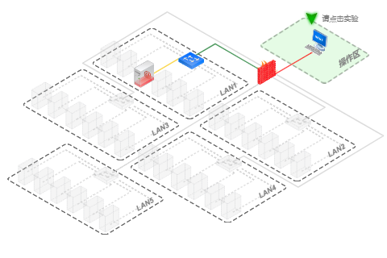
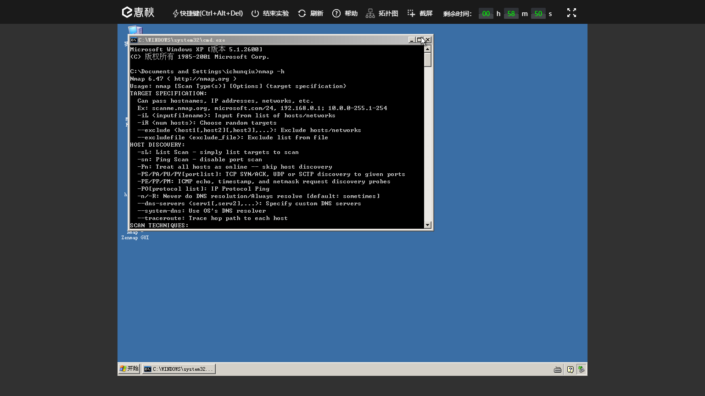

<!-- 下面是 实验报告 md 封面模板， 你可以自行修改-->

<!-- 显示校徽和校名图片，注意图片文件路径一定与md文件相匹配，否则无法显示-->
 </img>

  </img> 

<!-- 下面是标题和信息的格式， infor1 给出 标题的格式， infor2 定义 信息的格式-->

<!-- 下面是标题-->
 

入侵检测技术实验报告

情报收集
  <!--***************** 一定要修改为你的课设题目 ******************-->
 

<!-- 下面是信息-->
<b>

学&nbsp;&nbsp;&nbsp;&nbsp;院 &nbsp; <u>计算机学院</u>

专&nbsp;&nbsp;&nbsp;&nbsp;业 &nbsp; <u>信息安全</u>

年级班别 &nbsp; <u> 信安18（2） </u>

学&nbsp;&nbsp;&nbsp;&nbsp;号 &nbsp; <u>318005434</u>

学生姓名 &nbsp; <u>钟景文</u>

指导老师 &nbsp; <u>郝彦军</u>

<!-- 下面是日期-->
   

2021 年 6 月

</b>

<!-- 下面指定打印时标题1处自动分页-->

# 实验目的
1. 学习Namp扫描工具的使用。  
2. 学习使用Wappalyzer插件探测Web环境。  
3. 学习使用御剑扫描器探测Web端目录架构。  
4. 学习使用DirBuster探测Web端目录架构。  
5. 学习使用椰树工具识别CMS指纹。  

# 实验平台
1. 操作机：
	- OS: Windows XP 
	- IP: 172.16.11.2
2. 目标机：
	- OS: Windows XP
	- IP：172.16.12.2
	- 目标地址：http://www.test.ichunqiu 
2. 使用软件:   
	- 端口扫描：Namp。  
3. 开发语言与技术：无。  

# 实验前准备
1. 查阅教材，掌握端口扫描原理。  
2. 查阅man手册，掌握Namp工具的使用。  

# 实验内容  

## Namp收集系统端情报  

### Namp扫描之主机发现  

<h3 id="-">实验工具</h3>

 <strong>nmap：</strong>

<blockquote>

简介：

   nmap是一个网络连接端扫描软件，用来扫描网上电脑开放的网络连接端。确定哪些服务运行在哪些连接端，并且推断计算机运行哪个操作系统（fingerprinting）。它是网络管理员必用的软件之一，以及用以评估网络系统安全。

   正如大多数被用于网络安全的工具，nmap 也是不少黑客及骇客（又称脚本小子）爱用的工具 。系统管理员可以利用nmap来探测工作环境中未经批准使用的服务器，但是黑客会利用nmap来搜集目标电脑的网络设定，从而计划攻击的方法。

首先需要介绍几个常用的nmap参数，参数如何运用将在实验中体现：

<code>-sn</code>: Ping Scan 只进行主机发现，不进行端口扫描

<code>-Pn</code>: 将所有指定的主机视作开启的，跳过主机发现的过程

<code>-PE/PP/PM</code>: 使用ICMP echo, timestamp, and netmask 请求包发现主机

 <code>-PO</code>: 使用ICMP协议包探测对方主机是否开启

 <code>-oX</code>   将扫描的到结果以XML格式输出

</blockquote>
<h4 id="-">主机发现</h4>
<ul>
<li>
实验原理

<blockquote>

主机发现发现的原理与Ping命令类似，发送探测包到目标主机，如果收到回复，那么说明目标主机是开启的。Nmap支持十多种不同的主机探测方式，比如发送ICMP ECHO/TIMESTAMP/NETMASK报文、发送TCPSYN/ACK包、发送SCTP INIT/COOKIE-ECHO包，用户可以在不同的条件下灵活选用不同的方式来探测目标机。

</blockquote>
</li>
<li>
实验方法

<blockquote>

通常主机发现并不单独使用，而只是作为端口扫描、版本侦测、OS侦测先行步骤。而在某些特殊应用（例如确定大型局域网内活动主机的数量），可能会单独专门适用主机发现功能来完成。不管是作为辅助用法还是专门用途，用户都可以使用Nmap提供的丰富的选项来定制主机发现的探测方式，这些将在试验中体现。

</blockquote>
</li>
</ul>
<h3 id="-">实验步骤</h3>
<h4 id="-1-nmap">步骤1：使用Nmap</h4>
<blockquote>

打开命令行，并在其中使用Nmap进行扫描

</blockquote>

在Windows系统中，可以点击一次点击桌面右下角<code>开始</code>-&gt;<code>运行</code>-&gt;输入<code>cmd</code> ,打开命令行窗口。

由于Nmap是一款命令行工具，需要我们使用各种参数进行组合指定扫描的类型，在不知道参数的前提下，可以输入<code>nmap.exe -h</code>获得nmap使用帮助

<blockquote>
<ul>
<li>-h参数表示<code>显示使用帮助</code></li>
</ul>
</blockquote>

<h4 id="-zenmap">使用Zenmap</h4>
<blockquote>

Zenmap 是Nmap的GUI（图形化界面操作接口），使用Zenmap可以在初始阶段更快的熟悉Nmap的操作。

</blockquote>

Zenmap在Windows系统中在安装完成后，会在桌面生成快捷方式，直接双击打开即可。

<h2 id="-resources-files-picture-84b76fee2154c60e-section_1496304789000-png-resources-files-picture-84b76fee2154c60e-section_1496304789000-png-"></h2>
<h4 id="-2-nmap-">步骤2：使用Nmap进行主机发现</h4>
<blockquote>

本实验中，操作机所在的<code>172.16.12.0/24</code>网段中存在若干台部署有不同系统、不同服务的主机。我们使用Nmap在<code>172.16.12.1-172.16.12.255</code>这个IP段中进行主机发现扫描。

</blockquote>

打开命令行开始使用Nmap，输入主机发现对应的命令:

<pre><code>nmap -sn -PE -oX c:
map_output.xml 172.16.12.1-255
</code></pre>
这条命令中主要存在<code>-sn</code> <code>-PE</code> <code>-oX</code>三个参数，具体参数及含义如下：

<blockquote>
<ul>
<li><code>-sn</code>   不扫描端口，只ping主机</li>
<li><code>-PE</code>   通过ICMP echo判定主机是否存活</li>
<li><code>-oX</code>   将扫描的到结果以XML格式输出文件，路径为 <code>C:</code>，文件名为nmap_output.xml</li>
</ul>
</blockquote>

在命令的最后，指定了扫描的IP范围：<code>172.16.12.1-172.16.12.255</code>，在nmap命令行可以下简洁表示为<code>172.16.12.1-255</code>。
假如需要使用nmap指定单一的扫描目标，则只需要指定目标的IP即可。例如，要使用nmap对<code>172.16.12.2</code>这个本机IP进行一次无额外参数的端口扫描，可直接输入命令<code>nmap 172.16.12.2</code>

这条语句整体达到了一个<code>只通过ICMP echo判断判断目标网段主机是否存活，最后将扫描结果输出到c:
map_output.xml</code>的效果。

实际操作如图：

<h4 id="-3-">步骤3： 查看扫描结果</h4>

扫描结束后，直接打开指定位置的XML文档查看扫描结果。

看扫描结果，上面的绿色部分我们可以得知本段内有2台存活的主机，分别是<code>172.16.12.1、172.16.12.2</code>。

### Namp 扫描之端口发现  

<h3 id="-">实验工具</h3>
<ul>
<li>
Nmap

<blockquote>

主要功能

<ul>
<li>主机发现</li>
<li>端口扫描</li>
<li>系统指纹识别</li>
<li>网络应用服务侦测</li>
</ul>
</blockquote>

  首先需要介绍几个常用的nmap参数，参数如何运用将在实验中体现：

</li>
<li>
<code>sn</code>: Ping Scan 只进行主机发现，不进行端口扫描。 

</li>
<li><code>Pn</code>: 将所有指定的主机视作开启的，跳过主机发现的过程。 </li>
<li><code>PE/PP/PM</code>: 使用ICMP echo, timestamp, and netmask 请求包发现主机。</li>
<li><code>PO</code>: 使用ICMP协议包探测对方主机是否开启。 </li>
<li><code>oX</code>   将扫描的到结果以XML格式输出</li>
</ul>
<h4 id="-">端口扫描</h4>
<ul>
<li>
实验原理

<blockquote>

Nmap在端口扫描方面非常强大，提供了十多种探测方式。
具体说下namp的默认扫描方式<code>TCP SYN scanning</code>原理：
这是Nmap默认的扫描方式，通常被称作半开放扫描（Half-open scanning）。该方式发送SYN到目标端口，如果收到SYN/ACK回复，那么判断端口是开放的；如果收到RST包，说明该端口是关闭的。如果没有收到回复，那么判断该端口被屏蔽（Filtered）。因为该方式仅发送SYN包对目标主机的特定端口，但不建立的完整的TCP连接，所以相对比较隐蔽，而且效率比较高，适用范围广。

</blockquote>
</li>
<li>
实验方法

<blockquote>

端口扫描用法比较简单，Nmap提供丰富的命令行参数来指定扫描方式和扫描端口。具体请在试验中体会。

</blockquote>
</li>
</ul>
<h3 id="-">实验步骤</h3>
<h4 id="-1-nmap-">步骤1：使用Nmap进行单目标端口扫描</h4>
<blockquote>

本步骤将使用Nmap对目标IP或目标段进行端口开放情况判断 同时识别端口对应的服务

</blockquote>
<ul>
<li>单目标端口开放情况判断</li>
</ul>

以目标IP<code>172.16.12.2</code>测试，命令

<pre><code>nmap -sS -PO 172.16.12.2 -oX c:
map_output.xml
</code></pre>
命令中出现了新的参数：

<blockquote>

<code>-sS</code> TCP SYN 扫描 (又称半开放,或隐身扫描)
<code>-PO</code> 使用ICMP协议进行ping

</blockquote>

这条命令整体达到了一个对 <code>172.16.12.2</code> 进行一个隐身扫描，使用ICMP协议 ping，最后将结果输出到<code>c:
map_output.xml</code>的效果

实际测试如图：

 扫描结束后查看<code>c:
map_output.xml</code>浏览扫描结果：

根据报告可以看到，本机开放了多个端口。一般情况下，这些端口都对应着某一项服务，如<code>HTTP:80</code>、 <code>FTP:21</code> 、<code>远程桌面:3389</code>

<h4 id="-2-ip-80-">步骤2：扫描指定IP(段）主机指定端口（80端口）的开放情况</h4>
<blockquote>

本步骤将使用Nmap对目标段进行指定端口开放情况判断 

</blockquote>

例如我们要测试IP地址段为<code>172.16.12.1-172.16.12.255</code>中所有主机的80端口开放情况。命令如下：

<pre><code>nmap -sS -P0 -p 80 172.16.12.1-255 -oX c:
map_output.xml
</code></pre>
稍作解释参数：

<blockquote>

<code>-p 80</code> 指定只测试80端口

</blockquote>

整条命令主要达到了一个<code>对目标段是否开放了指定端口80的隐身扫描，并将结果输出到c:
map_output.xml</code>的效果。

实际测试如图：

扫描结束后查看<code>c:
map_output.xml</code>可以得到以下扫描结果：

根据XML文件中IP列表下面的<code>Ports（端口）</code>扫描结果，我们可以看到<code>172.16.12.2</code>的80端口属于开放状态(open)，对应的服务是http服务。

### Namp扫描之系统探测  

<h3 id="-">实验工具</h3>
<ul>
<li>
Nmap

<blockquote>

主要功能

<ul>
<li>主机发现</li>
<li>端口扫描</li>
<li>系统指纹识别</li>
<li>网络应用服务侦测</li>
</ul>
</blockquote>

  首先需要介绍几个常用的nmap参数，参数如何运用将在实验中体现：

</li>
<li>
<code>sn</code>: Ping Scan 只进行主机发现，不进行端口扫描。 

</li>
<li><code>Pn</code>: 将所有指定的主机视作开启的，跳过主机发现的过程。 </li>
<li><code>PE/PP/PM</code>: 使用ICMP echo, timestamp, and netmask 请求包发现主机。
  &gt;</li>
<li><code>PO</code>: 使用ICMP协议包探测对方主机是否开启。 </li>
<li><code>oX</code>   将扫描的到结果以XML格式输出</li>
</ul>
<h3 id="-">实验步骤</h3>
<h4 id="-">系统探测</h4>
<ul>
<li>
系统（OS）探测原理

<blockquote>

Nmap使用TCP/IP协议栈指纹来识别不同的操作系统和设备。在RFC规范中，有些地方对TCP/IP的实现并没有强制规定，由此不同的TCP/IP方案中可能都有自己的特定方式。Nmap主要是根据这些细节上的差异来判断操作系统的类型的。
具体实现方式如下：
Nmap内部包含了2600多已知系统的指纹特征（在文件nmap-os-db文件中）。将此指纹数据库作为进行指纹对比的样本库。
分别挑选一个open和closed的端口，向其发送经过精心设计的TCP/UDP/ICMP数据包，根据返回的数据包生成一份系统指纹。
将探测生成的指纹与nmap-os-db中指纹进行对比，查找匹配的系统。如果无法匹配，以概率形式列举出可能的系统。

</blockquote>
</li>
<li>
OS侦测用法

<blockquote>

OS侦测的用法简单，Nmap提供的命令比较少:
<code>-O</code>: 指定Nmap进行OS侦测。 
<code>--osscan-limit</code>: 限制Nmap只对确定的主机的进行OS探测（至少需确知该主机分别有一个open和closed的端口）。 
<code>--osscan-guess</code>: 大胆猜测对方的主机的系统类型。由此准确性会下降不少，但会尽可能多为用户提供潜在的操作系统。

</blockquote>
</li>
</ul>
<h4 id="-1-nmap-">步骤1：使用nmap进行系统识别</h4>
<blockquote>

假设我们想知道172.16.12.2这个IP的主机运行着什么操作系统

</blockquote>

执行命令：

<pre><code class="lang-powershell">nmap -sS -PO -sV -O 172.16.12.2 -oX c:
map_output.xml
</code></pre>

解释下新参数：

<blockquote>

<code>-sV</code> 打开系统版本检测

<code>-O</code> 尝试识别远程操作系统

</blockquote>

其它选项:

<blockquote>

<code>-A</code> 同时打开操作系统指纹和版本检测.

<code>-v</code> 详细输出扫描情况.

</blockquote>

整条命令达到了一个<code>对目标IP进行一次检测操作系统类型的隐身扫描类型的探测</code>的效果。

实际测试情况：

<h4 id="-2-">步骤2： 查看扫描结果</h4>

 扫描结束后查看<code>c:
map_output.xml</code>可以直观地得到以下结果：

根据报告我们得知 <code>172.16.12.2</code>这台服务器开放了<code>80</code>  、<code>135</code> 、 <code>139</code>等端口，服务器操作系统是Windows Server 2003  SP0 或 Windows XP SP2，系统指纹识别会有误报率，所以只会给出一个大致的概率。

### Namp扫描之网络应用服务侦测  

<h3 id="-">实验工具</h3>
<ul>
<li>
Nmap

<blockquote>

主要功能

<ul>
<li>主机发现</li>
<li>端口扫描</li>
<li>系统指纹识别</li>
<li>网络应用服务侦测</li>
</ul>
</blockquote>

  首先需要介绍几个常用的nmap参数，参数如何运用将在实验中体现：

<blockquote>

<code>-sn</code>: Ping Scan 只进行主机发现，不进行端口扫描。 
<code>-Pn</code>: 将所有指定的主机视作开启的，跳过主机发现的过程。 
<code>-PE/PP/PM</code>: 使用ICMP echo, timestamp, and netmask 请求包发现主机。

 <code>-PO</code>: 使用ICMP协议包探测对方主机是否开启。 
 <code>-oX</code>   将扫描的到结果以XML格式输出

</blockquote>
</li>
</ul>
<h3 id="-">实验步骤</h3>
<ul>
<li>探测开放网络应用服务的原理。</li>
</ul>
<blockquote>

版本侦测主要分为以下几个步骤：

首先检查open与open|filtered状态的端口是否在排除端口列表内。如果在排除列表，将该端口剔除。

如果是TCP端口，尝试建立TCP连接。尝试等待片刻（通常6秒或更多，具体时间可以查询文件nmap-services-probes中Probe TCP NULL q||对应的totalwaitms）。通常在等待时间内，会接收到目标机发送的“WelcomeBanner”信息。nmap将接收到的Banner与nmap-services-probes中NULL probe中的签名进行对比。查找对应应用程序的名字与版本信息。

如果通过“Welcome Banner”无法确定应用程序版本，那么nmap再尝试发送其他的探测包（即从nmap-services-probes中挑选合适的probe），将probe得到回复包与数据库中的签名进行对比。如果反复探测都无法得出具体应用，那么打印出应用返回报文，让用户自行进一步判定。
如果是UDP端口，那么直接使用nmap-services-probes中探测包进行探测匹配。根据结果对比分析出UDP应用服务类型。
如果探测到应用程序是SSL，那么调用openSSL进一步的侦查运行在SSL之上的具体的应用类型。

如果探测到应用程序是SunRPC，那么调用brute-force RPC grinder进一步探测具体服务。

</blockquote>
<h4 id="-1-">步骤1：实例测试网络服务探测</h4>
<blockquote>

其实这个步骤的命令与端口探测的命令一致：

</blockquote>
<pre><code>nmap -sS -P0 172.16.12.2 -oX c:
map_output.xml
</code></pre>
解释下命令参数：

<blockquote>

<code>-sS</code> TCP SYN 扫描 (又称半开放,或隐身扫描)

<code>-P0</code> 允许你关闭 ICMP pings.

<code>-oX c:
map_output.xml</code>    将结果以XML格式输出，文件名为nmap_output.xml

</blockquote>

整条命令的效果还是对IP<code>172.16.12.2</code>进行一次关闭ICMP PINGS的隐身端口扫描。

实际测试如图：

<h4 id="-2-">步骤2：扫描结果查看</h4>

 扫描结束后查看<code>c:
map_output.xml</code>可以直观地得到以下结果：

根据报告我们可以得知：

<blockquote>
<ul>
<li>端口135开放，对应的是msrpc服务</li>
<li>端口139开放，对应的是netbios-ssn服务</li>
<li>端口445开放，对应的是micrpsoft-ds服务</li>
<li>...</li>
</ul>
</blockquote>

## Web端情报搜集和指纹识别  

### 探测Web端环境  

<h3 id="-">实验目的</h3>
<ul>
<li>
学习安装Wappalyzer插件

</li>
<li>
使用Wappalyzer插件探测Web环境

</li>
</ul>
<h3 id="-">实验工具</h3>
<ul>
<li><code>Wappalyzer</code>：这个工具一般用在浏览器插件，支持分析目标网站所采用的平台构架、网站环境、服务器配置环境、JavaScript框架、编程语言等参数，同时还可以显示目标站点使用该技术的网站比例，例如有多少网站使用的是Wordpress、有多少网站使用AddThis第三方服务，其他还有网页服务器、分析工具、CDN、留言系统、控制台、网络空间等等，可以让你从使用比例中得出目前最流行的技术。</li>
</ul>
<h3 id="-">实验内容</h3>

<strong>Web应用指纹识别</strong>

Web应用指纹识别，是web渗透信息收集最关键的一步，这方面开源的工具也非常多，像BlindElephant，whatweb 以及在非安全圈都很火的Wappalyzer。我们以Wappalyzer为例简单描述下工具原理：Wappalyzer的功能是识别单个uri的指纹，其原理就是给指定URI发送HTTP请求，获取响应头与响应体并按指纹规则进行匹配。这也是web应用指纹识别最基础的部分，除此之外，还有指纹置信度计算（如何去处伪造指纹，多种指纹特征如何综合判断，隐藏指纹信息如何提取），整个站点的指纹识别等。

<h4 id="-1-wappalyzer-">步骤1：安装Wappalyzer插件</h4>
<h5 id="-">在线安装</h5>

<strong>注：以下的安装方法是在有网络的情况下，因实验环境没有互联网，请访问<code>172.16.4.2/8per6yk3</code>下载实验文件，将安装包拖入到火狐浏览器中进行安装</strong> 

注意:渗透测试中我们一般使用火狐浏览器。我们的实验环境中已经为大家安装好了Wappalyzer插件，本步骤大家了解即可，不必在实验环境中操作。

<blockquote>

本步了解如何在火狐浏览器中安装Wappalyzer

</blockquote>

我们打开火狐浏览器，如图点击右侧的<code>选项卡</code>-&gt;<code>附加组件</code>

进入附加组件之后，点击左边的第三个标签：<code>插件</code>，在插件页面的右上方的搜索框内输入我们想要的插件：<code>Wappalyzer</code>,回车搜索，第一个就是我们的插件，我们点击后面的选项-<code>安装</code>

<!-- 
稍等一会如果跳转到如下页面 则说明插件成功安装。

 -->
<h5 id="-">离线安装</h5>

<code>注意: 本实验中请选择离线安装的方法</code>

<blockquote>

请访问<code>172.16.4.2/8per6yk3</code>下载实验文件

将下载的实验文件拖动至打开的火狐浏览器

点击<code>安装</code>按钮，完成安装。

</blockquote>

操作步骤如下：

<h4 id="-2-wappalyzer-web-">步骤2：使用Wappalyzer插件探测web环境</h4>

<code>注意:渗透测试中我们一般使用火狐浏览器。</code>

<blockquote>

本步了解如何在火狐浏览器中使用Wappalyzer插件探测web环境

</blockquote>

Wappalyzer作为火狐浏览器中的一个插件，使用起来十分方便。只需要在火狐浏览器中打开对应的目标地址即可。
实例测试：

<blockquote>

探测目标<code>http://www.test.ichunqiu</code>的web环境。

</blockquote>

直接在火狐浏览器的地址栏中输入<code>http://www.test.ichunqiu</code>并回车访问，随后即可在地址栏后面看到一排缩略图，这排缩略图即代表此web应用运行在何种操作系统、是何种CMS、是何种语言编写、运行于何种web容器等。

点击地址栏后面的缩略图即可在窗口右侧得到更为具体的web环境信息。
我们根据分析下Wappalyzer插件探测到了目标<code>http://www.test.ichunqiu</code>的哪些环境信息：

<blockquote>

主要环境信息  

</blockquote>
<ul>
<li>web服务容器是：apche 2.4.10</li>
<li>web框架: Ink</li>
<li>Web服务器扩展 :  OpenSSL 0.9.8z</li>
<li>脚本语言：php 5.3.29</li>
<li>操作系统：windows</li>
<li>web CMS：wordpress 4.5.4</li>
<li>前端框架：jQuery</li>
</ul>
<blockquote>
</blockquote>
<h4 id="-3-">步骤3：探测结果的分析与利用</h4>

我们已经得知了web端的一些具体信息，如何利用呢？本部分主讲web端的环境探测，漏洞利用只做简述：

<blockquote>
<ul>
<li>apache程序的某些版本是存在一些严重漏洞的，我们可以尝试用metasploit尝试漏洞测试（将在后面几节里面介绍）</li>
<li>wordpress程序的历史版本也是存在过不少漏洞的，如代码执行，后台拿shell之类</li>
<li>目标站使用的是windows操作系统，也可以使用metasploit尝试漏洞测试</li>
</ul>
</blockquote>

<h4 id="-">实验结果分析与总结</h4>

如上，我们简单的通过Wappalyzer插件探测到了目标的web服务容器、web框架、Web服务器扩展 、脚本语言、操作系统、web CMS、前端框架这些具体的信息。

<h4 id="-">思考</h4>

目标站web环境的探测对渗透测试有何意义？

### 目录探测  

<h3 id="-">实验目的</h3>
<ul>
<li>
掌握使用御剑扫描器探测目标目录架构

</li>
<li>
掌握使用DirBuster探测目标目录架构

</li>
<li>
学习对扫描结果进行利用

</li>
</ul>
<h3 id="-">实验工具</h3>
<blockquote>
<ul>
<li>御剑扫描器：御剑是一款轻型的Web目录扫描器，它集成了很强的字典，并且可以自己进行添加，可以使用它扫描到常用的敏感目录，本次试验主要用到御剑测Web目录扫描功能。</li>
</ul>
<ul>
<li>DirBuster：该工具是一个多线程的Java应用开源工具，用于强攻被测试系统服务器的目录,只有知道了目录信息才能确定攻击的目标，通过该工具扫描找出隐藏的目录或文件漏洞。</li>
</ul>
</blockquote>
<h3 id="-">实验内容</h3>

<strong>简述目录探测工具的原理</strong>

<blockquote>

目录扫描探测的工具一般都带有我们整理好的web程序常用的目录，如<code>admin</code>(一般用作后台目录)、<code>upload</code>(一般用作上传目录)、<code>data</code>(一般用作数据存放目录)。

目录整理为文本模式的字典，对目标进行扫描时一般都是扫描器根据指定的目标url与字典中的目录组合成一个新的url，对组合的url进行模拟访问，获取页面状态并整理返回数据，然后不停的对字典里的目录进行枚举，结果整理。

</blockquote>

<strong>目录探测的意义</strong>

<blockquote>

目录扫描可以帮助我们大致了解目标的目录架构，实战中最为实用的意义在于网站后台的扫描（有些网站的后台存在非授权访问）、非授权上传漏洞的发现、备份文件的发现。

</blockquote>
<h4 id="-1-">步骤1：使用御剑扫描器探测目标目录架构</h4>
<blockquote>

本步骤使用御剑扫描器对目标进行文件、目录的扫描测试

</blockquote>

<code>御剑是一款轻型的Web目录扫描器，它集成了很强的字典，并且可以自己进行添加，可以使用它扫描到常用的敏感目录，本次试验主要用到御剑测Web目录扫描功能。</code>

在这之前我们需要了解Http状态码的含义：

<ul>
<li><strong>几个http状态码的意义</strong></li>
</ul>
<blockquote>
<ul>
<li><strong>成功2××：</strong> 成功处理了请求的状态码。 </li>
<li>200 ：服务器已成功处理了请求并提供了请求的网页。</li>
<li>204： 服务器成功处理了请求，但没有返回任何内容。</li>
</ul>
<ul>
<li><strong>重定向3×× ：</strong>每次请求中使用重定向不要超过 5 次。</li>
<li>301： 请求的网页已永久移动到新位置。当URLs发生变化时，使用301代码。搜索引擎索引中保存新的URL。</li>
<li>302： 请求的网页临时移动到新位置。搜索引擎索引中保存原来的URL。</li>
<li>304： 如果网页自请求者上次请求后没有更新，则用304代码告诉搜索引擎机器</li>
</ul>
<ul>
<li><strong>客户端错误4×× ：</strong>表示请求可能出错，妨碍了服务器的处理。　　 </li>
<li>400： 服务器不理解请求的语法。 </li>
<li>403： 服务器拒绝请求。 </li>
<li>404： 服务器找不到请求的网页。服务器上不存在的网页经常会返回此代码。 </li>
<li>410 ：请求的资源永久删除后，服务器返回此响应。</li>
</ul>
<ul>
<li><strong>服务器错误5×× ：</strong>表示服务器在处理请求时发生内部错误。 </li>
<li>500 ：服务器遇到错误，无法完成请求。 </li>
<li>503： 服务器目前无法使用（由于超载或停机维护）</li>
</ul>
</blockquote>

<strong>根据得知的web环境配置扫描器</strong>

参照 探测Web端环境这节课，我们利用Wappalyzer插件来获得目标的一些环境信息，当然最关键的是要得知目标是使用的何种编程语言所写。（方便于我们接下来的步骤配置御剑的扫描脚本类型）

如上图，我们得知，目标站点使用的是<code>PHP</code>脚本所写。

然后我们准备配置扫描 先打开我们工具包中的御剑工具，双击桌面tools图标，工具在御剑1.5目录下，打开工具后界面如下：

我们主要用到御剑的后台扫描功能来探测目录，切换到<code>批量扫描后台</code>选项卡：

参照如下动态图配置：

简单描述下：点击右下角<code>添加</code>-&gt;<code>键入目标</code>,建议把3XX状态和403都勾选，然后双击后面的字典文件作为扫描过程中的字典，我选择的是<code>PHP</code>的字典和一些我个人整理的文件字典。其他设置可选默认。

<ul>
<li><strong>开启扫描并查看结果</strong></li>	
</ul>

御剑工具的扫描前配置参照上图。
点击开始扫描按钮，开启扫描进程。扫描速度和字典的强大是息息相关的，本实验目的是教会大家如何使用工具，实验中字典较大，扫描速度较慢，此处仅作为参考。

目标站我们已经知道是wordpress的比较新的一个版本，所以我们就不去分析它的目录结构和有没有扫到什么可利用的东西了，为什么呢？
因为wordpress作为知名的博客系统，被全球无数的站长使用，其后有强大的专业团队在开发维护，更主要的是，wordpress是开源的，其目录结构相当于是公开的了，我们这里只是以它做工具的使用演示。

<h4 id="-2-dirbuster-">步骤2：使用DirBuster探测目标目录架构</h4>
<blockquote>

本步骤使用DirBuster对目标进行文件、目录的扫描测试

</blockquote>

<code>Dirbuster工具是一个多线程的Java应用开源工具，用于强攻被测试系统服务器的目录,通过该工具扫描找出隐藏的目录或文件漏洞。</code>

<ul>
<li><strong>根据得知的web环境配置扫描器</strong></li>
</ul>

参照第一步骤，我们利用Wappalyzer插件来获得了目标使用的是php脚本：

然后我们准备配置扫描 先打开我们的DirBuster工具 ：

<blockquote>

需要注意的是：diebuster工具为java语言所写，运行需要安装jre环境，并且在安装好DirBuster工具之后并不会在桌面产生一个快捷方式，我们需要在 <code>开始</code>-&gt;<code>所有程序</code>里面找到它

</blockquote>

如下图找到主程序，并单击打开：

打开后工具界面如下：

工具的配置也是非常简单，我们主要设置以下几个选项：<code>目标地址</code>、<code>目标脚本语言</code>、<code>字典文件</code>。

设置过程参照如下动态图：

其中，字典的选择大家按照需要，这里我演示选择的是medium中等大小的字典：

大家可以根据需要自行选择。

<ul>
<li><strong>开启扫描并查看结果</strong></li>
</ul>

配置好扫描参数之后，点击<code>start</code>开启扫描,这个工具的效率很高，才几秒钟我们就得到如下结果：

当然，为了查看方便我们可以点击<code>Tree View</code>标签，查看树形图结果，这样看的话，就会比较直观的了解到网站结构：

<h4 id="-3-">步骤3：扫描结果分析与利用</h4>

以上例来看，我们很快就扫到了许多结果：

我们根据上图，看到了以下2个比较特别的目录：

<blockquote>
<ul>
<li>/wp-content/</li>
<li>/wp-includes/</li>
</ul>
</blockquote>

其实老司机一看就知道这是wordpress的网站了，以上两个目录为wordpress的专有目录，我们不指望扫描器会在这里给我们扫出什么有意义的东西。
那么，实战中，常常有很多网站都是五花八门的小型CMS，或者是某团队自己开发的程序，这样我们的扫描器就很有可能扫到一些可利用的页面或目录。
本节主要讲信息探测，漏洞利用的演示将在下几节学习。

<h3 id="-">实验结果分析与总结</h3>
<blockquote>

如上，我们就使用了两款工具对目标进行了目录和文件的枚举探测。

一般来说，如果已知目标站是某种大型的CMS，扫目录就没有必要了，当然也可以碰碰运气扫一下，万一扫到个整站备份和数据库文件了呢。对小型CMS和 和未知CMS的网站进行安全检测时，扫目录还是有必要的，有利于我们对网站整体架构的认识，二级目录的发现、网站后台的发现等等。

</blockquote>
<h3 id="-">思考</h3>

如果我们扫到了网站的一个二级目录，如：<code>http://www.test.ichunqiu/bbs/</code>,你知道如何对这个二级目录再进行目录探测和文件扫描吗？

### CMS指纹识别  

<h3 id="-">实验目的</h3>
<ul>
<li>
了解常见的CMS应用及漏洞

</li>
<li>
学习使用工具进行CMS指纹识别

</li>
<li>
探测结果的分析与利用

</li>
</ul>
<h3 id="-">实验工具</h3>
<ul>
<li><code>椰树扫描器</code>：椰树WEB漏洞扫描器是一款国产的漏洞扫描器，集成了常见的SQL注入、跨站、后台路径等扫描，并且支持旁站和二级查询、CMS安全检测、漏洞收录查询等，有亮点的是CMS安全检测里面包含了常见的CMS漏洞，比如SHOPXP、DEDECMS、SHOPEX等。</li>
</ul>
<h3 id="-">实验内容</h3>

<strong>CMS指纹识别的原理</strong>

<blockquote>

一般应用程序在html、js、css等文件中多多少少会包含一些特征码，这跟ips、waf等产品的特性有点类似，有特征码匹配模式。比如wordpress如果没有特细隐藏的话，在robots.txt中会包含wp-admin之类，首页index.php中会包含generator=wordpress 3.xx，后面为版本号，页面中会包含wp-content路径等等。
这几条都是存在网页中的关键。其他的应用也有类似的例子，如discuz、dedecms、phpwind等在页面中都会发现一些固定的特征码。
CMS指纹识别程序一般就是根据这些特征来匹配CMS版本的。

</blockquote>

<strong>常见的web应用指纹识别主要有以下几种方式：</strong>

<blockquote>
<ol>
<li>网页中发现关键字</li>
<li>特定文件的MD5（主要是静态文件、不一定要是MD5）</li>
<li>指定URL的关键字</li>
<li>指定URL的TAG模式</li>
</ol>

以上4种模式结合起来识别的话正确率一般在95%以上，除非个别变态的站点修改的体无完肤，如meta、文件路径、css等都删除了或故意修改成其他的webapp等，那我只能说站长太厉害。
我们本步主要介绍工具使用 ，将不再对这四种方式再赘述。

</blockquote>

<strong>CMS指纹识别的意义</strong>

<blockquote>

我们都知道，开源的cms时不时会爆出各种不同的漏洞，曾有人说"<code>有人为的地方就有漏洞</code>"，网上有很多漏洞报告平台，漏洞时时刻刻都在被发现，被利用。知道了目标是何种CMS有利于我们搜集漏洞并进行利用，也可以去CMS官网下载源码进行漏洞审计。

</blockquote>

<strong>椰树工具的优点 相比Wappalyzer有何不同</strong>

<blockquote>
<ul>
<li>椰树扫描器不仅支持CMS指纹识别，而且还支持CMS安全检测、漏洞收录查询等，有亮点的是CMS安全检测里面包含了常见的CMS漏洞，比如SHOPXP、DEDECMS、SHOPEX等。</li>
<li>Wappalyzer:工具一般只用在浏览器插件，只支持分析目标网站所采用的平台构架、网站环境、服务器配置环境，并不支持漏洞扫描与利用。</li>
</ul>
</blockquote>

<strong>了解常见的CMS应用及漏洞</strong>

​  <strong>phpweb</strong>：

<ul>
<li>
搜索模块跨站脚本执行漏洞

</li>
<li>
phpweb成品网站最新版(注入、上传、写shell)

​
<strong>wordpress</strong>

</li>
<li>
WordPress4.2.3提权与SQL注入漏洞(CVE-2015-5623)

</li>
<li>
WordPress Abtest本地文件包含漏洞

</li>
</ul>

  <strong>discuz</strong>

<ul>
<li>
discus x2 SQL注入漏洞

</li>
<li>
dz6.1后台拿shell 

</li>
</ul>

  <strong>phpcms</strong>

<ul>
<li>
phpcms v9注入

</li>
<li>
phpcms v9本地文件包含漏洞

</li>
</ul>

  <strong>aspcms</strong>

<ul>
<li>
ASPCMS任意用户登录后台

</li>
<li>
ASPCMS留言板注入可直接将木马插入数据库

</li>
</ul>

  <strong>南方良精</strong>

<ul>
<li>
南方数据编辑器(southidceditor)注入

</li>
<li>
后台拿shell漏洞

</li>
</ul>

  <strong>ecshop</strong>

<ul>
<li>
sql注入漏洞

</li>
<li>
ECShop网店系统本地包含漏洞

</li>
</ul>

  <strong>dedecms</strong>

<ul>
<li>
sql注入漏洞

</li>
<li>
dedecms v5.7 文件包含导致任意代码执行

</li>
</ul>
<h4 id="-1-cms-">步骤1：使用工具对目标进行cms指纹识别</h4>
<blockquote>

本步将利用工具判断目标是使用了何种cms应用

</blockquote>

椰树WEB漏洞扫描器是一款国产的漏洞扫描器，集成了常见的SQL注入、跨站、后台路径等扫描，并且支持旁站和二级查询、CMS安全检测、漏洞收录查询等，有亮点的是CMS安全检测里面包含了常见的CMS漏洞，比如SHOPXP、DEDECMS、SHOPEX等。本节主要用到了椰树的CMS指纹识别功能。

请访问<code>172.16.4.2/99yg46tp</code>下载实验文件，解压后打开椰树工具，主程序是文件目录下的<code>windowsmanger.exe</code>，打开后工具主页面如下：

我们切换到<code>CMS安全检测</code>标签页，发现并没有如御剑工具可以直接添加目标的地方，这就需要我们把目标写在txt文件里面，再选择<code>外部导入</code>按钮，导入目标站点。

请看实际操作：

体会下椰树工具在扫描过程中是如何判断CMS版本的：

 由图可知，椰树工具向目标站发送不同的CMS特征页面或文件请求，如果符合该特征，将断定该目标为某种cms。由于这些特征都可以人为修改，所以我并不认为椰树的识别结果有多少的准确性。

<h4 id="-2-cms-">步骤2：CMS识别结果的分析与利用</h4>

比较尴尬的是，试验中，我们的椰树工具并没有探测出目标的CMS：

所以说工具只作为辅助，思想与经验才是最主要的。

我们再尝试使用<code>Wappalyzer</code>对目标进行CMS指纹识别（请参考探测Web端环境这节课安装插件，下载安装插件。工具地址：<code>172.16.4.2/8per6yk3</code>），结果令人欣慰，判断出目标使用的是<code>wordpress</code>程序，所以说，工具各有优点:

其实椰树工具的亮点不在于CMS的识别，而在于CMS漏洞的检测，其本身收录了一些常见的CMS漏洞：

椰树工具在判断出CMS类型之后，如果存在该版本的漏洞，椰树将会尝试进行漏洞利用，并将漏洞利用结果返回。

漏洞poc和exp的利用将在其他实验中学习。

<h3 id="-">实验结果分析与总结</h3>
<blockquote>

根据此实验我们得知，椰树工具的指纹识别能力并不是很准确，其亮点在于漏洞库的手机与利用。而Wappalyzer插件的CMS指纹识别能力是很强的，工具的综合利用往往会达到更好的效果。

</blockquote>
<h3 id="-">思考</h3>

CMS指纹识别有何实际意义？

# 实验总结  
把实验中遇到的问题及解决办法或体会写出来就行了。