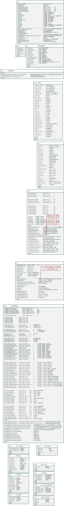

 </img>
<p align=center>  </img> </p>

<style>
p.infor1 {text-indent:0em;font-size:22.0pt;line-height:150%;font-family:黑体; font-style:blod;text-align:center;}
p.infor2 {text-indent:10em;font-size:16.0pt;line-height:150%;font-family:黑体; font-style:blod;}
p.date {text-indent:0em;font-size:16.0pt;font-family:黑体; font-style:blod;text-align:center;}
p.infor3 {text-indent:0em;font-size:25.0pt;line-height:150%;font-family:黑体; font-style:blod;text-align:center;}
p.infor4 {text-indent:0em;font-size:13.0pt;line-height:150%;font-family:隶书; font-style:blod;text-align:center;}
</style>

<!-- 下面是标题-->
<br/>
<p class="infor3">《入侵检测技术》课程报告</p>
<p class="infor4">入侵检测软件snort源代码分析</p>  <!--***************** 一定要修改为你的课设题目 ******************-->
<br/>

<!-- 下面是信息-->
<b>
<p class="infor2">课程名称 &nbsp; <u>&nbsp;&nbsp;&nbsp;计算机学院&nbsp;&nbsp;&nbsp;</u>
<p class="infor2">专业班级 &nbsp; <u>&nbsp;信息安全18（2） </u>
<p class="infor2">学&nbsp;&nbsp;&nbsp;&nbsp;号 &nbsp; <u>&nbsp;&nbsp;&nbsp;&nbsp;318005434&nbsp;&nbsp;&nbsp;&nbsp;</u>
<p class="infor2">学生姓名 &nbsp; <u>&nbsp;&nbsp;&nbsp;&nbsp;&nbsp;钟景文&nbsp;&nbsp;&nbsp;&nbsp;&nbsp;&nbsp;</u>
<p class="infor2">指导老师 &nbsp; <u>&nbsp;&nbsp;&nbsp;&nbsp;&nbsp;郝彦军&nbsp;&nbsp;&nbsp;&nbsp;&nbsp;&nbsp;</u>

<!-- 下面是日期-->
<br/><br/><br/>
<p class="date">2021 年 6 月</p>
</b>

<!-- 下面指定打印时标题1处自动分页-->
<!-- <style>
@media print {
  h1 {
    page-break-before: always;
  }
} -->
</style>

# 目录  
- [目录](#目录)
- [Snort1.5](#snort15)
  - [简介](#简介)
  - [用法](#用法)
    - [命令行](#命令行)
    - [选项](#选项)
    - [过滤器](#过滤器)
    - [规则](#规则)
  - [规则说明](#规则说明)
  - [插件说明](#插件说明)
  - [源码分析](#源码分析)
    - [功能模型](#功能模型)
    - [对象模型](#对象模型)
    - [动态模型](#动态模型)
- [Snort 1.0](#snort-10)
  - [简介](#简介-1)
  - [用法](#用法-1)
    - [命令行](#命令行-1)
    - [选项](#选项-1)
    - [过滤器](#过滤器-1)
    - [规则](#规则-1)
  - [规则说明](#规则说明-1)
    - [规则格式](#规则格式)
    - [规则应用顺序](#规则应用顺序)
    - [规则选项](#规则选项)
    - [示例与规则说明](#示例与规则说明)
  - [源码分析](#源码分析-1)
    - [功能模型](#功能模型-1)
    - [对象模型](#对象模型-1)
    - [动态模型](#动态模型-1)

# Snort1.5  

## 简介  
Snort是一个基于libpcap的包嗅探器/记录器，可以用作轻量级网络入侵检测系统。  
它具有基于规则的日志记录功能，除了用于检测各种其他攻击和探测（如缓冲区溢出、隐形端口扫描、CGI攻击、SMB探测等）外，还可以执行内容搜索/匹配。  
Snort具有实时警报功能，可以将警报发送到syslog（一个单独的“警报”文件），甚至可以通过Samba发送到Windows计算机。  

数据包以tcpdump二进制格式或其解码形式记录到基于远程对等方的IP地址生成的目录中。  
如果您指定要记录的流量和要通过的流量，这就允许Snort被用作一种“穷人的入侵检测系统”。  

Snort自一年前发布以来已经有了很大的发展，现在它包含了商业网络入侵检测系统（如NetRanger和issrealsecure）的主要功能。  
由于开源社区的贡献，开发在过去四个月里加速了！  

版本1.5增加了主要的新功能！  
检测和预处理插件，会话日志，规则文件变量和包括，五个新的网络层解码器，包括ISDN和令牌环支持，新的检测功能，以及其他一些很酷的东西。  
查看变更日志以获取完整列表。  

## 用法  

### 命令行   
- `snort -[options] <filters>`

### 选项  

- `-A <alter>` : 将`<alter>`模式设置为`full`,`fast`或`none`。  
    - `full`模式对警报文件执行普通的“经典Snort”样式的警报。  
    - `fast`模式只是将时间戳，消息，IP和端口写入文件。  
    - `none`模式关闭警报。  
    > 从版本1.5开始，CyberPsychic对Snort的UnixSock alert修改得到了实验性支持，允许对sepreate进程发出警报。  
    > 使用“unsock”参数激活此功能。  
- `-a`: 显示ARP包。  
- `-b` : 以tcpdump格式记录数据包。  
    > 所有数据包都以其本机二进制状态记录到名为“snort.log”的tcpdump格式的日志文件中。  
    > 这个选项导致程序的运行速度大大加快，因为它不必花费时间在包二进制->文本转换器中。  
    > Snort可以在“-b”模式下很好地支持100Mbps网络。  
- `-c <cf>` : 使用配置文件`<cf>`。这是一个规则文件，它告诉系统要记录、警告或传递什么！  
- `-d`  : 转储应用层数据。  
- `-D`  : 在守护程序模式下运行Snort。   
    > 除非另有规定，否则警报将发送到/var/log/snort.alert。  
- `-e`      : 显示/记录以太网数据包头数据。  
- `-F <bpf>`:	从文件`<BPF>`读取BPF筛选器。  
    > 对于那些将Snort作为影子替代品运行或喜欢超复杂BPF过滤器的人来说非常方便。  
- `-h <hn>` : 将“家庭网络”设置为`<hn>`，这是一个类似192.168.1.0之类的C类IP地址。 如果使用此交换机，则来自外部网络的流量将被格式化，数据包转储的方向箭头指向右侧表示传入的外部流量，左侧表示传出的内部流量。  
- `-i <if>` : 使用接口`<if>`。  
- `-l <ld>` : 将数据包记录到目录`<ld>`。建立一个分层目录结构，以日志目录为基本起始目录，以产生流量的远程对等方的IP地址为目录，将来自该地址的数据包存储在其中。  
- `-M <wkstn>` : 向`<wkstn>`文件中包含的工作站列表发送WinPopup消息。
    > 此选项要求Samba驻留在运行Snort的机器的路径中。  
    > 工作站文件很简单：文件的每一行都包含要创建的框的SMB名称将消息发送到（不需要\ \）。  
- `-n <num>`: 处理`<num>`个数据包后退出。  
- `-N` : 关闭日志记录。警报仍正常工作。  
- `-o`		: 更改规则应用于数据包的顺序。
    > 这将在Pass->Alert->Log order中应用它们，而不是在标准的Alert->Pass->Log order中应用它们，这样人们就不必使用大量的BPF命令行参数来过滤警报规则。用户请求的。  
- `-p` : 关闭混杂模式嗅探。  
    > 对于那些会严重破坏你人际网络的地方很有用。  
- `-r <tf>`: 读取tcpdump生成的文件`<tf>`。  
    > 这将导致Snort读取并处理提供给它的文件。  
    > 例如，如果您有一堆要处理的影子文件作为内容，或者即使有一堆重新组装的数据包片段已经写入tcpdump格式的文件中，这也很有用。  
- `-s`: 将警报消息记录到系统日志。  
    > 在LinuxBoxen上，它们将出现在许多其他平台上的/var/log/secure、/var/log/messages中。  
- `-S <n=v>`:	将变量名“n”设置为值“v”。  
    > 这对于将Snort规则文件中定义的变量名的值设置为命令行指定的值非常有用。  
    > 例如，如果在Snort规则文件中定义一个HOME\u NET变量名，则可以从命令行的预定义值设置该值。  
- `-v`		: 使冗长(即详细模式)，将数据包打印到控制台。详细模式有一个大问题：它仍然有点慢。如果您使用Snort进行IDS工作，不要使用-v开关，您将丢弃数据包（不是很多，而是一些）。  
- `-V`		: 显示版本号并退出。  
- `-X`      : 当你看到一个恼人的IPX包时，显示一个恼人的小消息。
- `-?`		: 显示用法摘要并退出。  


### 过滤器   

“过滤器”是TCPDump中看到的标准BPF样式的过滤器。  
查看TCPDump手册页，了解如何正确使用TCPDump。  
一般来说，您可以给它一个主机、网络或协议来进行过滤，以及一些逻辑语句来将其连接在一起，并获得您感兴趣的特定流量。  

例如：  

```bash
[zeus ~]# ./snort -h 192.168.1.0/24 -d -v host 192.168.1.1  
```  
> 记录进出主机192.168.1.1的通信量。    

```bash
[zeus ~]# ./snort -h 192.168.1.0/24 -d -v net 192.168.1 and not host 192.168.1.1   
```  
> 记录192.168.1.0/24 C类子网上的所有流量，但不记录进出192.168.1.1的流量。    
> 请注意，在“-h”开关之后指定的命令行数据的格式与在命令行末尾提供的BPF命令不同。   
> 很抱歉造成混淆，但我喜欢CIDR符号，我不会重写libpcap使其一致！    
> 从版本1.3开始，您可以使用-F开关从文件中读取BPF过滤器。  

### 规则    
  
**规则与rules.SAMPLE`文件**：   
> 规则的概念是0.98版本的新特性。    
> 现在您可以开始使用Snort作为一个真正的实时入侵检测系统，尽管它不如商业系统好。    
> 规则格式目前相当简单，包含在发行版中的“rules.SAMPLE”文件中。    
> 请在那里查看规则系统如何工作的完整解释。    

**警报与`alter`文件**：    
> 系统生成的警报被记录到一个名为（令人惊讶的是）“alter”的文件中。    
> 您可以使用“rt”或“tail-f”之类的命令来显示系统警报。    
> 警报也可以发送到syslog（并使用类似swatch的东西进行监视），或者可以通过smbclient作为WinPopup消息发送出去。  
> 有关启用SMB警报选项的信息，请查看“安装”文件。  

**`-l`重定向日志目录**：  
> 请注意，系统需要使用“-l”标志将基于规则的日志重定向到特定目录。  
> 如果您没有指定它要去的地方，它会进入/var/log/snort。

**`-c`指定规则文件**：   
> 请记住，如果指定一个规则文件，它将不再记录所有内容，只记录与当前规则集匹配的内容。    
> 规则是按照它们在类中输入的顺序应用的。    
> 换句话说，警报规则是按照从规则文件中读取的顺序应用的，对于日志和传递规则也是如此。    

## 规则说明   

> 从版本0.99rc6开始，就有了全新的规则选项，即旧规则将不再适用于此新版本。  

> 规则只能在一行上，解析器不能处理多行规则！  
> 您可以使用“#”作为注释。  
> 对所有IP地址和端口使用数字，此系统不进行查找。  

> 规则的格式为：`func proto src_ip/mask src_port_range->dst_ip/mask dst_port_range（options）`。  
> 使用“any”表示IP地址通配符或端口通配符。  

> 从版本1.2.1开始，您可以使用“！”在源或目标IP地址上表示异常情况。
> 这将允许IP异常记录地址和网络，而不必使用传递规则。  
> 有关用法示例，请参见此文件的结尾！  

>从版本1.3开始，您可以使用否定运算符（！）在源和目标TCP/UDP端口上。  
> 这将允许你做一些事情，比如避免查看来自DNS服务器的流量，等等。  

> 在版本1.3.1中添加了双向规则。  
> 这些允许规则的地址/端口对从规则中方向指示灯的任意“侧”考虑，在源信息和目标信息之间使用“<>”运算符。  

> 从版本1.5开始，您可以在Snort规则文件中指定include文件和替换变量。  
> 有关Christian Lademann提供的这个新功能的更多信息，请参见1.5修改部分。 

>规则按以下顺序应用于流量：   
> 警报规则  
> 通过规则  
> 日志规则  

> 新的规则选项用括号括起来，用分号分隔。  

> 有效的规则选项包括：  
> msg=>要在警报/日志文件中输出的消息。  
> flags=>TCP标志，使用0表示完全没有标志。  
> ttl=>您想要输入的ttl值（非常适合捕捉traceroutes）。  
> content=>包应用层，在这里查找缓冲区溢出。  
> itype=>ICMP类型的编号。  
> icode=>ICMP代码的编号。  
> minfrag=>最小碎片负载大小。  
> seq=>tcp序列号。  
> ack=>tcp确认号。  
> id=>IP头片段id号。  
> logto=>记录特定警报的文件。  
> dsize=>匹配数据包负载大小。  
> offset=>开始在有效负载中搜索`<offset>`字节。  
> depth=>仅在有效负载中搜索`<depth>`字节以获得模式匹配。  
> session=>记录来自明文协议的会话流量，如ftp或telnet。  
> ipopts=>检查特定的IP选项。   

> 这些下一个规则进入规则的选项部分TCP标志可以搜索的标志值如下:  
> S = SYN  
> F = FIN   
> A = ACK  
> U = URG  
> P = PSH  
> R = RST  
> 0 = NULL  
> 1=保留位1   
> 2=保留位2  

> `content`字符串将与包负载中包含的数据相匹配。  
> 此字符串可以是二进制的，也可以是文本，二进制部分由管道“|”符号表示。  
> 实际的“二进制”代码是用十六进制表示法编写的。  
> 如果要将管道符号放入内容匹配字符串中，只需使用“\|”，这将在模式缓冲区中放入一个“|”。  

> 版本1.1中的新功能  
> 新规则选项：minfrag。  
> 此规则允许用户指定可接受的最小片段大小。  
> 这个规则背后的概念是，没有商业网络设备生成小于256字节的片段，因此任何小于256字节的片段都是非常可疑的。  
> `alert tcp any any -> any any (msg: "Tiny Fragments, probable hostile activity"; MinFrag: 128;)`  

> 新规则选项：logto  
> 此选项允许将与规则匹配的数据包记录到用户指定的特殊日志文件中。  
> 例如：`log tcp any any -> 192.168.1.0/24 23 (logto:"telnets";)`  
> 将捕获所有未登录的telnet流量，并将其放入日志目录中名为telnets的文件中。  

> 新规则选项：tcp标志。  
> 您现在可以在TCP数据包的标志字段中查看保留位。  
> 这可以让你检测像奎索扫描之类的东西。新位用“1”和“2”指定。  
> 有关用法，请参见上面的TCP示例。  

>新规则选项：ack。  
> 此选项监视TCP数据包的ack字段以获取用户指定的值。  
> 例如，nmap TCP“pings”将TCP ACK标志设置为0，并将acknowledge字段设置为0。  
> 现在可以编写Snort规则来检测：`alert tcp any any -> 192.168.1.0/24 any (flags: A; ack: 0; msg:"NMAP TCP ping!";)`  

> 新规则选项：seq。  
> 这个检查TCP包的序列号。  
> 到目前为止，我还没有想到这个规则的应用程序，但为了完整起见，它在那里。  

> 新规则选项：id。  
> 此规则查看IP标头的ID字段。  
> 一些攻击/探测程序将此值设置为可爱的值，或者至少是“可指纹”值，例如31337或262或其他任何值。  
> 此选项字段可用于使用可预测的数字搜索数据包。  

> 版本1.2.1中的新功能。  
> 现在可以为源和目标IP地址指定求反运算符。  
> 在规则中。例如：`alert tcp !192.168.1.0/24 any -> 192.168.1.0/24 143 (flags: S; msg: "External IMAP access attempt!";)`  
> 此规则将为所有不是来自“本地”网络的流量生成警报，并在设置SYN标志的情况下指向端口143上的本地网络。  
> 这是一个非常好的功能，可以检测来自给定地址范围之外的活动，或者指向您不感兴趣的范围的活动。感谢Ron Snyder的补丁！  

> 版本1.3中的新功能。  
> 否定运算符现在可用于端口规范。  
> `alert udp any !53 -> 192.168.1.0/24 31337 (msg: "Back Orifice";)`。  
> 这将对任何去往端口31337的UDP通信发出警报，该通信不是来自端口53。  

> 新关键字：dsize。  
> 此关键字检查数据包有效负载（应用程序层）的大小是否匹配。  
> 例如，如果您正在搜索您感兴趣的有效负载长度为80字节的数据包，您可以这样写： 
> `alert tcp any any -> 192.168.1.0/24 any (msg:"80-byte packet!"; dsize: 80;)`  

> 与其他选项关键字结合使用时，这可能很有用。  
> 此外，从版本1.3.1开始，您可以指定大于和小于关键字。  
> 例如：`alert tcp any any -> 192.168.1.0/24 any (msg:"80+ byte packet!"; dsize: >80;)`    
> 此规则将对大小大于80字节的所有数据包发出警报。  

> 新建关键字：offset。  
> 如果您更明确地知道在数据包负载中搜索什么，那么可以指定起始偏移量并缩小要搜索的数据量（以及执行搜索所需的时间）。  
> `alert tcp any any -> 192.168.1.0/24 80 (content: "cgi-bin/phf"; offset: 4; msg:"PHF probe/attack!";)`  
> 此规则将开始搜索数据包有效负载中的字符串4字节。  
>  一般来说，这在这种情况下很有用，因为预期的字符串类似于“GET/cgi-bin/phf…”。  
> 这样做的唯一缺点是，您必须小心避免过于严格地调整规则，并考虑到事情在网络上的显示方式的变化。  

> 新关键词：depth。  
> 规则将指示内容匹配器仅检查有效负载的`<depth>`字节。与抵销规则配合使用效果良好，例如：  
>  `alert tcp any any -> 192.168.1.0/24 80 (content:"cgi-bin/phf"; offset: 4; depth: 12; msg: "PHF Probe/attack";)`    
> 此规则将开始在有效负载中搜索内容字符串4个字节，然后搜索前12个字节。 
> 通过这样指定适当的规则，可以节省大量时间（并提高性能），但不要做得太多！如果你把你的参数设置得太紧，你就什么也检测不到了！  

> 版本1.5中的新功能

> 新功能：include 
> 现在可以使用“include”功能将其他规则文件与另一个规则文件一起包含。  
> 例如，如果您想将所有的CGI探测规则与主规则文件放在一个单独的文件中，那么您现在只需将其所有规则集成到另一个文件中即可。  
> 命令的格式只是“include`<filename>`”，其中`<filename>`是规则文件的名称。  
> 例如： `include web-lib`。  

> 新功能：var 。 
> 通过添加“var”关键字，替代变量现在可以添加到Snort规则文件中。  
> 这是一个功能，使您在设置规则文件时有很大的灵活性！  
> 基本格式很简单：`var HOME_NET 192.168.1.0/24`。  

> 然后在如下规则中引用：  
> `alert tcp any any -> $HOME_NET 32771 (msg: "SUNRPC highport access!";)`  

> 但是等等，还有更多！可以使用“$”运算符定义元变量。  
> 这些可以与变量修饰符运算符“？”和“-”一起使用。   
> $var—定义元变量。  
> $（var）-替换为变量“var”的内容。  
> $(var:-default)-替换为变量“var”的内容，如果“var”未定义，则替换为“default”。  
> $（var:？message）-替换为变量“var”的内容或打印错误消息“message”并退出。  

>例如：
> `var MY_NET $(MY_NET:-192.168.1.0/24) `  
> `log tcp any any -> $(MY_NET:?MY_NET is undefined!) 23 (session: printable;)`  

> 新关键字：session。  
> 此关键字将使符合规则的数据包的有效负载记录到会话文件中。  
> 这个关键字有两个参数，“printable”和“all”。  
> “printable”参数将导致只记录可打印字符。  
> “all”参数将导致会话文件中存储所有可打印和不可打印的字符。  
> 不可打印字符由“\XX”类型值表示，其中XX是不可打印字符的十六进制值。  
> 记录会话的文件的名称使用格式“`SESSION:<hi>-<lo>`”，其中“`<hi>`”是连接的高端口号，“`<lo>`”是低端口号。    
>`log tcp any<>192.168.1.0/24 23 (session:printable;)`  
> 上述规则将实时双向记录任何telnet会话的可打印字符。  
> 如果您想查看用户在连接上键入的内容，只需在会话文件中输入“tail-f”。很漂亮吧？  

> 新关键字：ipopts。  
> 检查包含指定类型的IP选项的数据包中的IP选项。  
> 这对于寻找诸如源路由之类的东西非常有用。  
> 有效的选项参数包括：rr、eol、nop、ts、sec、lsrr、lsrre、satid、ssrr。  
> `alert tcp any any -> any any (ipopts: lsrr; msg: "Source Routed packet!";)`  

> 新特性：每个规则有多个“content”字符串。  
> 现在，您可以将多个内容关键字放在单个规则规范中，这样就可以为每个数据包负载搜索多个模式。  
> 这可用于提高分组有效负载匹配规则的通用性和准确性。  
> 例如，现在可以搜索缓冲区溢出的NOP代码以及“exec”操作码：  
> `alert tcp any any -> $HOME_NET 143 (content:"|9090 9090 9090 9090|"; content:"|E8 C0FF FFFF|"; msg:"IMAP Buffer Overflow!";)`  
>  

> 请注意，如果在搜索多个内容字符串的实例中包含“depth”和“offset”关键字，则必须使用它们自己的内容关键字对它们进行分组。  
> 换句话说，如果规则中有两个内容关键字，并且它们都使用深度和偏移量关键字，则第一组深度和偏移量关键字必须在规则*中第一个内容字符串之后，但在第二个内容字符串之前。  
> 例如：`alert tcp any any -> $HOME_NET 143 (content:"|9090 9090 9090 9090|"; depth: 16; offset: 5; content:"|E8 C0FF FFFF|"; depth: 10; offset: 200; msg:"IMAP Buffer Overflow!";)`  

> 新的预处理器：http_decode。  
> http_decode“规范化”web流量，将“转义”字符转换回其ASCII表示形式。 
> 例如，一个%20转换成一个空格，等等。  
> 攻击者和较新的web扫描器（如whisker.pl）试图通过使用这些字符替换来混淆其探测/攻击，从而对ID系统隐藏其攻击，而此预处理器则会挫败这些尝试。  
> 预处理器将要分析的端口号作为规则文件中的参数。  
> 在大多数情况下，这只是端口80，但有些地方会有网络服务器在多个端口上运行，比如下面的例子。 
> `preprocessor http_decode：80 443 8080`  

> 新的预处理器：minfrag  
> 这个预处理器只是简单地检查碎片流量中的“微小碎片”，这通常是有可疑事情发生的迹象。   
> 此预处理器的唯一参数是将生成警报的片段的阈值大小。   
> 128字节的示例大小（如下）可能是一个非常好的大小。  
> `preprocessor minfrag: 128`   

## 插件说明  

> Snort版本1.5引入了一个主要的新概念，插件。  
> Snort中目前有两种类型的插件：检测插件和预处理器。  

> 检测插件检查数据包的一个方面是否有规则中定义的值，并确定数据包数据是否符合它们的接受标准。  
> 例如，tcp标志检测插件检查tcp数据包的标志部分是否与特定规则中定义的标志组合匹配。  
> 每个数据包可以用不同的参数多次调用检测插件。  

> 每个数据包只调用一次预处理器，它可以执行非常复杂的功能，如TCP流重组、IP碎片整理或HTTP请求规范化。   
> 它们可以直接操作包数据，甚至直接用修改后的数据调用检测引擎。  
> 它们还可以执行不太复杂的任务，如统计数据收集或阈值监视。  

> 以用户身份向Snort添加新插件：  
> 现在，向Snort添加一个新插件很简单，但需要手动编辑两个文件。  
> 插件应该由两个文件组成，  
> “sp_something.c”/“sp_something.h”用于检测插件，  
> 而“spp_something.c”/“spp_something.h”用于预处理器。  

>对于检测插件，将其与Snort集成有两个步骤：  
> 1) 编辑`plugbase.h`并将行`#include“sp_something.h”`与其他“#include”语句一起插入文件。  
> 保存并关闭文件。  
> 2) 编辑`plugbase.c`文件，在`InitPlugins（）`函数中，将安装函数的名称与其他安装函数一起添加到列表中。  
> 保存并关闭文件。  
> 3) 编辑`Makefile.am`并将这两个文件的名称添加到`“snort_SOURCES”`行的名称列表中。  
> 保存并退出文件。  
> 运行`“automake”`。  
> 准备就绪。现在重新编译Snort，插件就可以使用了！  

>添加预处理器同样简单。 
> 过程基本上与上述相同：  
> 1） 编辑`plugbase.h`并将行`#include“spp_preproc.h”`与其他“#include”语句一起插入文件。  
> 保存并关闭文件。  
> 2） 编辑`plugbase.c`文件，在`InitPreprocessors（）`函数中，将安装函数的名称与其他安装函数一起添加到列表中。  
> 保存并关闭文件。  
> 3） 编辑`Makefile.am`并将这两个文件的名称添加到`“snort_SOURCES”`行的名称列表中。  
> 保存并退出文件。  
> 运行`“automake”`。  

> 作为开发人员编写新的Snort插件：  
> 这个过程也很简单，查找这些信息的最佳位置是“templates”目录中的文件。  
> `sp_*`文件是为检测插件设置的，`spp_*`文件是指预处理器文件。  
> 在编写之后，要记住的主要事情是将适当的include和函数调用放入plugbase[.c |.h]中。  
> 我可能应该充实这个文件更多，但我认为最好的信息是在模板文件。  
> 如果您有任何问题或意见，请随时给我发电子邮件！  

## 源码分析  


- **分析信息**：将分析信息注释在源代码里面不太好，所以我**把分析信息注释在模型**里面。   
- **静态结构分析**：分析为对象模型。  
- **动态行为分析**：分析为动态模型。  
- **程序整体分析**：分析为功能模型。  

**关键代码**：  
- `OpenPcap()`函数：打开Pcap抓软件，获取并设置相关抓包信息，如：`dp`,`datalink`。  
- `grinder`保存数据包处理器：
    > snort.c 116行代码，调用自定义的`SetPktProcessor()`设置数据包处理函数的函数指针给`grinder`全局变量。  
    >`SetPktProcess()`函数根据进程所在主机的数据链路层来决定数据包处理函数。  
    >当数据链路层是EtherNet时，用`DecodeEthPkt()`处理数据包。  
    >当数据链路层是Slip时，用`DecodeSlipPkt()`处理数据包。  
    >当数据链路层是Raw时，用`DecodeRawPkt()`处理数据包。  
    >```C
    >116  SetPktProcessor();
    >```
- `pcap_loop`回调`grinder`处理数据包:   
    > snort.c 119行代码，将pd,pv.pkt_cnt,grinder传递个pacp模块的抓包函数`pcap_loop`。  
    >`pcap_loop`将至多抓包pv.pkt_cnt次，并回调`grinder`函数处理数据包。  
    >```C
    >119 if(pcap_loop(pd, pv.pkt_cnt, grinder, NULL) < 0)  
    >```
- `RegisterPlugin(char* keyword, void (*func)(char*, OptTreeNode*, int))`将探测型插件的**选项关键字**和**选项解析函数**注册到`KeywordXlateList`链表中。  
    - `KeywordXlate`结构的`void (*func)(char*, OptTreeNode*, int)`成员保存解析函数。   
    - `sp_template`的`TemplateInit(char*, OptTreeNode*, int)`即为上述的**选项解析函数**。  
        - 用`otn->ds_list`成员来保存插件数据结构，即选项参数。  
        - 用`TemplateRuleParseFunction(data, otn)`解析选项字符串。  
        - 用`AddOptFuncToList(TemplateDetectorFunction, otn)`函数调用将**选项检测函数`TemplateDectecortFunction`**注册到`otn`的`OptFpList * opt_func`域。   
- `RegisterPreprocessor(char* keyword, void(*func)(u_char*))`将预处理插件的**预处理指令关键字**和**预处理指令解析函数**注册到`PreprocessKeywords`链表中。  
    - `ProprocessKeyowrdNode`结构的`void (*func)(char*)`成员保存解析函数。  
    - `spp_template`的`TemplateInit(u_char* args)`即为上述**预处理指令解析函数**。   
        -  `ParseTemplateArgs(args)`解析预处理指令参数字符串。  
        - `AddFuncToPreprocList(PreproceFunction)`函数调用将**预处理指令检测函数`PreprocesFunction(Packet* p)`**注册到链表`PreprocessList`中， 成员结构体`PreprocessFuncNode`的`void(*func)(Packet*)`成员。  
- `rule`模块使用`plugbase`模块`Keywordlist`和`PreprocessKeywords`全局变量保存的插件解析函数来解析规则文件中的选项和预处理指令。   
- `rule`模块的`Preprocess(Packet*)`函数每次对一个数据包应用全部预处理指令，然后根据请况决定是否调用`Detect(p)`。
- `rule`模块的`Detect(Packet*)`
### 功能模型    

   


### 对象模型   

**建模规则**：  
- 所有成员的访问权限一律为`public`。  
- 一对`.h`与`.c`映射为一个模块类。   
- `struct`：映射为一个类，其成员映射为域。  
- 宏常量：映射为模块类类常量。  
- 宏函数：隐射为模块类静态方法。  
- 全局变量：映射为模块类类变量。  
- 函数：映射为模块类的静态方法。  
- main函数：映射为公有静态方法。  

   

### 动态模型    

**建模规则**：   
- 调用系统外模块不展开生命线。  
- 只被调用一次的函数，调用时则连续展开。  
- 被多个地方调用的函数，则独立为其建立生命线。  

   

# Snort 1.0  

## 简介  

这个程序穿过应用层从链路层读取和解析数据包，转储解码的数据包。  
它可以将这些数据包以解码的形式记录到基于远程对等方的IP地址生成的目录中。  
如果您指定要记录的流量和要通过的流量，则可以将其用作一种“穷人的入侵检测系统”。  
要记录的流量可以在命令行中过滤，也可以通过文件中包含的一组灵活的规则进行过滤。  
例如，当我外出旅行或周末外出时，我用它来记录办公室六台电脑的感兴趣的流量。  
它还可以很好地调试网络代码，因为它向您展示了有关数据包的大部分重要内容（TM）（在我看来）。  
代码很容易修改，可以提供更完整的包解码，所以可以随意提出建议。  

## 用法  

### 命令行  

- `snort -[options] <filters>`  

### 选项  

- `-a`      : 显示ARP数据包(非常基本的解码)。  
- `-c <cf>` : 使用配置文件`<cf>`。这是一个规则文件，它告诉系统要记录、警告或传递什么！  
- `-d`      : 转储应用层数据。  
- `-e`      : 显示/记录以太网数据包头数据。  
- `-h <hn>` : 将“家庭网络”设置为`<hn>`，这是一个类似192.168.1.0之类的C类IP地址。 如果使用此交换机，则来自外部网络的流量将被格式化，数据包转储的方向箭头指向右侧表示传入的外部流量，左侧表示传出的内部流量。  
- `-i <if>` : 使用接口`<if>`。Linux上默认为eth0，Solaris上默认为hme0，FreeBSD上默认为xl0。  
- `-l <ld>` : 将数据包记录到目录`<ld>`。建立一个分层目录结构，以日志目录为基本起始目录，以产生流量的远程对等方的IP地址为目录，将来自该地址的数据包存储在其中。  
- `-n <num>`: 处理`<num>`个数据包后退出。  
- `-o`		: 更改规则应用于数据包的顺序。这将在Pass->Alert->Log order中应用它们，而不是在标准的Alert->Pass->Log order中应用它们，这样人们就不必使用大量的BPF命令行参数来过滤警报规则。用户请求的。  
- `-s`		: 将警报消息记录到系统日志。在LinuxBoxen上，它们将出现在/var/log/secure中。  
- `-v`		: 使冗长(即详细模式)，将数据包打印到控制台。详细模式有一个大问题：它仍然有点慢。如果您使用Snort进行IDS工作，不要使用-v开关，您将丢弃数据包（不是很多，而是一些）。  
- `-V`		: 显示版本号并退出。  
- `-?`		: 显示用法摘要并退出。  

### 过滤器   

“过滤器”是TCPDump中看到的标准BPF样式的过滤器。  
查看TCPDump手册页，了解如何正确使用TCPDump。  
一般来说，您可以给它一个主机、网络或协议来进行过滤，以及一些逻辑语句来将其连接在一起，并获得您感兴趣的特定流量。  

例如：  

```bash
[zeus ~]# ./snort -h 192.168.1.0/24 -d -v host 192.168.1.1  
```  
> 记录进出主机192.168.1.1的通信量。    

```bash
[zeus ~]# ./snort -h 192.168.1.0/24 -d -v net 192.168.1 and not host 192.168.1.1   
```  
> 记录192.168.1.0/24 C类子网上的所有流量，但不记录进出192.168.1.1的流量。    
> 请注意，在“-h”开关之后指定的命令行数据的格式与在命令行末尾提供的BPF命令不同。   
> 很抱歉造成混淆，但我喜欢CIDER符号，我不会重写libpcap使其一致！    

### 规则    
  
**规则与rules.SAMPLE`文件**：   
> 规则的概念是0.98版本的新特性。    
> 现在您可以开始使用Snort作为一个真正的实时入侵检测系统，尽管它不如商业系统好。    
> 规则格式目前相当简单，包含在发行版中的“rules.SAMPLE”文件中。    
> 请在那里查看规则系统如何工作的完整解释。    

**警报与`alter`文件**：    
> 系统生成的警报被记录到一个名为（令人惊讶的是）“alter”的文件中。    
> 您可以使用“rt”或“tail-f”之类的命令来显示系统警报。    

**`-l`重定向日志目录**：  
> 请注意，系统需要使用“-l”标志将基于规则的日志重定向到特定目录。    
> 如果您没有为它指定一个位置，它就会进入Snort认为“.”所在的位置，可能是您当前的工作目录，也可能是Snort二进制文件所在的位置。    
> 我建议使用“-l”选项。    

**`-c`指定规则文件**：   
> 请记住，如果指定一个规则文件，它将不再记录所有内容，只记录与当前规则集匹配的内容。    
> 规则是按照它们在类中输入的顺序应用的。    
> 换句话说，警报规则是按照从规则文件中读取的顺序应用的，对于日志和传递规则也是如此。    

## 规则说明    

从版本0.99rc6开始，有全新的规则选项，旧规则将不再适用于此新版本。    

对所有IP地址和端口使用数字，此系统不进行查找。    
您可以使用“#”作为注释。    

### 规则格式  
- **文法**：`func proto src_ip/mask src_port_range -> dst_ip/mask dst_port_range (options)`    
- **单行限制**：规则只能在一行上，解析器不能处理多行规则！      
- **`any`通配**： 使用“any”表示IP地址通配符或端口通配符。   
- **`ip`**：是域名或点分十进制表示。  
- **`mask`**: CRID记法，表示连续mask个1，然后全0。   
- **`!`**: 对端口范围取反。  


### 规则应用顺序   
规则按以下顺序应用于流量。    
1. 警报规则。    
2. 通过规则。    
3. 日志规则。    

### 规则选项    
> 新的规则选项用括号括起来，用分号分隔。     
- `msg`=>要在警报/日志文件中输出的消息。    
- `flags`=>TCP标志，使用0表示完全没有标志。    
- `ttl`=>您想要输入的ttl值（非常适合捕捉traceroutes）。     
- `content`=>包应用层，在这里查找缓冲区溢出。    
- `itype`=>ICMP类型的编号。    
- `icode`=>ICMP代码的编号。    

### 示例与规则说明    

**基本用法示例**：   

`log tcp any any -> 192.168.1.1/32 23`    
> 此规则记录从任何网络上的任何计算机到您（名义上）网络上特定IP地址的telnet通信。   

`log icmp any any -> 192.168.1.0/24 any`    
> 这个将所有ICMP通信记录到您的本地C类地址。    
> 注意端口通配符，即使是ICMP通信也需要为端口输入一些内容，这样规则解析器就不会混淆了。    

**双向通信的规则示例**：  
```
pass tcp any 80 -> 192.168.1.0/24 any   
pass tcp 192.168.1.0/24 any -> any 80   
```
> 此规则将双向传递站点所做的所有传出web浏览。    
> 请注意，这些规则都是单向的，因此如果您希望能够记录/忽略/提醒双向通信，则每个要执行的操作需要两个规则！    

**规则选项的示例**：    
```
alter tcp 192.168.1.0/24 any -> any 111 (msg:"Portmapper call";)    
alter tcp any 111 -> 192.168.1.0/24 any (msg:"Portmapper call";)    
```
> 此示例显示了警报规则的外观，并在规则末尾添加了“规则选项”：    

**端口范围的示例**：  
```
log tcp any :1024 -> 192.168.1.0/24 :1024    
```
> 现在我们来看看端口范围是如何指定的这个记录了从任何地方到本地C类的所有TCP通信，这些通信来自1024以下的端口。    


`log tcp any 6000:6010 -> 192.168.1.0/24 6000:6010`    
> 这个监视从任何计算机到C类的端口范围（X个窗口）。    

```
pass udp any 1024: -> 192.168.1.0/24 1024:    
```
> 这一个向/从大于1024的端口传递流量。    

**`flags`选项的示例**： 
下面这些规则进入规则的选项部分   
可以在上搜索TCP标志    
标志值如下：   
- S = SYN    
- F = FIN    
- A = ACK    
- U = URG    
- P = PSH    
- R = RST    
- 0 = NULL   

`alert tcp any any -> 192.168.1.0/24 any (msg:"SYN-FIN scan!"; flags: SF;)`    
> 此规则将查找SYN FIN扫描。    

`alert tcp any any -> 192.168.1.0/24 any (msg:"Null scan!"; flags: 0;)`    
> 这个会找到TCP空扫描。    


**`content`选项的示例**：   

> 内容字符串将与应用层中包含的数据相匹配。     
> 此字符串可以是二进制的，也可以是文本，二进制部分由管道“|”符号表示。    
> 实际的“二进制”代码是用十六进制表示法编写的。    
> 如果要将管道符号放入内容匹配字符串中，只需使用“\|”，这将在模式缓冲区中放入一个“|”。    

`alert tcp any any -> 192.168.1.0/24 143 (msg:"IMAP Buffer overflow!"; content:"|90E8 C0FF FFFF|/bin/sh";)`    
> 下面是一个基于内容的警报示例。    

`alert tcp any any -> 192.168.1.0/24 80 (msg:"PHF attempt"; content:"/cgi-bin/phf";)`    
> 一个PHF攻击检测的示例，在应用层中只搜索一个纯文本字符串。    

```
alert tcp any any -> 192.168.1.0/24 111 (msg:"External mountd access"; content:"|00 01 86 A5|";)  
alert udp any any -> 192.168.1.0/24 111 (msg:"External mountd access"; content:"|00 01 86 A5|";)  
```
> 应用层中的直接二进制代码（外部装载访问尝试）的示例。    

**`ttl`选项示例**：   
`alert udp any any -> 192.168.1.0/24 any (msg:"Traceroute"; ttl:1;)`    
> 是一个如何使用99rc6的新ttl选项功能检测跟踪路由的示例。    

**`itype`和`icode`选项示例**：    

`alert icmp any any -> 10.1.1.0/24 any (msg:"Being Pinged"; itype: 8;) `    
> 这一个将检测到来自外部的ping（大概）。     

`alert icmp any any -> any any (msg:"Port Unreachable"; itype: 3; icode: 1;)`    
> 下一步将检测到ICMP主机不可访问，这在某些情况下可能是有意义的。    

## 源码分析    

- **分析信息**：将分析信息注释在源代码里面不太好，所以我**把分析信息注释在模型**里面。   
- **静态结构分析**：分析为对象模型。  
- **动态行为分析**：分析为动态模型。  
- **程序整体分析**：分析为功能模型。  

**关键代码**：  
- `OpenPcap()`函数：打开Pcap抓软件，获取并设置相关抓包信息，如：`dp`,`datalink`。  
- `grinder`保存数据包处理器：
    > snort.c 116行代码，调用自定义的`SetPktProcessor()`设置数据包处理函数的函数指针给`grinder`全局变量。  
    >`SetPktProcess()`函数根据进程所在主机的数据链路层来决定数据包处理函数。  
    >当数据链路层是EtherNet时，用`DecodeEthPkt()`处理数据包。  
    >当数据链路层是Slip时，用`DecodeSlipPkt()`处理数据包。  
    >当数据链路层是Raw时，用`DecodeRawPkt()`处理数据包。  
    >```C
    >116  SetPktProcessor();
    >```
- `pcap_loop`回调`grinder`处理数据包:   
    > snort.c 119行代码，将pd,pv.pkt_cnt,grinder传递个pacp模块的抓包函数`pcap_loop`。  
    >`pcap_loop`将至多抓包pv.pkt_cnt次，并回调`grinder`函数处理数据包。  
    >```C
    >119 if(pcap_loop(pd, pv.pkt_cnt, grinder, NULL) < 0)  
    >```

### 功能模型    

   


### 对象模型   

**建模规则**：  
- 所有成员的访问权限一律为`public`。  
- 一对`.h`与`.c`映射为一个模块类。   
- `struct`：映射为一个类，其成员映射为域。  
- 宏常量：映射为模块类类常量。  
- 宏函数：隐射为模块类静态方法。  
- 全局变量：映射为模块类类变量。  
- 函数：映射为模块类的静态方法。  
- main函数：映射为公有静态方法。  

   

### 动态模型    

**建模规则**：   
- 调用系统外模块不展开生命线。  
- 只被调用一次的函数，调用时则连续展开。  
- 被多个地方调用的函数，则独立为其建立生命线。  

   
